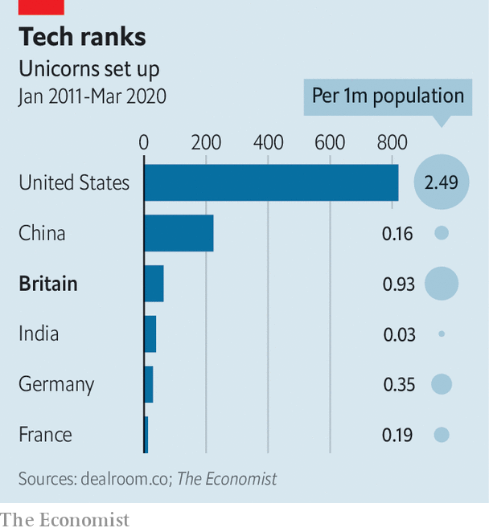

## Technology startups

# Britain is ahead of many of its competitors in technology startups

> Unicorn lead

> Mar 12th 2020

AS A DERIVATIVES trader with Credit Suisse, Nikolay Storonsky was used to gambling, but his riskiest bet was to quit the markets in 2013 and set up Revolut, a fintech startup. It paid off. Last month Revolut raised $500m, becoming Europe’s most highly valued fintech company, with a valuation of $5.5bn.

Revolut’s rise mirrors Britain’s unicorn scene. A unicorn is defined as a privately held startup valued at more than $1bn in a financing round, initial public offering or acquisition. According to Dealroom.co, a data-analytics firm, Britain has created 63 such companies in the past ten years. That is still far behind the giants, America and China, which have added 820 and 224 respectively, but it is more than twice as many as Germany’s 29 and almost five times as many as France’s 13 (see chart).

More interesting than these numbers is a step-change in the rate of growth. Between 2009 and 2013, Britain averaged about two new unicorns a year. Since then the figure has quadrupled. Part of that may be down to overall market optimism in recent years around anything tech-related. But investors may also have worked out how to navigate the “valley of death”, in which promising innovations would either disappear without being commercialised, or end up being swallowed by dragons. That was the fate of DeepMind, an artificial-intelligence startup, when Google bought it in 2014.

A few British unicorns, such as Graphcore, which designs specialised chips for artificial intelligence, are pure tech companies. But for most, computing is not the product, even if tech is central to the process. Finance, making up nearly a third of Britain’s unicorns, is the biggest sector, with companies like Revolut, Monzo and OakNorth (all upstart banks) and TransferWise (a money-transfer service). Retail, with ten unicorns (such as, Deliveroo and Ocado, which deliver cooked and supermarket food, respectively) and health (such as Oxford Nanopore, a gene-sequencing company) are also success stories. Some, such as BrewDog, a beer-maker, have nothing to do with technology at all.

The financial crisis may have been partly responsible for the uptick in unicorn production, particularly in finance, because it pushed talent out of established City banks and into entrepreneurship. When Zar Amrolia and Alex Gerko, two maths PhDs at Deutsche Bank, realised the bank’s spending on compliance would dwarf that on research, they left. In 2015 they set up XTX markets, an algorithmic foreign-exchange company that is now the first non-bank to make the list of the ten largest currency houses by trading volume. Mr Storonsky decided to give up the trading floor to start Revolut because it “just wasn’t as fun as it used to be”. In 2013 tech overtook finance as the preferred destination of MBA graduates from London Business School.

The government has tried to help as well. David Cameron, prime minister from 2010 to 2016, was keen to increase incentives and cut regulatory burdens for startups. The enterprise investment scheme (EIS), which was introduced in 1994 to give startup investors tax rebates and loss reliefs if investments fail, was extended from companies with fewer than 50 employees to those with fewer than 250, and from investments of £2m ($2.6m) to £10m. A new seed EIS offered larger tax relief for smaller companies. Nick Jenkins, founder of Moonpig, an online greeting-card firm, says the EIS incentives served as a catalyst, getting enough startups going to persuade venture-capital firms to pay attention to what was going on in Britain. In 2019 firms in London received $9.7bn in venture-capital funding, more than Berlin, Paris, Amsterdam and Madrid combined.

It was also Mr Cameron who called the referendum that led to Britain’s decision to leave the European Union. That dismayed many startups, since the EU’s freedom-of-movement rules make it easy to attract workers from across the continent. TechUK, a trade body, has given a cautious welcome to the government’s plans for a new, “points-based” system, announced last month and due to launch next year. Ministers hope it will maintain Britain’s attractiveness to the sorts of skilled workers that startups need. Tech firms also worry that vital data flows between Britain and Europe could be hampered if a trade deal is not negotiated by the end of the year.

There are other clouds on the horizon. Even before the covid-19 outbreak crashed the markets, investors had been cooling on unicorns, many of which have posted persistent losses as they have tried to boost customer numbers. Financial startups in particular could suddenly find life much harder if any of the big incumbent banks can manage to create similarly slick services or apps.

One question is how large British startups can become. In “The Social Network”, a film depicting the rise of Facebook, Sean Parker, Facebook’s first president, tells the site’s founder, Mark Zuckerberg, that “a million dollars isn’t cool—you know what’s cool?” The answer is a billion dollars. That was ten years ago. Today, quite a lot of British unicorns are billion-dollar cool. But America’s and China’s home-grown champions are bigger still (AirBnB, for instance, was valued at $35bn in 2019; Didi Chuxing, a Chinese ride-hailing service, hit $62bn in the same year).

Britain has a long way to go before it can boast of any startups approaching that size. But the past five years have demonstrated that the country can indeed breed unicorns. The next challenge is to turn them into dragons—and to keep other dragons from gobbling them all up.■

## URL

https://www.economist.com/britain/2020/03/12/britain-is-ahead-of-many-of-its-competitors-in-technology-startups
