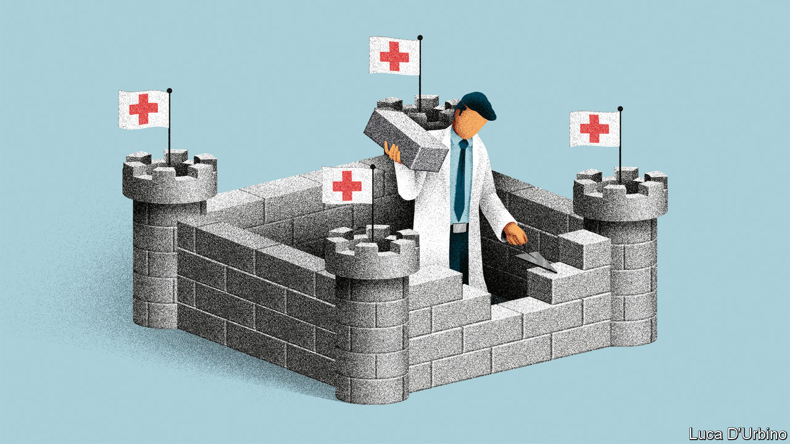

## Is it ready?

# Britain’s NHS is well suited to dealing with crises

> But it is overstretched and faces an enormous task

> Mar 12th 2020

WHEN BORIS JOHNSON addresses the nation about the threat posed by covid-19, he likes to be flanked by a Praetorian Guard of mild-mannered scientific advisers. Chris Whitty, the government’s chief medical adviser, and Sir Patrick Vallance, the chief scientific officer, have become unlikely stars thanks to their calm bedside manner. The prime minister’s aim is to show that the government is following the best available advice—in part to offer reassurance and in part, surely, for insurance if things do not go according to plan.

Over the past few weeks, the advice has mainly been about how to stop the spread of the virus, with Britain taking a more laissez-faire approach than some other countries (see [article](https://www.economist.com//international/2020/03/12/fatality-rates-for-covid-19-could-vary-enormously)). More than 27,000 tests have been carried out, with 459 positive results and eight deaths. Attention is now turning to the NHS. International comparisons made before the current threat suggest that Britain is among the best prepared countries for a pandemic, thanks to its testing infrastructure and contingency planning. But some have also pointed to the health system as a relative weak point. In his budget on March 11th, Rishi Sunak announced £5bn ($6.4bn) extra for the health service to help deal with the virus, with more to come if needed. It will have as many “millions…or billions” as it requires, the chancellor assured MPs (see [article](https://www.economist.com//britain/2020/03/12/anti-covid-19-measures-mask-a-shift-in-britains-budget-strategy)).

Whether more money will be enough is not yet clear. The NHS is far from the monolithic organisation, caring for people from “cradle to grave”, of popular imagination. In reality, it is an enormously complex network of intertwined and sometimes competing bodies. Yet at times of crisis there are well-established lines of instruction, and hospitals are used to working together. “There are many disadvantages to centrally organising a health-care system for 60m-plus people,” says Helen Buckingham of the Nuffield Trust, a health think-tank. “An advantage is that, when you need to do command-and-control, you can, and you can do it quickly.”

NHS England has established a dedicated team to handle its response to the virus. It is in daily contact with all 223 NHS providers, which range from ambulance to mental-health services, keeping tabs on such things as levels of protective equipment and whether providers have enough space to quarantine those who are infected. An advisory group for emergencies, made up of various experts, provides ministers with a single source of information. Across the country local resilience forums, which include representatives from health services, local authorities, the army and others, meet in peacetime, meaning that connections are already established. “We know each other’s faces, we know each other’s foibles,” says one attendee.

Their task would be easier if the NHS were not already so stretched. In January just 82% of people requiring emergency treatment were seen within four hours, against a target of 95%. A report last year estimated that there were some 100,000 vacancies across the health service. Staff shortages could quickly be exacerbated by covid-19. If schools are closed, lots of workers will have to stay at home to look after children. The government is preparing emergency legislation to protect the employment of those who volunteer to help out. Recently retired medics may be brought back and trainees brought in. The majority of covid-19 patients will be asked to recover at home.

Two areas are of particular concern. Alison Pittard, dean of the Faculty of Intensive Care Medicine, notes that Britain has historically spent relatively little on intensive care. It has fewer beds than other countries in Europe, with just 4,048 in England, of which three-quarters are already full. The NHS hopes vastly to increase capacity. But doing so will require looser rules on staff numbers and lots of new equipment, which there is limited time to buy. “You can’t share a monitor, you can’t share an oxygen pipe,” says Dr Pittard. The other worry among health wonks is social care, which is already running on empty. If lots of carers are unable to work, it will be even more difficult to get people out of hospital. If conditions deteriorate in care homes, there could be more hospitalisations.

Officials hope the health service will be able smoothly to reallocate resources. Most people are not aware of the “degree to which hospital capacity can be flexed pretty significantly,” says Chris Hopson, chief executive of NHS Providers, a membership group. Lots of hospital traffic is either elective surgery, which can be delayed, or people who have had surgery and can be discharged rapidly if necessary, he adds. So far, NHS England has not said when or if it will consider such moves, although it has put in place measures to reduce workload. Health-care leaders have also asked the government to consider whether they might adopt more radical measures, like not allowing those blocking beds a choice of care home, to free up space in a worst-case scenario.

Speaking on March 5th, Dr Whitty, the chief medical officer, said that “depending on how high the peak is, this could be anything from a rather bad winter but in spring and summer...to huge numbers way overtopping the ability of the NHS realistically to put everyone in beds.” Vigorous tracing of those who potentially contracted the virus in its early stages was put in place partly to push the peak back to a time when the NHS is not under typical winter pressure. The weeks and months ahead will push an already stretched health service to its limits. Officials will be praying that their preparations are enough to ensure it is not pushed beyond them. ■

Dig deeper:

## URL

https://www.economist.com/britain/2020/03/12/britains-nhs-is-well-suited-to-dealing-with-crises
