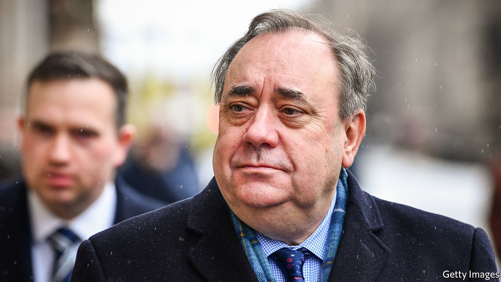

## Sturgeon at bay

# The fallout from Alex Salmond’s trial will damage the SNP

> Splits between fundamentalists and gradualists are growing wider

> Mar 12th 2020EDINBURGH

JUST A FEW years ago, in 2014, he came within a whisker of realising his dream of leading Scotland out of the United Kingdom. The former leader of the Scottish National Party, Alex Salmond, transformed the politics of his homeland, dragging the SNP from the fringes to the centre-ground, from where it now dominates elections to both the Westminster and the Edinburgh parliaments. Today, Mr Salmond’s public appearances are from the dock at Edinburgh’s High Court, where he is on trial in a series of sexual-offence charges. The trial, which began on March 9th, is expected to last for four weeks.

Mr Salmond’s relationship with Nicola Sturgeon, his former protégé and successor as both SNP leader and Scotland’s first minister, has been badly damaged by the allegations against him. But in truth the two had been growing apart for some time, with the strategy for how best to achieve independence lying at the heart of their differences. And the division between them now extends right through the party, with members tending to cleave to one side or the other.

As first minister from 2007 to 2014, Mr Salmond backed a slow and steady approach to the question of Scotland’s independence. This culminated in the September 2014 referendum, which he lost by 55-45%. Ms Sturgeon, who took over soon afterwards, has been similarly cautious, rejecting suggestions by some colleagues that she should mount a legal challenge to the right of the British government to decide whether to allow a referendum, or perhaps even (like Catalonia) attempt to call one unilaterally.

But since he stepped down, Mr Salmond has become more radical. And he has wilfully ignored the convention that former bosses should keep their views to themselves and allow their successors freedom to follow their own path. Mr Salmond’s frequent interjections on the question of whether and when a second independence referendum should be held have, at times, undermined Ms Sturgeon. Her patience with her former leader had worn tissue-thin even before his arrest.

Mr Salmond remains a hugely popular figure among many in the party. There are those who would have him back as leader in an instant. Hardliners in the party see him, even now, as the true standard-bearer for the cause of Scottish independence. To such acolytes, Ms Sturgeon seems too cautious, too managerial. She lacks the swagger that was a part of Mr Salmond’s appeal to ordinary Scottish voters.

Historians of Scottish politics say that, until Mr Salmond began his second stint as the party’s leader in 2004, the SNP was perpetually split. On one side were the gradualists, who favoured a cautiously drawn-out campaign for independence. On the other were fundamentalists, who wanted a more swashbuckling approach, including such options as a unilateral declaration of independence.

Mr Salmond’s achievement was to bring these two warring factions together, instilling a discipline that was crucially important for the SNP’s victory in the 2007 Scottish parliamentary election. In effect, he brought the fundamentalists to heel behind a gradualist strategy. But now he has become a figurehead for those who favour a more radical approach.

It is difficult to see how what emerges from the trial in the weeks ahead will help Ms Sturgeon to repair the split. Her reputation may suffer from persistent claims that she mishandled the allegations against Mr Salmond when they first surfaced. And whatever the outcome, she leads a party that now looks more divided than it was when she took it over.■

## URL

https://www.economist.com/britain/2020/03/12/the-fallout-from-alex-salmonds-trial-will-damage-the-snp
