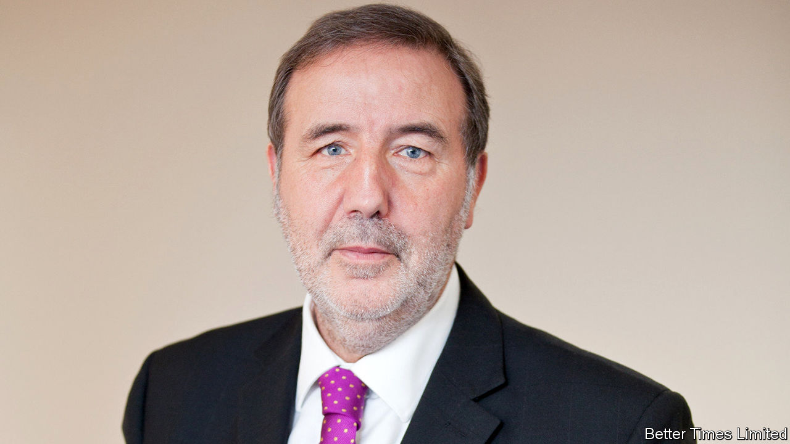

## Watchdogs without bite

# Why Britain’s police commissioners are not living up to their promise

> David Cameron hoped “big local figures” would apply to police the police. They haven’t

> Mar 12th 2020

AS EVERY ENGLISH child knows, the Sheriff of Nottingham is always the baddie. His tyrannical rule is tempered only by Robin Hood, with a little help from his band of merry men. These days, Nottinghamshire’s law-and-order supremo is up for election every four years. And Paddy Tipping—properly known as the county’s police and crime commissioner (PCC)—can hardly be said to possess overweening ambition. One of his innovations is a “pension” for police dogs, so that their handlers do not pick up vet’s bills when the mutts are too old to work. “I can’t tell people what to do, by any means,” says the 70-year-old, an ex-Labour MP for Sherwood. “But I can change things.”

That is what David Cameron hoped. The then prime minister introduced PCCs in 2012 as part of his attempt to shake up the police, which he saw as the “last great unreformed public service”. Instead of answering to police authorities (bodies of councillors and other local worthies), the chief constables of most of the 43 police forces in England and Wales would be held to account by a directly elected PCC. The new watchdogs have power to hire and fire chief constables, to write policing plans for the force to follow and to set local taxes to pay for policing. Voters will go to the polls in May to pick a PCC for the third time.

The first generation of PCCs have confounded critics who feared the possible politicisation of policing. To be sure, they have ruffled a few feathers. Lincolnshire’s chief constable was reinstated in 2013 after a court ruling that the PCC’s decision to suspend him had been “irrational and perverse”. But most have struck up good relations with chiefs and recognise that they cannot interfere in police inquiries. “They have kept to strategy and financing,” says Rick Muir of the Police Foundation, a think-tank. “They are not gung-ho, locking people up.”

Two other problems have emerged. The first concerns what they do. Tackling organised crime and “county lines” drug-dealing—city kingpins sending go-betweens to provincial users—requires national co-ordination. Getting 43 chief constables to agree on a strategy was tricky enough, grumbles a senior official. Adding PCCs makes it harder: “These people couldn’t agree on what they’d had for lunch.” Since they are meant to respond to local demands, their priorities are often parochial. There is no electoral incentive to pool resources such as computer systems and specialist surveillance units, points out Harvey Redgrave of Crest Advisory, a criminal-justice consultancy.

The second problem is who they are. Mr Cameron billed the role as a “big job for a big local figure”. He wanted bosses and “pioneers of all sorts” to become PCCs, as well as politicians. Yet only three of the current crop of 40 stood as independents. Most of the rest are stalwarts of Britain’s two dominant political parties. A salary ranging from £65,000 ($84,000) to £100,000 makes for a plum job for those who have spent years delivering party leaflets. The plans they have produced are stuffed with “value-free rhetorical cliches” not analysis of local crime patterns, says a study by John McDaniel of Wolverhampton University. Voters do not appear to find them inspiring. Only 27% of eligible electors cast a ballot in 2016.

The government has promised more power for PCCs. That might help. Elected mayors in London and Manchester act as PCCs, but with more power to co-ordinate initiatives with councils and local health services. A handful of powerful regional mayors might be more effective than diffuse PCCs. And a beefier role might attract a higher calibre of candidate. Two of the current big-city mayors are former ministers; a third is an ex-boss of John Lewis, a big retailer. The answer to a flawed reform may be further reform. ■