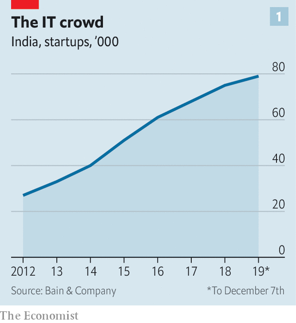
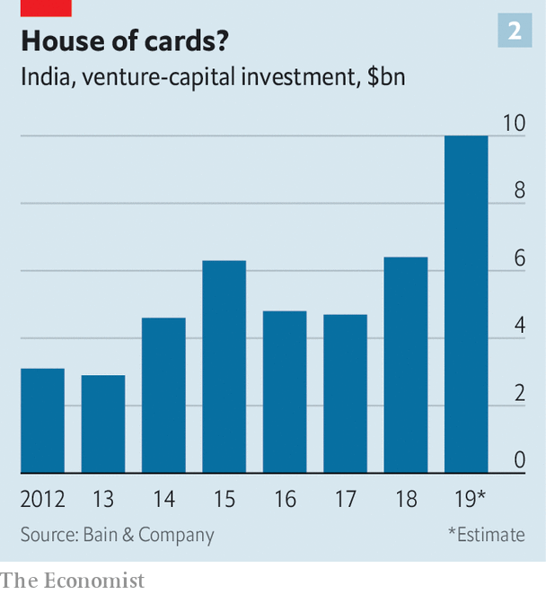
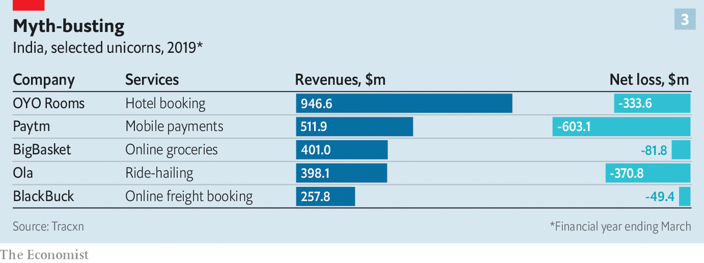

## Silicon subcontinent

# India’s booming startup scene is showing signs of trouble

> A decade of phenomenal growth has created 80,000 tech firms—and mounting losses

> Mar 12th 2020DELHI, MUMBAI AND SINGAPORE

WHEN ITINERANT venture capitalists land at Delhi airport, many head straight to Aerocity, a new development of glass, steel and Starbucks next door that would not look out of place in Silicon Valley, Singapore or Shanghai. Cyber City, another tech enclave 20 minutes away by Uber (traffic permitting), swarms with young programmers in T-shirts and jeans not unlike the Stanford students plotting the next disruptive app at Philz Coffee in Palo Alto. Many are one and the same.

What Delhi’s tech parks lack in the splendour of India’s historic business hub, in south Mumbai, they make up for in unpotholed roads, uninterrupted mobile connections and stable broadband. Between 2017 and 2019 the capital spawned 2,562 startups, according to Tracxn Technologies, a data provider. Other clusters, notably in Bengaluru, Mumbai, Hyderabad, Pune and Chennai, added a further 4,500 or so between them. India now has 80,000 startups (see chart 1). They raised $10bn in 2019, up from $3.1bn in 2012 (see chart 2). That puts India’s venture capital (VC) activity behind America ($114bn) and China ($34bn) but ahead of larger economies such as Germany or France.

PitchBook, a research firm, counts 18 unlisted “unicorns”, valued at more than $1bn apiece, grazing in India. They are worth a combined $72bn. Bright engineers and managers now aspire to work for them—or their VC backers—rather than settle for safe careers at a multinational, a bank or a state-run firm. Another 150-odd “soonicorns” may reach the $1bn mark shortly. They promise free cappuccinos, excitement—and, for a lucky few, riches. They may reconfigure parts of the national economy. Mohandas Pai, a VC-wallah and former finance chief of Infosys, a local tech giant, predicts that within a decade India’s startups will help triple its GDP.

Mr Pai is not alone in his bullishness. India’s business press revels in tales of startup wonder. Foreign VC firms have piled in. They hope to ape the success of Flipkart, an e-commerce platform in which Walmart bought a majority stake for $16bn in 2018. Yet despite startup India’s indisputable promise, pitfalls await the unwary.

The Indian VC scene has come a long way. In 2005, when Rajan Anandan, a partner at Sequoia Capital, a Silicon Valley VC titan, returned to India after a spell in America, all-important early-stage VC was close to non-existent. Foreign firms began to fill the gap. Californian stalwarts, including Accel, Matrix, Lightspeed, Bessemer and Norwest, have since set up mostly autonomous Indian offices. So have Singaporean sovereign-wealth funds, Temasek and GIC; Chinese tech giants, Tencent and Alibaba; and, inevitably given its startup covetousness, SoftBank of Japan. They have been joined by powerful local firms such as Blume Capital. Giant Indian conglomerates such as Tata, Reliance and Mahindra have launched VC arms. VC types say they get more than 5,000 pitches a year.

Most of the money has gone into familiar platforms: ride-hailing (Ola), food delivery (Swiggy, Zomato), online grocers (bigbasket), car rental (Zoomcar), online education (Byju’s). The first new unicorn of 2020, HighRadius, offers software-as-a-service (SaaS), another tested business model which provides companies with things like accounting or customer support via the computing cloud.

This penchant for the familiar is understandable. And the platforms work in India—just about—without the need to fix its rickety physical and digital infrastructure. But their growth is limited in a country rich in people but poor in disposable income. And, like counterparts in the West, few of them make any money (see chart 3). The reasons—and justifications—are the same, too: heavy investments are necessary to acquire new customers and achieve scale.

The success of this strategy is hard to gauge. Information on realised returns—the cash VCs get from their investments as opposed to unrealised capital gains from swelling valuations—remains scant. What little there is suggests a near absence of cash returns. People who have reviewed pitch books used to raise money say as much. True, only a few funds have been around the decade or so required for investments to ripen. But it may have something to do with weak operating performance. Oyo Rooms, a seven-year-old firm which sells tech-infused budget-hotel franchises and has expanded furiously across 800 cities in India and abroad, has had to sack workers and faces questions about its viability.

Individual companies’ valuations—including Oyo’s, long put at $7.5bn-10bn—are thus increasingly viewed with suspicion. Many are “marked to myth” rather than to market, as local wags put it. That in turn helps explain why clean exits, through a public listing or a private sale, are rare. Walmart’s Flipkart deal accounted for 80% of the ten biggest exits in 2018, according to Bain, a consultancy. Last year’s top ten raked in just $4bn. Half were sales of secondary stakes by one VC firm to another. Only one, of a 24-year-old e-merchant called Indiamart, was a public offering.

Investor-unfriendly bureaucracy presents more hurdles to divestment. A term sheet related to incorporating in India, from the Indian branch of an American VC firm, can run to 12 pages, remembers an executive at a hot startup; one from its American office related to incorporating in America took up a single page. Some of those who invested in Flipkart are enmeshed in a fight with the government to recover a withholding tax imposed on their returns.

To list on India’s main exchanges firms must demonstrate a few years of profits. Laws impede those whose management is based in India from floating overseas (the approach of many successful Israeli startups) without first going public at home. Complex and mutable levies on shares handed to investors and staff in effect give the government first dibs on a firm’s cash.

Despite its pro-business rhetoric, the nationalist government of Narendra Modi has made life harder for startups in other ways. Like all of India Inc they contend with complex and constantly changing rules. Some are draconian and indiscriminate. In December the government blocked digital-payments providers from collecting fees from merchants who use their services, hurting the business model of Paytm, India’s biggest unicorn. It also launched a public payments system that competes with private providers. Flipkart has found itself facing restrictions on warehousing and discounting, slapped with a complex transaction tax, and under investigation by the competition authorities for long-standing sales arrangements.

The cost, complexity and chaos of India’s VC world is prompting many startups to try to incorporate elsewhere while they remain small. An analysis by Tracxn shows that of 73 SaaS firms that have received at least $20m each in funding, 50 have headquarters outside India. Many flee to Singapore, where expatriate managers can catch a six-hour flight to Delhi or Mumbai, which plenty do on a weekly basis. America is luring them with its vast market, better protection of intellectual property, lower taxes and a deep network of analysts, VC firms, lawyers and bankers. If India is to unleash its huge startup potential, it must first ask itself why some of its entrepreneurs and venture capitalists are so eager to leave. ■

## URL

https://www.economist.com/business/2020/03/12/indias-booming-startup-scene-is-showing-signs-of-trouble
