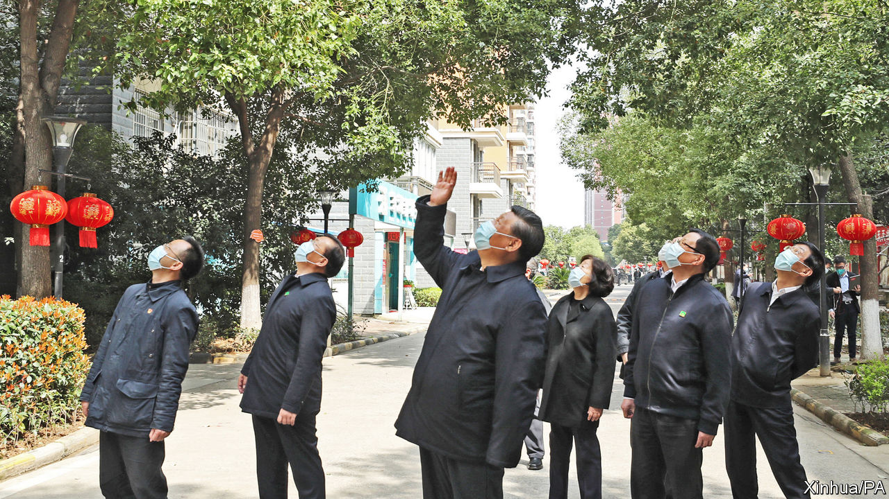

## A gesture to the sequestered

# China appears confident that its coronavirus epidemic has abated

> Many citizens are not yet celebrating

> Mar 12th 2020BEIJING

SEVEN WEEKS after cordoning off Hubei, the Communist Party is itching to declare victory over the novel coronavirus that has swept across the country from that central province. On March 10th the country’s leader, Xi Jinping, visited Hubei’s capital, Wuhan, for the first time since the lockdown. He spoke by videolink to patients at an army-run hospital there. He also visited a residential area (see picture) to see how Wuhan’s citizens—most of whom are still under orders to stay at home—are coping with quarantine. Mr Xi said the spread of the virus had been “basically” curbed.

Official figures are certainly encouraging. On the day of Mr Xi’s trip only 19 confirmed new infections were recorded in China, down from thousands at the peak of the outbreak in February. About three-quarters of the 80,000 or so people known to have caught the virus in China are now said to have recovered from it. Officials in Wuhan have closed makeshift wards in public buildings such as sports centres and exhibition halls. Local governments in less-affected parts of Hubei say they are beginning to relax travel restrictions in the hope that people can get back to work. China is now stressing the importance of making sure that travellers from countries where infections are rising do not bring the pathogen with them. On March 11th city officials in Beijing said passengers flying into the capital’s airports from abroad must spend 14 days in self-quarantine.

China’s growing confidence in its struggle with the epidemic is evident in its propaganda. State media increasingly crow about the party’s strengths in handling the crisis. Their editorials marking Mr Xi’s visit to Wuhan proclaimed the success of China’s anti-virus measures, which have required hundreds of millions of people to submit to quarantine, and gave the credit to China’s political system. People who use the crisis to “smear” the country’s politics are “immoral and despicable” said Xinhua, a state news agency. With the virus now threatening to damage the health and livelihoods of people globally, the party appears keener than ever to deflect criticism of its own bungling in the early days of the outbreak when news of its spread was suppressed. On March 10th a Chinese magazine, Renwu, published an interview with Ai Fen, one of several doctors in Wuhan who are known to have been muzzled by officials for discussing the virus online soon after its discovery. Censors quickly pulled the story from Renwu’s website.

Ordinary Chinese are relieved by the sharp drop in daily numbers of confirmed new infections. Many show remarkable tolerance for the lengthy quarantines they have had to suffer. But there is much grumbling online about the behaviour of some officials during the outbreak, and less full-throated praise for the merits of one-party rule than officials would like to see. Tensions have been particularly evident in Wuhan. In early March quarantined residents in one housing complex shouted down from their windows as Sun Chunlan, a deputy prime minister, was being shown round. They warned her that officials in their neighbourhood were putting on a “fake” show of relief efforts in order to impress her. The hecklers explained that they were having problems getting deliveries of groceries, among other difficulties. Videos of the incident spread online. Unusually, state media broadcast footage of the incident, perhaps to show that the authorities are heeding complaints. During his trip to Wuhan, Mr Xi also made a rare nod to public anger. “The masses in Hubei, Wuhan and other areas hard-hit by the epidemic have been in self-isolation for a long time,” he said. “They have some emotions to vent. We must understand this and be tolerant and forgiving. We must continue to step up the intensity of our work in all aspects.”

Mr Xi may have had in mind an eruption of emotion on March 6th, when Wuhan’s recently appointed party boss, Wang Zhonglin, told officials that a campaign of “gratitude education” was needed to make sure local people understood the important role that Mr Xi and the party had played in their deliverance. His words, carried in local newspapers, provoked outrage on social media and were swiftly deleted from websites. The party chief of Hubei, Ying Yong, also newly appointed, made a statement clarifying that “Wuhan people are heroes” and that he was sincerely grateful to them. The party probably hopes that Mr Xi’s visit will help to assuage some of the public’s anger.

There is plenty of it bubbling up online, and not always about the government’s handling of the epidemic. People have been fuming about officials’ lax controls over construction projects, after the collapse on March 8th of a hotel in the coastal province of Fujian that had been requisitioned for use as a quarantine centre. Around 30 people died. The victims were travellers who had returned from other parts of the country and who were being kept in precautionary isolation for 14 days. Many people have also been venting about a proposed regulation that would make it easier for certain foreigners to gain permanent residency (see [article](https://www.economist.com//china/2020/03/12/a-proposal-to-help-a-few-foreigners-settle-in-china-triggers-a-furore)).

Mr Xi may find it hard to choose his moment to declare complete success. As people gradually get back to work, there is a risk that the virus may begin to spread more widely again in China. That may lead to renewed lockdowns. The party appears to remain intent on treating the virus as something that can be conquered, rather than—as some other governments are handling it—something that can only be hindered from spreading too rapidly.

In Wuhan, Mr Xi was careful not to sound triumphant. “Through arduous efforts, there has been a positive turn for the better in epidemic containment in Hubei and Wuhan. Important interim results have been achieved,” he said. But he also said there should be “no slackening at all” in anti-virus work. That will not be music to the ears of people in Wuhan and many other parts of China where draconian quarantine measures may have helped to curb the epidemic, but at no small cost, not least for firms and people in need of medical care unrelated to covid-19. ■

Dig deeper: