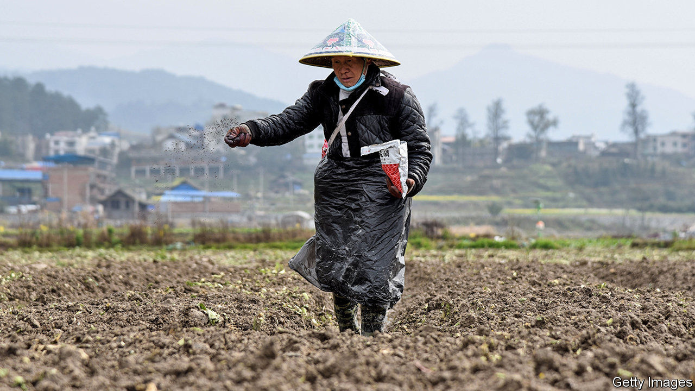
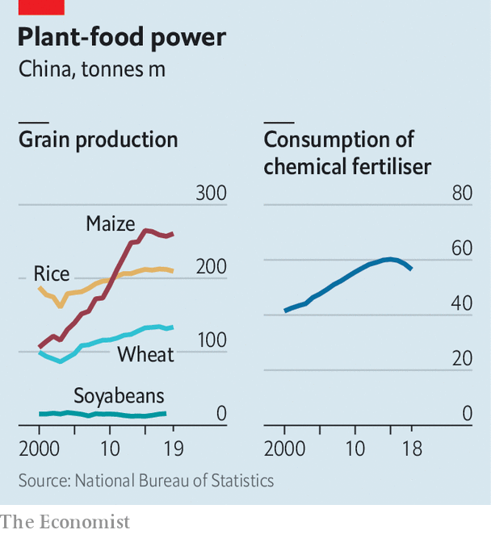

## Planters, plagued

# Covid-19 is making it harder to grow food in China

> The government is straining to get supplies to farmers

> Mar 14th 2020ZHAOQUANYING

NEXT TO A row of idle tractors on the edge of a field in Zhaoquanying, a village on the outskirts of Beijing, sits a row of wheat farmers. Like almost all Chinese when outdoors these days, they are wearing face masks because of the epidemic of covid-19. Their gaze is fixed on their smartphones because, they say, there is not much else to do. “The ground is still too hard,” says one. “But we’re ready to plant when the time is right.” As the weather warms, that day is imminent. It is one that they, and many government officials, have been worrying about.

In mid-February, at the peak of the coronavirus outbreak, some of China’s agricultural experts said it was “unclear” whether spring planting could happen on time. They worried that massive disruptions to transport caused by virus-containment measures could affect the delivery of inputs such as fertiliser on which farmers rely (see chart). They also feared that quarantine controls would prevent seasonal workers from getting to farms where their labour is needed for planting. On February 25th China’s president, Xi Jinping, and the prime minister, Li Keqiang, issued instructions on the need to “stabilise” agriculture. They called for an “all-out effort” to ensure that the epidemic did not affect the planting of vital crops.

Much of China’s economy shudders with uncertainty about the damage caused by covid-19. But many firms still hope they can recoup at least some of their losses. Some cancelled events will be rescheduled. Some of the cars or refrigerators that were not sold during the shutdown will be snapped up when things return to normal. Farmers, however, cannot accept any disruption. To avoid a total loss for the season, they must start their spring planting soon. At stake is not only the welfare of the 40% of China’s people who live in the countryside and depend on agriculture, but the stability of the national food supply.

In the two months since the outbreak began, China has already felt covid-19’s impact on supplies of some food. Restrictions on the movement of people have left labour-intensive slaughterhouses understaffed, squeezing meat production. This follows the severe damage already done to pork supplies by an outbreak of African swine fever, an animal disease that struck China in 2018 and led to the loss of 40% of China’s pigs. Pork prices have tripled since early last year.

In response to the leadership’s calls, local officials have been pulling out the stops to ensure planting proceeds. They have set up “green channels” for lorries carrying agricultural necessities so they do not get delayed at checkpoints and toll booths (tolls have been waived on all highways since February 15th). Bureaucrats have a strong incentive: promotions, they have been told, will depend on how effectively they ensure that farmers can do their work this spring. Officials have been trying to make life easier for farmers in other ways, too, such as by reducing land-use fees and directing state-owned banks to give them loans on easy terms.

In Zhaoquanying, together with a faint scent of manure, there is a hint of optimism in the air. The farmers say their wheat planting will go ahead as usual. In the nearby village of Hongtongying, some vegetable farmers have just taken delivery of several lorry-loads of plastic film for use on the greenhouses they erect over their fields. The shipment arrived on time from the eastern city of Hangzhou, some 1,300km (800 miles) away. Everything else they need is already in place, they say. Still missing, however, are migrant workers from other provinces, who have been held up by epidemic-related travel restrictions. “They’ll get here when they can, but until then we will manage,” says one of the men.

Recovery will be slower in Hubei, the province hardest hit by covid-19, and that is no small matter. It is one of the country’s main sources of chemical fertiliser. Last year it produced nearly a tenth of China’s rice. But agricultural experts say most of China’s farmers are likely to muddle through the busy season ahead. The government has made clear that spring planting must be carried out without delay, says Thomas Luedi of Bain & Company, a consultancy. “They built two hospitals in about a week,” he notes, so they can probably get the grains sown on time, too. ■

Dig deeper:

## URL

https://www.economist.com/china/2020/03/14/covid-19-is-making-it-harder-to-grow-food-in-china
