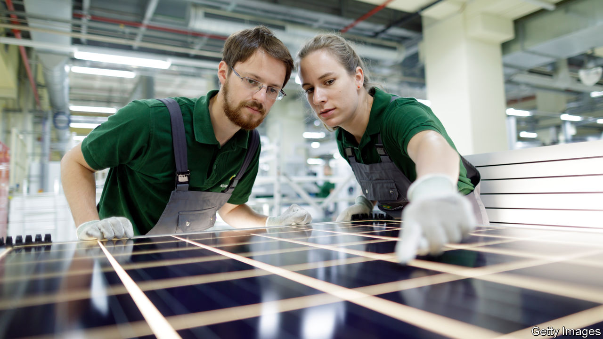
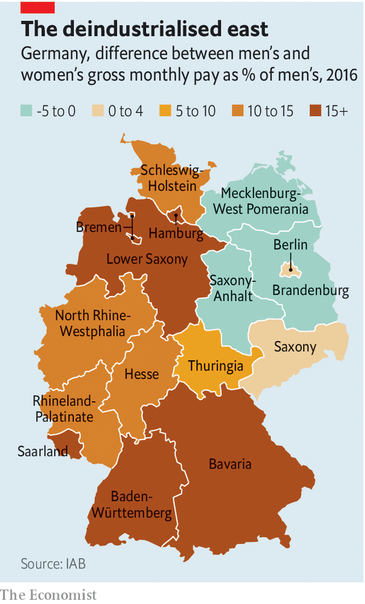

## From peer to maternity

# Why the pay gap in Germany is so large

> Women are more likely to work part-time—except in the east

> Mar 14th 2020BERLIN

“REVOLUTIONARY” IS not a word that often escapes Angela Merkel’s lips. Yet on March 8th, international women’s day, that was how Germany’s chancellor described the change she had observed in men’s attitudes to balancing work and family. This matters in a country that can still deride Rabenmütter (“Raven mothers”), women who supposedly neglect children for career. But on another measure of equality—pay—Germany is lagging.

The median hourly wage for German women is €17.09 ($19.31), 21% less than men’s €21.60. In the European Union, only Estonia has a wider gap. But the raw numbers can mislead. Adjust for sector, skills, age and other factors, and the gap plummets to 6-7%. Women are likelier than men to work in badly paid service jobs; two-thirds of shop assistants are female. Almost half of working women are part-time (compared with 9% of men) and so tend not to climb the career ladder as fast. Katharina Wrohlich at the German Institute for Economic Research notes that some countries with lower pay gaps, such as Italy, have far fewer women working. Women who earn low wages drag down the average; those who earn nothing are not counted.

Yet the adjusted figures leave something out, too. Which career to follow, and whether to work part-time, are individual choices. Yet they are influenced by tax and benefit rules, education and child-care policy, and social norms. Ensuring equal pay for equal work would not, in itself, make Germany’s boardrooms less male, or get more women into well-paid sectors.

In the former East Germany, the unadjusted pay gap between men and women is minuscule. In some areas, women earn more. This is partly explained by the lack of industrial giants in the east. Germany’s pay gap yawns widest in the humming southern states of Bavaria and Baden-Württemberg, where men dominate lucrative technical and manufacturing jobs. In the east the public sector, where women do better, employs more people. History counts, too. The old communist regime cajoled women to work outside the home, and started a tradition of state-backed child care that persists. East German women have long been more likely to work than westerners, although the figures are converging.

The pay gap has almost vanished for full-time workers under 30, the average age for new mothers, but for those over 40 it has barely budged for three decades. The motherhood wage penalty is higher in Germany than in many rich countries; ten years after giving birth the average German mother earns almost two-thirds less than before, a far more precipitous drop than in countries with better child-care provision, such as Sweden or France. Tax rules and education practices, including schools that can close as early as noon, nudge large numbers of women into part-time work.

Germany is changing. Since 2013 the state has guaranteed day care for children over 12 months (though finding a spot can be nightmarish). The minimum wage, which was introduced in 2015, disproportionally helped women. New transparency rules oblige big firms to explain pay decisions to curious staff. But much remains to be done, including chivvying men to take on more of the duties of parenting; just 36% of German fathers take paternity leave. The revolution is incomplete. ■