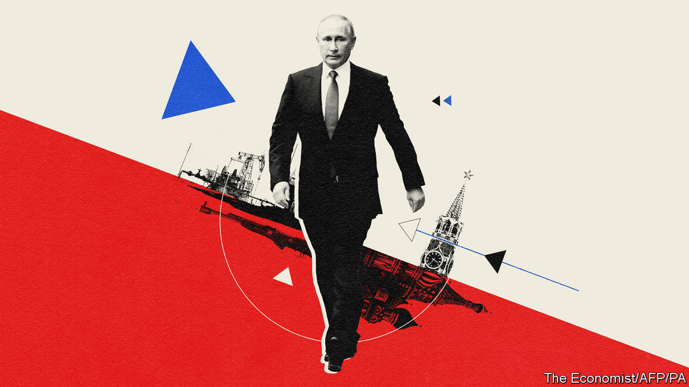

## Prisoner in the Kremlin

# Why Vladimir Putin cannot retire

> He has too many enemies, and too many cronies who depend on him

> Mar 14th 2020

SHORTLY AFTER becoming president in 2000, the 48-year-old Vladimir Putin pondered how he would one day leave office. Riding in a presidential limousine through Moscow at night, he confided to an interviewer: “I very much hope that one day I will manage to go back to a normal life and that I will have some private future. I can’t say that the life of a monarch inspires me. A democracy is much more viable.”

Twenty years on, Mr Putin is further away from a peaceful post-presidential life than ever. On March 10th the Duma, Russia’s parliament, voted to approve constitutional changes proposed by Mr Putin, and added one that resets the number of terms he can serve. Under the current system, he would have had to stand down in 2024; now, he could go on until 2036, and perhaps longer.

Mr Putin has pondered various methods of retaining power for some time: merging Russia with Belarus to create a new country to rule over; presiding over an all-powerful Supreme State Council; or becoming prime minister in a new parliamentary system. In the end, he chose the crudest, but perhaps simplest, method—changing the constitution and giving himself an option to stay on. In this, he is following in the footsteps of several post-Soviet central Asian despots, observes Kirill Rogov, a political analyst.

Mr Putin’s other amendments curb the power of parliament and courts and position him as “not only the head of the state but the head of the executive branch as well, attributing to him the co-ordination of all public authorities and affirming his dominance in the judiciary”, as Mr Rogov explains. The power-grab is shrouded in the language of God, tradition, heterosexual families and Russia’s great victory in the second world war (the 75th anniversary of which Russia will mark on May 9th).

Like many autocrats, Mr Putin suggests that he needs to remain in power to ensure stability. This week he invoked the turbulence in the oil market, the new coronavirus and threats from enemies within and outside. “They are waiting for us to make a mistake or to slip up, losing our bearings or, worse still, getting bogged down in internal dissent, which is sometimes fanned, fuelled and even financed from abroad,” he told the Duma.

The collapse in the oil price, which at one point this week was down by 30%, added drama to his words. Oil and gas are most of Russia’s exports and generate a third of GDP. That Russia remains so reliant on hydrocarbons is largely Mr Putin’s fault. On his watch attempts to diversify the economy have failed to achieve as much as they should have.

Mr Putin implied that the world was too stormy a place for him to abandon his position. A former KGB agent, he defined his role not merely as the defender of the constitution (which he is busily rewriting), but “the guarantor of the country’s security, domestic stability and evolutionary development”—evolutionary because “Russia had its share of revolutions.” It hardly needed saying that he was the only man capable of averting such mortal dangers. Still, it was said, and by none other than Valentina Tereshkova, a famous Soviet cosmonaut who is now an MP aged 83. She was given the role of voicing the reset proposal, which was promptly approved by the president and the Duma.

All of this was part of a special operation that Mr Putin launched in mid-January when he first announced plans for constitutional changes. The process was murky and abrupt. So it was in keeping with the style of a former KGB man whose own ascent to power was a special operation plotted in the corridors of the Kremlin. “A group of FSB agents assigned to work undercover in the government of the Russian Federation is successfully fulfilling its task,” he quipped in his speech to the FSB (the successor to the KGB) in December 1999 upon being made prime minister. He became president the following year.

Since then he has conducted other special operations, such as the annexation of Crimea and invasion of Ukraine in 2014, not to mention the expropriation of the oil-and-gas firm Yukos in 2004-06. Each of these operations was dressed up in legal procedure, be it a referendum in Crimea or a show trial in the case of Yukos. The constitutional change is no different.

Mr Putin says that the changes will come into effect only with the endorsement of the Constitutional Court (which he controls), and with the approval of the Russian people. They will vote, as it happens, on April 22nd—the birthday of Lenin, the founder of the Soviet state who still lies in a mausoleum in Red Square. The vote is neither a referendum nor an election, and the whole process is as legally dubious as the referendum staged in Crimea. The fact that Mr Putin is expected to sign his constitutional amendment on March 18th, the sixth anniversary of the illegal annexation of Crimea, is revealing.

While Mr Putin’s intention of staying in power was never much in doubt, the timing and the rush with which the changes to the constitution have unfolded have been striking. Ekaterina Schulmann, a political scientist, attributes this in part to the mood of Russia’s elite, who were feeling nervous about their own future. Mr Putin’s cronies depend on him for their positions. Uncertainty about his plans makes them fearful of losing their money, status and possibly their freedom.

The aim of Mr Putin’s move, she reckons, is to eliminate the risk that the elite might agree on a successor. Such an agreement would turn Mr Putin into a lame duck. Sergei Sobyanin, the mayor of Moscow, noted on his personal website that “a president who cannot run for another term cannot be a strong figure by definition. A ban on the incumbent being re-elected is a destabilising factor both in domestic and foreign policy.”

But Mr Putin’s erratic and unconvincing performance over the past few months risks alienating the public. The fact that he wants to impose his plan on the Russian people does not mean he will succeed. Few countries are as capable of delivering surprises as Russia. His power-grab is taking place against the background of a stagnating economy and rampant corruption.

In the two years since Mr Putin’s most recent election in March 2018, trust in him has fallen from 60% to 35%. His foreign adventures no longer thrill the public. Even anti-Americanism, one of the staples of his ideology, is going stale. This is why the promised vote on April 22nd is likely to be a fraudulent affair. Rallies against the changes are likely to be banned, thanks to the convenient coronavirus.

Ella Paneyakh, a Russian sociologist, argues that the Kremlin has lost touch with society. Its channels of communication have been reduced to broadcasting propaganda, which is losing its effect. Even bribing people with their own money does not seem to work any more.

The only instrument left is repression, which the government has already shown a willingness to use. “The state has plenty of potential for repression and it can be used again and again, until it encounters a problem that cannot be resolved by force,” Ms Paneyakh says. Mr Putin’s constitutional coup and his growing reliance on repression rather than patronage or propaganda raises the cost of challenging him, reduces the chances of an orderly transfer of power and increases the risk of violence in Russia. All this in the name of stability. ■

## URL

https://www.economist.com/europe/2020/03/14/why-vladimir-putin-cannot-retire
