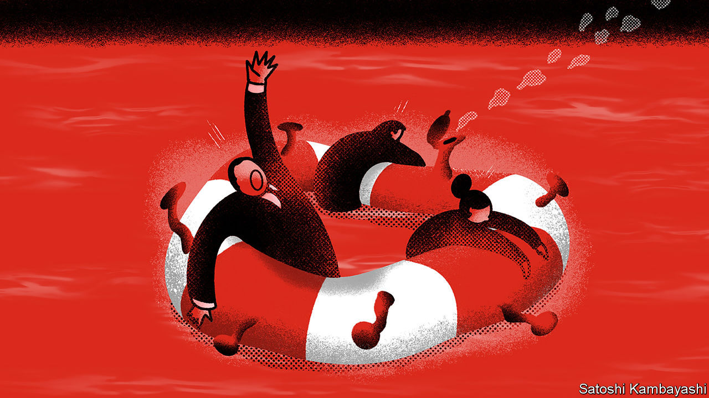
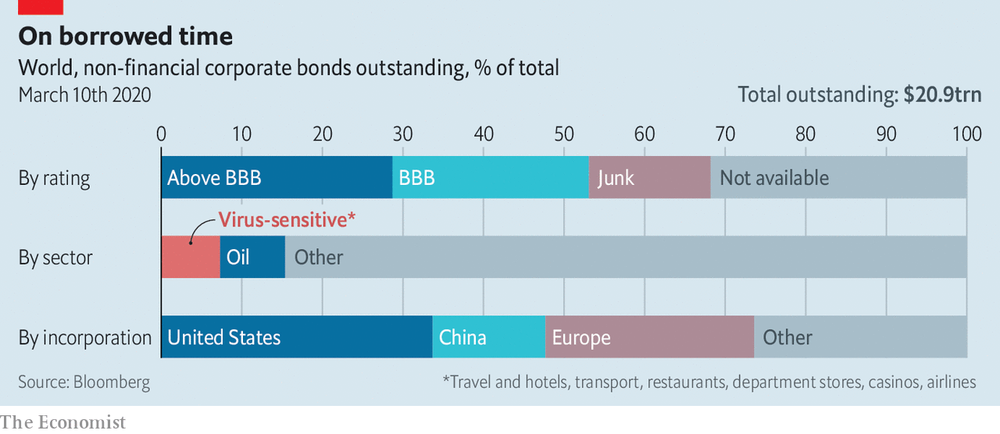

## A sea of debt

# Corporate bonds and loans are at the centre of a new financial scare

> The pool of corporate lending has risen to $74trn

> Mar 12th 2020

OVER THE past decade officials—and some bankers—have tried to redesign the financial system so that it acts as a buffer that absorbs economic shocks rather than as an amplifier that makes things worse. It faces a stern test from the covid-19 virus and the economic ruptures it has triggered, not least a Saudi-led oil-price war (see next article). The locus of concern is in the world’s ocean of corporate debt, worth $74trn. On Wall Street the credit spreads of risky bonds have blown out, while in Italy, a bank-dominated economy that is already in lockdown, the share prices of the two biggest lenders, Intesa Sanpaolo and UniCredit, have dropped in the past month by 28% and 40% respectively.

The scare has four elements: a queasy long-term rise in borrowing; a looming cash crunch at firms as offices and factories are shut and quarantines imposed; the gumming-up of some credit markets; and doubts about the resilience of banks and debt funds that would bear any losses.

Take the borrowing first. Companies came out of the 2007-09 financial crisis in a relatively sober mood, but since then have let rip. Global corporate debt (excluding financial firms) has risen from 84% of GDP in 2009 to 92% in 2019, reckons the Institute of International Finance. The ratio has risen in 33 of the 52 countries it tracks. In America non-financial corporate debt has climbed to 47% of GDP from 43% a decade ago, according to the Federal Reserve.

Underwriting standards have slipped. Two-thirds of non-financial corporate bonds in America are rated “junk” or “BBB”, the category just above junk. Outside America the figure is 39%. Firms that you might think have rock-solid balance-sheets—AT&T—have seen their ratings slip, while others have been saddled with debts from buyouts. Naughty habits have crept in: for example, using flattering measures of profit to calculate firms’ leverage.

All this leaves business more vulnerable to the second factor, the shock from covid-19 and the oil-price slump. Some 7% of non-financial corporate bonds globally are owed by industries being walloped by the virus, such as airlines and hotels. With oil close to $35, America’s debt-addicted frackers and other oil firms are in trouble. Energy is 8% of the bond market.

A far broader set of firms could face a cash crunch if temporary shutdowns and quarantines spread. In China over the past months, financial distress—and informal forbearance—has been widespread. One multinational says it has relaxed its payment terms with suppliers in China. HNA, an outrageously indebted conglomerate than runs an airline, has been bailed out.

To get a sense of the potential damage in other countries The Economist has done a crude “cash-crunch stress-test” of 3,000-odd listed non-financial firms outside China. It assumes their sales slump by two-thirds and that they continue to pay running costs, such as interest and wages. Within three months 13% of firms, accounting for 16% of total debt, exhaust their cash at hand. They would be forced to borrow, retrench or default on some of their combined $2trn of debt. If the freeze extended to six months, almost a quarter of all firms would run out of cash at hand.

The near-certainty of rating downgrades and defaults in the travel-related and oil industries, and the possibility of a broader crunch, is the third concern. Credit derivatives, the most actively traded part of the fixed-income markets, have recoiled. The CDX index, which reflects the cost of insuring against default on investment-grade debt, is at its highest level since 2016, as is the iTraxx crossover, which covers riskier European borrowers. Out of the public eye, privately traded debt may now only change hands at heavily discounted prices. The issuance of new debt has “dried up”, says the head of a big fund manager. This could fast become a serious problem because firms need to refinance $1.9trn of debt worldwide in 2020, including $350bn in America.

Fractured markets mean the fourth element, the resilience of the institutions that make loans and buy bonds, is critical. A majority of American bonds are owned by pension funds, insurers and mutual funds that can cope with losses. But some will be reluctant to buy more. And 10-20% of all American corporate debt (bonds and loans) is owned by more esoteric vehicles such as collateralised-loan obligations and exchange-traded funds. Such exposures have yet to be fully tested in an extended period of severe market stress.

Who, then, can act as a source of stability and fresh lending? Some big cash-rich firms such as Apple could grant more favourable payment terms to their supply chains. Private-equity firms have capital to burn. But in the end much will rest on the banks, who have the relationships and flexibility to extend credit to tide firms over. America’s banks have their flaws—Goldman Sachs is sitting on $180bn of loans and lending commitments with ratings of BBB or below, for example. But broadly speaking they are in reasonable shape, with solid profits and capital positions.

Outside America the picture is less reassuring. Europe’s banks make puny profits, partly because interest rates are so low; Italian banks had a return on equity of just 5% last year. Since the virus struck, the cost of insuring their debt against default has flared up, hinting that they could yet become a source of contagion. State-backed banks in China and India will do as directed by politicians. But they are already labouring under large bad debts.

Global business may need a giant “bridging loan” to get through a tough few months. And governments may need to intervene to make it happen: by flooding credit markets with liquidity; by cutting taxes to get cash to companies; and by prodding banks to lend and show forbearance. The world’s financial system has not yet become a source of contagion in its own right. But neither has it shown it can spontaneously help firms and households absorb a nasty but transitory shock.■