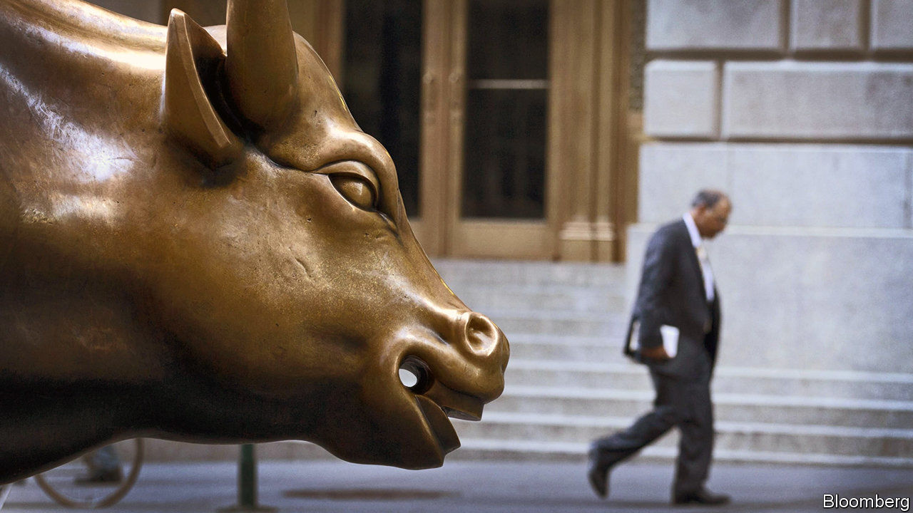
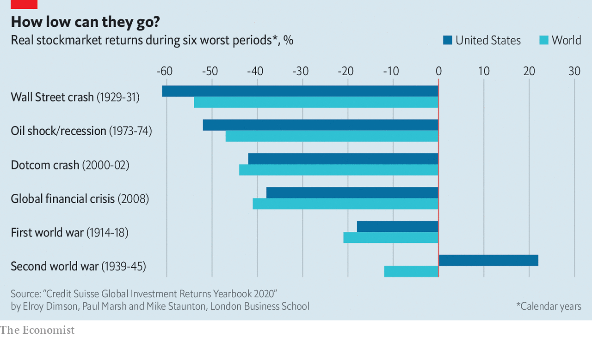

## The bear facts

# Entering a bear market

> Mar 14th 2020

IT MAY HAVE been lost amid the stockmarket panic but on March 9 America’s bull market turned 11 years old. Two days later, it was history. Concerns about the covid-19 epidemic have caused a rout in the Dow Jones Industrial Average, pushing it down more than 20% from its high on February 12th—a fall that fits the definition of a bear market. The worst sell-off in history began with the Wall Street crash of 1929. Two big bear markets have occurred this century. For this one to become truly grizzly will probably require a severe economic downturn, not just a temporary halt to growth.

## URL

https://www.economist.com/finance-and-economics/2020/03/14/entering-a-bear-market
