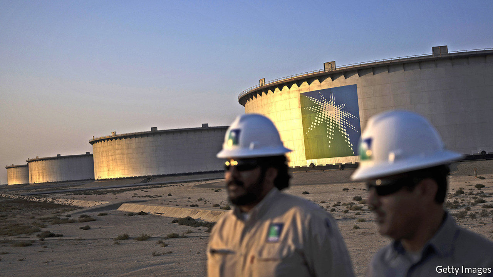
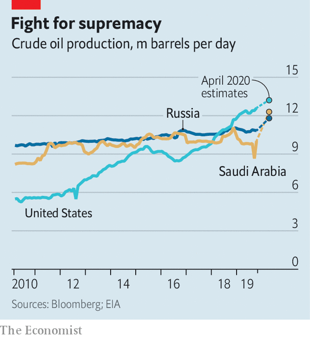

## Scorched earth

# No one is likely to win the oil-price war

> Saudi Arabia, Russia and America will all suffer

> Mar 12th 2020

SAUDI ARABIA and Russia are used to fighting their enemies via proxies. But the oil-price war that has broken out between them is head-on and has swiftly escalated. It started when Russia refused to slash production during a meeting with the Organisation of the Petroleum Exporting Countries in Vienna on March 6th. Saudi Arabia, OPEC’s de facto leader, hit back with discounts to buyers and a promise to pump more crude. Shortly thereafter it said it would provide customers with 12.3m barrels a day (b/d) in April, about 25% more than it supplied last month—and a level it has never before attained. Russia said it could raise output, too, adding up to 500,000 b/d to its 11.2m b/d. The price of Brent crude plunged by 24%, to $34 a barrel, on March 9th—its steepest one-day drop in nearly 30 years.

Amid turmoil in global markets unleashed by the plummeting oil price, and panic about its impact on the global economy, Saudi Arabia upped the ante again on March 11th, ordering Saudi Aramco, its state-owned oil giant, to raise national production capacity by a further 1m b/d. Is the kingdom merely strengthening its bargaining position to force Russia back to the table? Or is it waging a fierce price war to crowd out rivals that will instead ensure what analysts at Bernstein, an investment firm, call “mutually assured destruction”? The answer may determine how long the disruption will last.

The fallout caps a seismic decade for oilmen. Power has shifted between Saudi Arabia, Russia and America (see chart). In 2014 Saudi Arabia sought to check America’s ascendant shale industry by flooding the market with oil. The result was cataclysmic for all producers. Two years later OPEC restored its grip on output by forging an alliance with Russia and others.

In recent years, though, Russia has flouted the terms of its deals with OPEC. Its oil companies, led by Rosneft, have chafed at market share lost to American frackers. As troubling for Russia, America has become less shy about leaning on foreigners. In December it announced sanctions to delay Nord Stream 2, a Russian gas pipeline to Europe. In February America imposed sanctions to punish Rosneft for its dealings with Venezuela.

Russia’s partnership with OPEC has won it new influence in the Middle East, while Saudi Arabia has borne most of the burden of production cuts. The Saudis are getting tired of the role of swing producer. That position has become all the more invidious since January, when the outbreak of covid-19 in China, the world’s biggest oil importer, put downward pressure on prices.

The Saudi decision to open the spigots is nevertheless extremely rash. With the coronavirus raging, global appetite for oil may decline in 2020 for only the third time in more than 30 years. Increasing supply at a time of falling demand may send the price of Brent crude below $30 in the second quarter, estimates Citi, a bank.

The pain may be most acute for smaller, unstable countries dependent on oil revenue, such as Nigeria. Iraq’s government is already teetering—a collapsing oil price may topple it. The movement of forward contracts on Gulf currencies pegged to the dollar, such as Oman’s rial, suggest incipient concerns about the ability to sustain the pegs if dollar revenues from oil remain depressed for a long time.

America, too, will be hit hard. Cheap oil used to be a boon to America’s economy. That is no longer the case. In a viral outbreak, savings on petrol are unlikely to translate into more spending on other things, especially ones that involve crowds. Even if it did, any boost to the economy from consumers would be outweighed by damage to shale states such as Texas and North Dakota. Breakeven prices—those oil producers need to turn a profit—in America’s shale basins range from $23 to $75 a barrel, according to the Dallas Federal Reserve. Production cuts and lay-offs are likely.

Making matters worse, shale firms were suffering even before the latest sell-off, as investors questioned their capacity for sustained profits. Capital markets have all but closed to the industry. It will not collapse; many shale firms are hedged against falling prices this year. Those on their knees may well be taken over by bigger competitors. Analysts say larger rivals such as ExxonMobil have the balance-sheets to cope with cheap oil.

Russia may fail in its attempt to kill off America’s shale industry. Moreover, weak oil prices will hurt its economy. But unlike Saudi Arabia, whose currency is pegged to the dollar, the rouble floats. When oil prices fall, the currency does, too, lowering production costs. On March 10th Russia’s finance ministry said that the country had enough foreign-currency reserves to withstand a decade of prices hovering between $25 and $30. It seems in no hurry to go back to negotiations with OPEC.

With some of the world’s cheapest oil, Saudi Arabia may be able to pile more pressure on the Russians. Aramco has more than 50 years of reserves, and costs per barrel of less than $9, according to Rystad Energy, a data firm, compared with $15 for Russia. Still, Saudi Arabia may struggle to maintain production—even 12.3m b/d will require tapping its vast inventories.

Moreover, the kingdom’s budget requires an oil price of more than $80, estimates the IMF. Goldman Sachs, a bank, reckons that if it increases output and oil prices recover, its finances will weather temporary pain. But if the virus persists and demand keeps plunging, the damage may be more lasting. It is a price war that no one looks likely to win. ■

## URL

https://www.economist.com/finance-and-economics/2020/03/12/no-one-is-likely-to-win-the-oil-price-war
