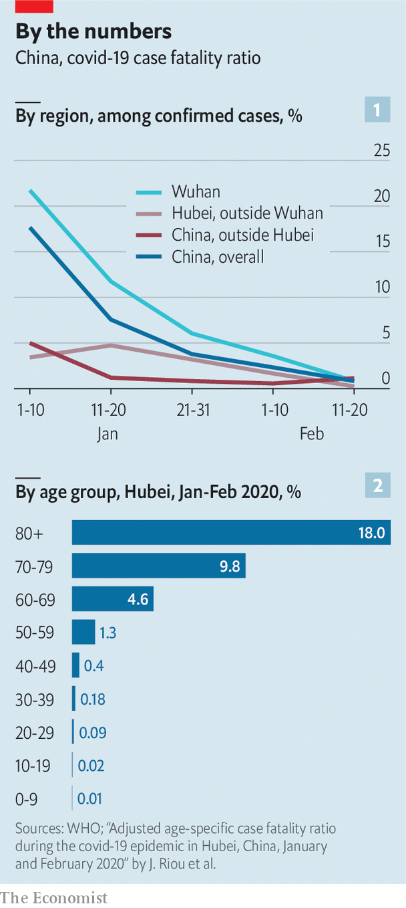

## Where will it be worst?

# Fatality rates for covid-19 could vary enormously

> It is too soon to know how many will die from covid-19

> Mar 12th 2020

Editor’s note: The Economist is making some of its most important coverage of the covid-19 pandemic freely available to readers of The Economist Today, our daily newsletter. To receive it, register [here](https://www.economist.com//newslettersignup). For more coverage, see our coronavirus [hub](https://www.economist.com//coronavirus)

AS THE NUMBER of deaths among people infected by the new coronavirus mounts, it is tempting to divide that figure by the number of reported cases and conclude that the result is the fatality rate. Apply such maths to the world’s total of confirmed cases and deaths on March 11th and you get a fatality rate of 3.6%. But this figure, which epidemiologists call the “naive” case fatality rate, may be wrong in two different ways. First, many of the infections detected at this early stage of the epidemic are recent, so some will eventually result in deaths. That will push the fatality rate up. Second, many infections have not been spotted because testing for the virus has been patchy. Lots of mild cases of the disease have gone unnoticed. If all infections were actually counted, the result would be a bigger denominator. That would push the fatality rate down. As China began to trace infections more carefully, its fatality rate fell (see chart 1).

A conclusive measure of the denominator requires testing for antibodies against the virus in a large sample of people in a place which an outbreak has already swept through. Such studies are under way in China. In the meantime, researchers have estimated the fatality rate for covid-19 using a cohort of people for whom there is a full count of infections and deaths: passengers on the Diamond Princess cruise ship. A bungled quarantine on board led to nearly 700 cases of covid-19. Eight people have died so far. A working paper published on March 5th by Timothy Russell at the London School of Hygiene and Tropical Medicine and an international team of researchers estimates that the fatality rate among infected passengers will end up being 1.2%.

The researchers applied the results from the ship to data on covid-19 cases and deaths in China. They conclude that the fatality rate for covid-19 in the country’s outbreak was 0.5%. For comparison, that is five times the fatality rate for the seasonal flu in America.

The covid-19 fatality rate among those on the Diamond Princess was higher partly because their average age was 58, older than the general population in any country. At the same time, they are probably in fairly good shape. They must be healthy enough to embark on an extended holiday. People who go on cruises tend to be richer. So the fatality rate among these passengers may be lower than it would be among people of a similar age in their home countries.

A recent study by researchers at the University of Bern, in Switzerland, sheds more light. It provides estimates of covid-19 fatality by age group in Hubei, the province in China with the worst outbreak of the disease (see chart 2). Fatality is dramatically higher among people older than 60, rising to 18% among those in their 80s or older.

But covid-19 may prove no less devastating for poor countries, which tend to have younger populations. The disease is more severe in people whose immune systems are weakened by chronic diseases, so those who are malnourished or have HIV/AIDS will probably be hit hard.

The fatality rate in any country will depend primarily on the quality of care it can provide—and how many people have access to it. About 5% of people diagnosed with covid-19 in China have needed intensive care, which is in short supply or non-existent in most hospitals in developing countries. A surge in cases even in rich countries can soon overwhelm hospitals and result in higher fatality rates. ■

Dig deeper:

Dig deeper:For our latest coverage of the covid-19 pandemic, register for The Economist Today, our daily [newsletter](https://www.economist.com//newslettersignup), or visit our [coronavirus hub](https://www.economist.com//coronavirus)

## URL

https://www.economist.com/international/2020/03/12/fatality-rates-for-covid-19-could-vary-enormously
