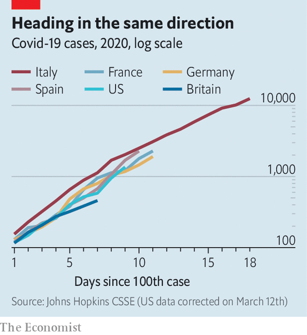
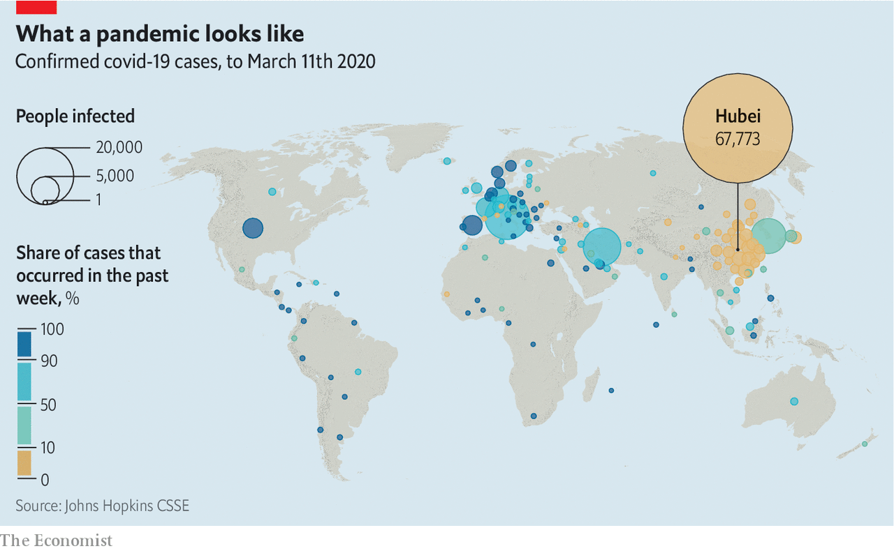
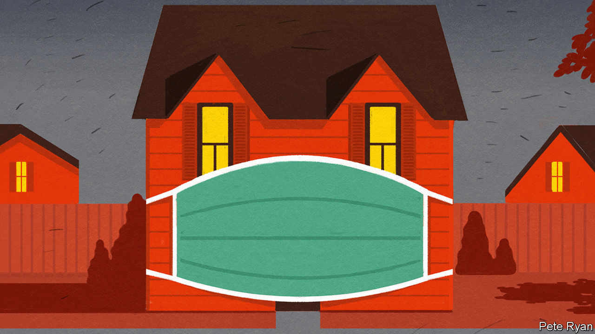

## All’italiana

# Should other countries copy Italy’s nationwide lockdown?

> The government’s response to covid-19 is unprecedented in modern-day Europe

> Mar 12th 2020ROME AND SEOUL

GIOVAMBATTISTA PRESTI, a psychologist at the Kore University of Enna in Sicily, is an adviser to the Policlinico, Milan’s oldest hospital, which is at the centre of Italy’s covid-19 epidemic. Of great concern now, says Mr Presti, is staff burnout. He is particularly worried about post-traumatic stress disorder among some medics. If hospitals reach the point at which they no longer have the capacity to treat every patient, some of them “will be forced to decide who should go into intensive care and who should be left to die”.

Similar accounts are emerging elsewhere. Daniele Macchini is a doctor at the Humanitas Gavazzeni hospital in nearby Bergamo. It has been overwhelmed by covid-19 patients. “Cases are multiplying. We are getting 15-20 admissions a day,” he wrote on Facebook. “The results of the swabs come in one after another: positive, positive, positive. All of a sudden, accident and emergency is collapsing.” Nurses, he added, have been reduced to tears “because we cannot save everyone”.

These reports are coming out of Lombardy, a wealthy region whose health service is judged to be among the best in a country that last year came second in Europe in a health-care efficiency ranking by Bloomberg. On March 10th Antonio Pesenti, the intensive-care co-ordinator for Lombardy’s crisis unit, told journalists that the region’s health system was “one step from collapse”.

Italy’s epidemic, which is still concentrated in Lombardy, spread rapidly. On February 25th the country’s health authorities had detected 322 cases of covid-19. Two weeks later that number had passed 10,000. Deaths have risen even more steeply as the virus, which is disproportionally lethal to the elderly, has attacked Europe’s oldest population. By March 11th, more than 800 of those infected had died.

The crisis in Italy is sending shivers down spines in Europe and America. In many countries the number of cases being detected is rising on a trajectory that will soon bring them to the point at which Italy currently finds itself (see chart). Governments elsewhere are watching to see whether Italy’s efforts slow its epidemic, spreading infections out over time and giving its hospitals some breathing room.

On March 8th the Italian government imposed nationwide curbs on large gatherings. Big weddings and funerals were banned; museums, cinemas and theatres were closed. Nationwide travel restrictions followed a day later. Italians are not allowed to leave—or travel within—the cities and towns where they live, except for work or emergencies. Restaurants, bars and all shops except foodstores and pharmacies were told to close entirely from March 12th. Europe has not seen controls on this scale since the second world war.

Other European countries have, for the moment, opted for less restrictive measures. Like Italy, several countries including France, Spain and Greece have closed schools and universities. Some have banned big public gatherings. In America variations on these themes are being imposed at county or state level. A growing number of universities, including Harvard and Princeton, are switching to remote teaching or simply sending their students home. But if these limitations fail to slow rapidly and substantially the rate at which infections are increasing, Italy may become a role model.

Italy’s national lockdown was prompted by its apparent success using comparable measures on a regional level. The government tested similar restrictions in two “red zones” around a handful of small towns in the northern part of the country where, in late February, it found its first big clusters of covid-19 cases. On March 8th Silvio Brusaferro, the president of Italy’s national public health institute, said the number of new infections in both areas was falling.

But that is no guarantee the national quarantine will lead to similar results. The efficacy of the shutdown depends on two things: the extent to which people comply with the rules; and the length of time the rules can be left in place, given their vast social and economic costs. For those watching Italy, the crucial question is whether they need to go to similar lengths, or whether a more modest set of restrictions will slow the epidemic.

Italy is following the example set by China, which got a raging covid-19 epidemic in Hubei province under control and prevented outbreaks elsewhere by imposing stringent mass quarantines. Millions have been mostly stuck inside for weeks. In some cities, such as Wuhan, where the outbreak began, people have been prevented from leaving their homes for more than a month. The lockdown has been strictly enforced by neighbourhood committees and building managers, though restrictions are now being loosened as China’s new cases have dwindled. In Italy, by contrast, the implementation of the travel restrictions depends on the public’s co-operation. Authorities and doctors are imploring people to stay at home. But at checkpoints drivers need only show a self-certified form stating their reasons for travelling.

So far Italians seem to be adhering to the new rules. There have been exceptions. A hospital porter who tested positive for the virus and should have been in self-quarantine was found shopping in a supermarket at Sciacca in Sicily. He risks being charged with spreading an epidemic, which carries a maximum penalty of 12 years in jail. People were still gathering in bars and clubs—in at least one case, to watch a football match—before the strictest measures came into effect. But in Caserta near Naples, where a handful of infractions were reported on the first full day of police checks, a senior officer said: “Members of the public are starting to be aware that it’s in the interests of their health to keep their movements to a minimum.”

The extent to which people continue to comply with demands that they keep their distance from friends, colleagues and the general public depends in large part on how long they are required to do so. Social-distancing measures work best when they are put in place early, before an epidemic takes off, says Elias Mossialos from the London School of Economics. In China cities that imposed restrictions on mass gatherings and transport before identifying their first covid-19 case had fewer infections in the first week after that milestone than places that acted later.

In Britain, however, the government is worried about introducing such restrictions too soon. The country, which is at an earlier stage of its covid-19 outbreak than many others, has not yet banned mass gatherings, nor has it closed schools or instructed people to work from home. The scientists advising the government are concerned that if such measures come now, compliance fatigue may set in just as the epidemic is taking off. But tougher restrictions are almost certainly on the way. Sometime in the next two weeks everyone with symptoms of a cold will be asked to stay at home for seven days because at that point many such cases will be assumed to be covid-19 infections.

The experience of South Korea, which has seen one of the largest outbreaks of covid-19, suggests that scientists in Britain may be right to worry. Outside the city of Daegu, where most of the country’s covid-19 cases have been identified, the government has not introduced any mandatory restrictions—hoping instead that people will voluntarily follow advice to stay at home and to take precautions during gatherings that they cannot avoid. In Gyeonggi province, which surrounds Seoul, mourners at funerals have been told to co-operate with temperature checks before writing their names in visitors’ books. They have also been ordered to minimise contact and conversation with others in attendance (including relatives of the deceased). Across the country guests attending weddings must wear masks—as must the happy couples, prompting many to postpone their nuptials.

Restaurants and bars in Seoul were noticeably quieter for a few days during the peak of the government’s official social-distancing campaign, which began in the capital on March 2nd. But that has changed in recent days. Seoul’s popular nightspots are once again seeing long queues forming. Trains are filling up and people are getting laxer about wearing masks. The shift is probably the result of officials saying that, based on a steep fall in new cases in recent days, they hope that the country has passed the peak of its epidemic.

But on March 11th a new cluster of infections was discovered in a call centre in an office building in Seoul that sits next to one of the city’s busiest subway interchanges. The outbreak may prompt people to stay at home once again. And the government may start enforcing its rules more strictly if the voluntary approach proves inadequate. On March 11th Park Won-soon, the mayor of Seoul, said that he may consider forcing call centres to shut down if they do not follow recommendations to keep their employees at a distance from each other.

As countries employ varying intensities of measures to battle their covid-19 epidemics, it should become clearer which work best—and whether the most drastic are the most effective. Gabriel Leung, an epidemiologist from Hong Kong University who was part of a World Health Organisation team that examined China’s efforts to contain its epidemic, says nobody knows yet what combination of controls works best against covid-19. “Do you need to do everything that the Chinese have done to control it?” he says, or is it enough to copy only certain elements. “That”, says Mr Leung, “is really the big question.” ■

Dig deeper:

## URL

https://www.economist.com/international/2020/03/12/should-other-countries-copy-italys-nationwide-lockdown
