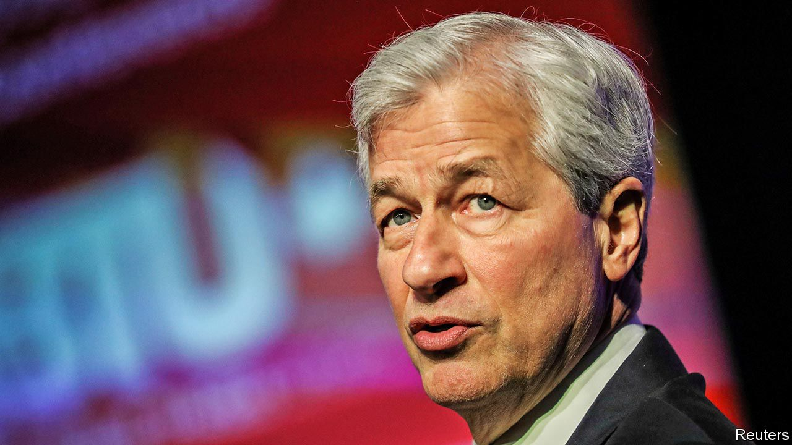

## Mission accomplished

# Should Jamie Dimon, Wall Street’s most celebrated boss, call it a day?

> A health scare puts succession in the spotlight

> Mar 12th 2020

WHEN JAMIE DIMON took the reins at JPMorgan Chase in 2005 he had, at the relatively tender age of 49, already earned himself a reputation. In the 1990s he was the wunderkind sidekick to the imperial Sandy Weill, then boss of Citigroup, the world’s pre-eminent bank. Still, while some peers described Mr Dimon as brilliant, charismatic, caring and dedicated, others complained he was abrasive, foul-mouthed and unpredictable. Plenty doubted he was well suited to such a large stage.

As we explain this week (see [article](https://www.economist.com//briefing/2020/03/12/is-dimons-work-done-at-jpmorgan-chase)), Mr Dimon has put paid to these doubters. JPMorgan weathered the financial crisis well and has since become the bank that all the others want to emulate. It is big, globally active, dominant in retail and investment banking, transparent, well capitalised and admirably profitable. Last year its return on equity was a handsome 15%. Its annual profits are now double the entire current market value of Deutsche Bank, once Europe’s pretender to the global investment-banking throne.

However, another big question has remained unanswered: when Mr Dimon should leave and who will run the bank after he is gone. It has been cast in sharp relief by the recent news that Mr Dimon has undergone emergency surgery for an “aortic dissection”, a rare heart condition. The bank says he is recovering well. But investors, the board, staff and regulators have had a reminder that one day JPMorgan will have to have a different leader.

Wall Street’s biggest succession decision is tricky for several reasons. JPMorgan could benchmark itself against other banks: in 2018 the head of Goldman Sachs retired and a flurry of European banks have waved goodbye to their leaders in the past few months. But in all these cases the firms were performing below their potential. Aged 63, Mr Dimon is no geriatric—77 CEOs who are older than him are serving at firms in the S&P 500 index of America’s biggest companies. The most seasoned, Warren Buffett, is still, inadvisedly, clinging on at the age of 89.

Mr Dimon has served for longer than the typical American CEO, who lasts about a decade. Bob Iger, the boss of Disney, has just stood down after 15 years at the top. But tenure is not, in and of itself, a disqualification. There are 66 S&P 500 CEOs who have been in place longer than Mr Dimon. Reed Hastings has run Netflix for over two decades and few reckon he should press stop.

So how to make a decision? Two tests matter. The first is that Mr Dimon is not blocking the path of an entire generation of successors who might end up leaving or becoming disillusioned. Inevitably, one cohort has already departed. A JPMorgan diaspora now run financial firms all over the world, including Wells Fargo, Barclays and Standard Chartered. It would be a mistake to let another generation go, too. Mr Dimon has two co-presidents directly beneath him who are both aged about 60. Beneath them is a broader group of half-a-dozen potential successors, most of whom are in their 50s and still being battle-hardened.

The second test is the likely time horizon of the strategic threats and opportunities that the bank faces. These mainly arise from technology—the prospect that big tech firms might challenge the big banks, or that new payments firms win huge customer bases independently of the banks, as they already have in China, or that new digital currencies take the world by storm. These trends will play out over a decade or more—and no one, not even Mr Dimon, thinks that he will stay that long.

Both tests suggest that Mr Dimon should leave the stage sooner rather than later. A good option would be for him to do so at the end of next year. By then the next generation of executives will have acquired the experience necessary to run the Western world’s biggest bank at a time of technological tumult, while not being so frustrated that they quit. Even if JPMorgan and Mr Dimon follow this advice, they and the shareholders should reflect on another succession. March 2nd saw the death of Jack Welch, the former chief executive of General Electric (GE), and perhaps the most celebrated American boss of recent decades. He retired from GE in 2001 on a high, but the firm soon slipped into brutal decline, reflecting in part long-standing problems that became clear only once he had left. The best bosses face up to the reality that at some point someone else has to be in charge. But even then their legacy can only be assessed years after they have thanked their team, shed a tear and walked out the door with their head held high.■