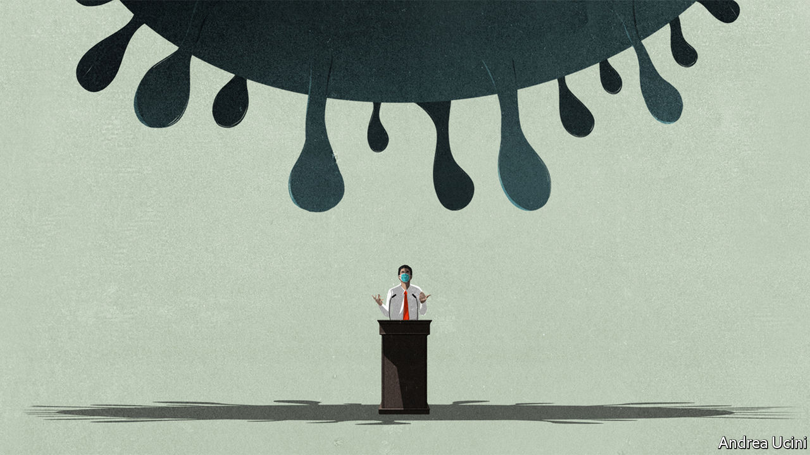

## Covid-19

# The politics of pandemics

> All governments will struggle. Some will struggle more than others

> Mar 12th 2020

TO SEE WHAT is to come look to Lombardy, the affluent Italian region at the heart of the covid-19 outbreak in Europe. Its hospitals provide world-class health care. Until last week they thought they would cope with the disease—then waves of people began turning up with pneumonia. Having run out of ventilators and oxygen, exhausted staff at some hospitals are being forced to leave untreated patients to die.

The pandemic, as the World Health Organisation (WHO) officially declared it this week, is spreading fast, with almost 45,000 cases and nearly 1,500 deaths in 112 countries outside China. Epidemiologists reckon Italy is one or two weeks ahead of places like Spain, France, America and Britain. Less-connected countries, such as Egypt and India, are further behind, but not much. (For more coverage of covid-19 see our [coronavirus hub](https://www.economist.com//news/2020/03/11/the-economists-coverage-of-the-coronavirus).)

Few of today’s political leaders have ever faced anything like a pandemic and its economic fallout—though some are evoking the financial crisis of 2007-09 (see [article](https://www.economist.com//leaders/2020/03/12/how-to-deal-with-a-new-sort-of-financial-shock)). As they belatedly realise that health systems will buckle and deaths mount, leaders are at last coming to terms with the fact that they will have to weather the storm. Three factors will determine how they cope: their attitude to uncertainty; the structure and competence of their health systems; and, above all, whether they are trusted.

The uncertainty has many sources. One is that SARS-CoV-2 and the disease it causes, covid-19, are not fully understood (see [article](https://www.economist.com//briefing/2020/03/12/understanding-sars-cov-2-and-the-drugs-that-might-lessen-its-power)). Another is over the status of the pandemic. In each region or country it tends to proliferate rapidly undetected. By the time testing detects cases in one place it will be spreading in many others, as it was in Italy, Iran and South Korea. By the time governments shut schools and ban crowds they may be too late.

China’s solution, endorsed by the WHO, was to impose a brutal quarantine, bolstered by mass-testing and contact tracing. That came at a high human and economic cost, but new infections have dwindled. This week, in a victory lap, President Xi Jinping visited Wuhan, where the pandemic first emerged (see [article](https://www.economist.com//china/2020/03/12/china-appears-confident-that-its-coronavirus-epidemic-has-abated)). Yet uncertainty persists even in China, because nobody knows if a second wave of infections will rise up as the quarantine eases.

In democracies leaders have to judge if people will tolerate China’s harsh regime of isolation and surveillance. Italy’s lockdown is largely self-policed and does not heavily infringe people’s rights. But if it proves leakier than China’s, it may be almost as expensive and a lot less effective (see [article](https://www.economist.com//international/2020/03/12/should-other-countries-copy-italys-nationwide-lockdown)).

Efficacy also depends on the structure and competence of health-care systems. There is immense scope for mixed messages and inconsistent instructions about testing and when to stay isolated at home. Every health system will be overwhelmed. Places where people receive very little health care, including refugee camps and slums, will be the most vulnerable. But even the best-resourced hospitals in rich countries will struggle.

Universal systems like Britain’s National Health Service should find it easier to mobilise resources and adapt rules and practices than fragmented, private ones that have to worry about who pays whom and who is liable for what (see [article](https://www.economist.com//britain/2020/03/12/britains-nhs-is-well-suited-to-dealing-with-crises)). The United States, despite its wealth and the excellence of its medical science, faces hurdles. Its private system is optimised for fee-paying treatments. America’s 28m uninsured people, 11m illegal immigrants and an unknown number without sick pay all have reasons to avoid testing or isolation. Red tape and cuts have fatally delayed adequate testing (see [article](https://www.economist.com//united-states/2020/03/12/covid-19-is-spreading-rapidly-in-america-the-country-does-not-look-ready)).

Uncertainty will be a drag on the third factor—trust. Trust gives leaders licence to take difficult decisions about quarantines and social-distancing, including school closures. In Iran the government, which has long been unpopular, is widely suspected of covering up deaths and cases. That is one reason rebellious clerics could refuse to shut shrines, even though they spread infection (see [article](https://www.economist.com//middle-east-and-africa/2020/03/12/iran-has-let-its-covid-19-outbreak-get-out-of-hand)).

Nothing stokes rumour and fear more than the suspicion that politicians are hiding the truth. When they downplay the threat in a misguided attempt to avoid panic, they end up sowing confusion and costing lives. Yet leaders have struggled to come to terms with the pandemic and how to talk about it. President Donald Trump, in particular, has veered from unfounded optimism to attacking his foes. This week he announced a 30-day ban on most travel from Europe that will do little to slow a disease which is already circulating in America. As people witness the death of friends and relatives, he will find that the pandemic cannot be palmed off as a conspiracy by foreigners, Democrats and CNN.

What should politicians do? Each country must strike its own balance between the benefits of tracking the disease and the invasion of privacy, but South Korea and China show the power of big data and mass-testing as a way of identifying cases and limiting their spread. Governments also need to anticipate the pandemic, because actions to slow its spread, such as banning crowds, are more effective if they are early.

The best example of how to respond is Singapore, which has had many fewer cases than expected. Thanks to an efficient bureaucracy in a single small territory, world-class universal health care and the well-learned lesson of SARS, an epidemic of a related virus in 2003, Singapore acted early. It has been able to make difficult trade-offs with public consent because its message has been consistent, science-based and trusted.

In the West covid-19 is a challenge to the generation of politicians who have taken power since the financial crisis. Many of them decry globalisation and experts. They thrive on division and conflict. In some ways the pandemic will play to their agenda. Countries may follow America and turn inward and close their borders. In so far as shortages crimp the world economy, industries may pull back from globalisation—though they would gain more protection by diversifying their supply chains.

Yet the pandemic also puts doctors, scientists and policy experts once again at the heart of government. Pandemics are quintessentially global affairs. Countries need to work together on treatment protocols, therapeutics and, it is hoped, a vaccine. Worried voters may well have less of an appetite for the theatrical wrestling match of partisan politics. They need their governments to deal with the real problems they are facing—which is what politics should have been about all along. ■

Dig deeper:

## URL

https://www.economist.com/leaders/2020/03/12/the-politics-of-pandemics
