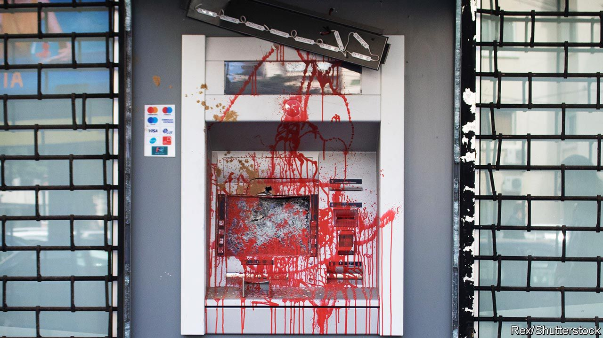
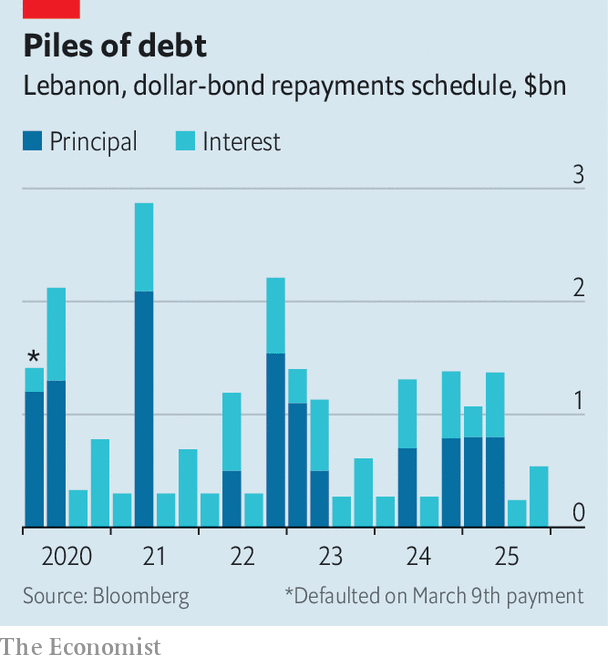

## Resilient no more

# For the first time, Lebanon defaults on its debts

> Restructuring will be a struggle. Fixing the country’s rentier economy will be even harder

> Mar 12th 2020BEIRUT

A  CURRENCY CRISIS has done what years of sectarian bloodletting could not. On March 9th Lebanon did not repay a $1.2bn Eurobond, the first sovereign default in the country’s history. Even during the darkest days of its civil war in the 1980s, the state met its obligations. But Lebanon must now choose between honouring its debts and providing the most basic services to its citizens. “How can we pay the creditors while there are people in the streets without the money to buy a loaf of bread?” said Hassan Diab, the prime minister.

Lebanon has spent months slipping towards an economic abyss. Its currency, the pound, is officially pegged to the dollar, but has lost more than 40% of its value on the black market. Banks are imposing ever-stricter capital controls because they lack the hard currency to repay depositors. Big protests in October, against the corruption and incompetence that led Lebanon to crisis, brought down the previous government. Mr Diab, an academic, inherited a mess when he took over in January. Many Lebanese support his decision to default. But it is only a first step—and it is not clear that his government has a plan.

Start with restructuring. About two-thirds of government debt (which, in total, is more than 150% of GDP) is held by local banks. They argued for months against a default, because they fear even a modest haircut would wreck their balance-sheets. As default grew more likely, the banks dumped some of their holdings to outside investors that were willing to gamble. Officials believe foreigners now hold more than 25% of some bond issues—enough to block any restructuring deal.

The problems do not end there. For years the central bank, the Banque du Liban (BdL), borrowed dollars from commercial banks to sustain the currency peg and cover big fiscal and current-account deficits (in 2018 they were 11% and 26% of GDP, respectively). In return, the banks received above-market interest rates on what seemed like a risk-free investment.

But this state-sanctioned pyramid scheme no longer has enough new money to sustain itself. Bank deposits, which grew at a healthy clip for years, levelled off in 2018 and have started to decline. Commercial banks had 247trn pounds ($160bn, at the official rate) in deposits in December, an 8% drop from a year earlier. The central bank does not have enough dollars to repay what it owes. At the end of January it had a healthy $37bn in gross foreign-currency reserves—but an eye-watering $52.5bn in liabilities, mostly owed to local banks, estimates Fitch, a ratings firm.

Lebanon may thus have to negotiate a deal not only on its bonds, but also on deposits held by the BdL. If the central bank defaulted on deposits, it would be a death blow to the financial sector, which has 55% of its assets tied up there. A haircut of just 18% would leave commercial banks insolvent and require a recapitalisation worth at least 25% of GDP, estimates IHS Markit, a research firm.

The dollar shortage has sent the pound into a spiral. On March 6th the central bank told money-changers not to buy dollars for more than 30% above the official rate. But supply and demand dictate that the edict will merely create a new black market.

Money has become a daily fixation for many Lebanese. ATMs no longer spit out dollars. To obtain them, customers trudge to the bank each week, often queuing for hours, to withdraw whatever pittance their branch allows, sometimes just $50 a week. Paying with plastic is also fraught—some businesses have stopped accepting cards.

Banks still honour cheques, which has led to an odd boomlet in luxury goods as clients snap up tangible assets. Khoury Home, a household-goods store, advertises new washing machines as a way to “survive the haircut”. But cheques simply move inaccessible money from one account to another. Sellers have begun to demand at least partial payment in cash.

On February 15th the national carrier, Middle East Airlines, announced that it would stop accepting Lebanese pounds the next day. The decision, later reversed, was striking, because the airline is majority-owned by the BdL. Such is the state of Lebanon’s economy: a firm controlled by the central bank no longer wants to accept the currency issued by the central bank.

With money scarce, the economy is frozen. Even before the crisis, unemployment was thought to be as high as 25%. Perhaps 40% of Lebanese are now poor, and the number could soon rise to 50%, according to the World Bank.

No one is lining up to help Lebanon: neither its Western partners nor the Gulf states that have bailed it out in the past. It will probably have no choice but to seek an IMF loan. The fund will insist on painful reforms. There is already talk of raising the value-added tax and fuel prices. Lebanon will also have to find a new economic model. Mr Diab rightly points out that it is a rentier state, too reliant on finance and inflows from a sprawling diaspora. “We don’t need a banking sector four times the size of our economy,” he said. Last year Lebanon exported just $3.7bn-worth of goods.

Though it will never be an industrial powerhouse, businessmen point to opportunities for growth. With an educated, multilingual workforce, Lebanon could be a hub for tech companies and high-end manufacturing. Agriculture has room to grow. So does tourism, which already contributes 19% of GDP. All these, however, need big investment in new infrastructure. Electricity is spotty, internet speeds are glacial and roads are clogged. The country’s natural beauty has been spoiled by heedless development. But the coffers are bare. Restructuring the debt will be easier than restructuring a country blighted by decades of bad government. ■

## URL

https://www.economist.com/middle-east-and-africa/2020/03/12/for-the-first-time-lebanon-defaults-on-its-debts
