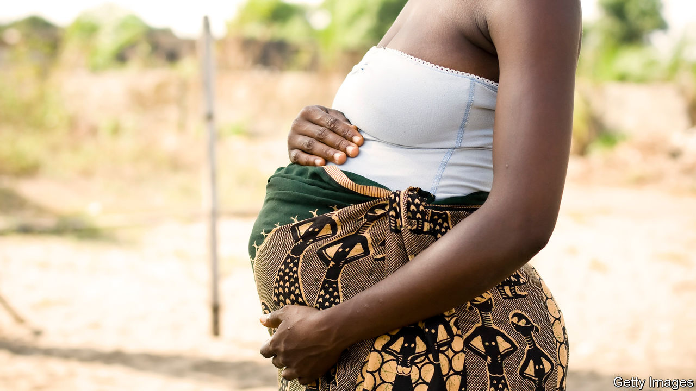

## A Tanzanian trilemma

# Should the World Bank fund schools that expel pregnant girls?

> Bankrolling bigotry is bad. So is cutting aid to the needy

> Mar 14th 2020DAR ES SALAAM

TANZANIA’S PRESIDENT, John Magufuli, has little sense of irony. He marked International Women’s Day by tweeting that his government wants to help women “fulfil [their] responsibilities effectively”. Those responsibilities evidently do not require an education: his government expels girls from school if they become pregnant. Mr Magufuli sounds less than empathetic when discussing the matter. “After calculating some few mathematics, she’d be asking the teacher in the classroom: ‘Let me go out and breastfeed my crying baby’,” he once complained.

Aghast, the World Bank withheld a $300m loan in 2018 that was intended to fund secondary education. After some toing and froing, Mr Magufuli promised to expand a programme to teach young mothers. The bank once again offered a loan, this time of $500m.

Many people think it was wrong to do so. One pundit dubbed the new deal “separate but equal”, in a nod to the era when schools for blacks and whites were segregated in America. The analogy holds. There are not always enough places for young mothers in Tanzania’s parallel schooling programme, which, moreover, teaches an outdated curriculum and is staffed by ill-prepared teachers.

Under pressure from Tanzanian campaigners, the World Bank again delayed issuing the loan in January. Yet the controversy also illustrates a quandary often faced by donors trying to help poor people ruled by unpleasant governments.

Some activists argue that the bank should simply withdraw the loan. But that would mean hobbling the education of about 6.5m children in an attempt to protect a much smaller number. (Some 5,500 pregnant girls were expelled in 2017.)

A second option would be for it to offer the loan with strings attached. But such “conditionality” is often ineffective, in part because donors fail to enforce it, notes Haley Swedlund of the Centre for International Conflict Analysis and Management at Radboud University in the Netherlands. “The incentive is always to disburse,” she says. Aid programmes take time and effort, and next year’s budget allocation often depends on whether this year’s was used. So donors often push the money out of the door regardless of whether conditions are met. Some worry that if they press too hard, recipients will just walk away.

Then there is the problem of fungibility. Aid for schools does not automatically raise spending on schools. The government may react by diverting the money it was going to spend on schools to another purpose, such as weapons or presidential palaces. Even attempts to fund worthwhile projects can facilitate repugnant ones.

The availability of Chinese financing further complicates things. Mr Magufuli says he prefers Chinese aid because it comes with fewer conditions. This is not quite true. Chinese loans often have higher interest rates and must be spent with Chinese firms. However, China never fusses about human rights—and this forces other lenders to adjust. One study found that the World Bank offered loans with fewer conditions to African countries if they were also assisted by China.

A third option is for donors simply to give money without any strings. But this is unpopular with taxpayers in donor countries, who do not like their cash being spent on things they find appalling.

Many aid programmes face similar quandaries, and there is no easy answer. In this case, though, the World Bank could be firmer. It is the only consistent funder of secondary schooling in Tanzania, and standing up to Mr Magufuli has worked before. Last year, after being criticised by donors, Tanzania amended a law that made it a crime to dispute official statistics. Another firm nudge might get him to let teenage mothers back into school.■