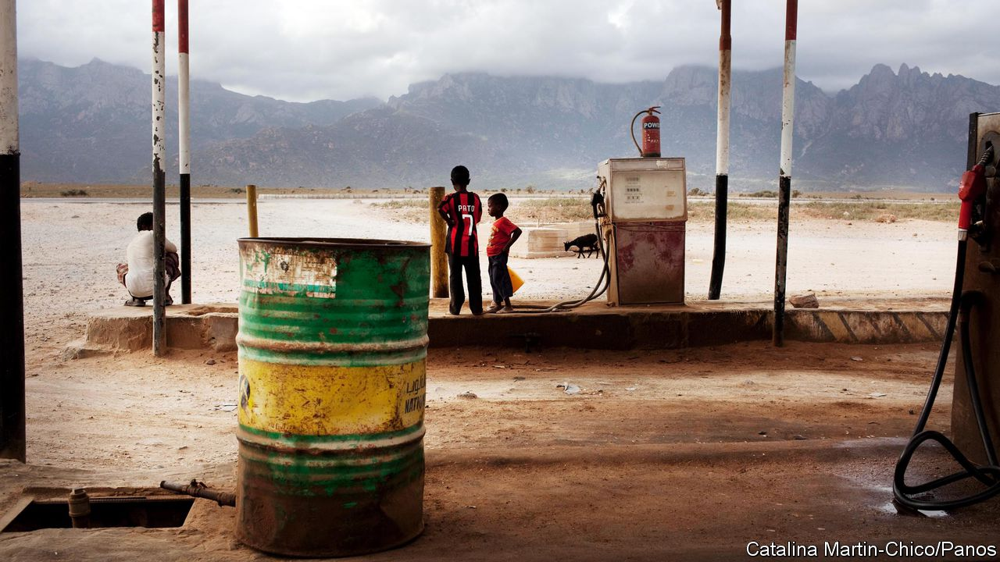

## The big squeeze

# The low price of oil will test governments in the Middle East and Africa

> With less cash to bribe the people, some strongmen will resort to repression

> Mar 12th 2020ABU DHABI

“IN THE HISTORY of any nation there are special moments and seminal events,” said President Uhuru Kenyatta in August. He was celebrating Kenya’s entry to the club of oil producers with a symbolic shipment of 200,000 barrels. “The first export of crude oil by our nation...marks a special moment in our history,” he declared.

Politicians love oil. Selling it generates easy money for governments; much easier than taxing citizens, who might then demand services, democracy and good governance. Petrodollars also lubricate patronage networks. They can be used to buy votes, silence rivals or, if that fails, fund a comfortable retirement abroad.

So when the price of oil fell by about 30% on March 9th, to below $32 a barrel (see [article](https://www.economist.com//finance-and-economics/2020/03/12/no-one-is-likely-to-win-the-oil-price-war)), many politicians were aghast. Oil prices crashed because covid-19 cut global demand and Saudi Arabia opened its taps to crush high-cost producers. The consequences for other oil-pumping nations will be economic pain and hard choices. The pain will be felt in broad swathes of the Middle East and Africa.

A rehearsal took place in 2014, when oil prices fell by more than half. This time will be tougher, since countries burned through many of their cash reserves during that crash. The most immediate impact will be on government budgets.

Start in Nigeria, where oil accounts for roughly 90% of exports and two-thirds of government revenue. The finance minister has already called for a review of the budget, which was based on an oil price of $57 a barrel. Yet austerity will prove difficult in an economy so lethargic that it is barely keeping pace with population growth. There is little space for borrowing: 65% of government revenues go to servicing existing debt. Nonso Obikili, a Nigerian economist, assumes that the government will simply print money to pay civil servants, which would stoke inflation.

The price war will make a mess of public finances in parts of the Gulf, too. Oman’s 2020 budget predicted a deficit of 8% of GDP even with oil at $58 a barrel. Prices at $30 would send the deficit as high as 22%. Bahrain, a middling producer that nonetheless relies on oil for around 75% of public revenue, had hoped to balance its budget by 2022. Both will probably have to cut spending and borrow money. Their debt loads have soared since 2014, when years of $100-a-barrel oil came to an end. Oman now owes more than 60% of GDP, up from 5% in 2014, while Bahrain’s debt load jumped from 44% to 105%.

Wealthier countries can muddle through for years. Saudi Arabia had budgeted for a $50bn deficit in 2020. Goldman Sachs, a bank, thinks it could now surpass $80bn; other economists put the hole at $100bn. But the kingdom has about $500bn in the central bank, and it can borrow cheaply, with ten-year bonds trading at yields of less than 4%. Saudi debt is 24% of GDP, low by global standards. However, it is a marked increase from 2014, when the kingdom owed less than 2% of GDP.

Much of this debt is unproductive: Gulf states are borrowing to sustain current, bloated levels of spending. The new sultan of Oman, Haitham, who took power in January after his cousin’s death, would like to dole out largesse. Dubai, part of the United Arab Emirates (UAE), has an expansionary budget meant to kick-start a weak economy. Some of this will have to be scaled back. Expats in Dubai are already being hit by lay-offs and salary cuts. Contractors in Saudi Arabia worry that the government will start delaying payments, as it did during the last oil-price slump.

Low oil prices will be even more painful in Iraq, which relies on the black stuff for 90% of government revenue. The country is gripped by political paralysis. Months of protests brought down the government in October, and the prime minister-designate, Muhammad Tawfiq Allawi, failed to form a new one. His predecessor raised public spending by 45% last year and doubled the deficit. Almost half its spending is on public-sector wages and pensions; with oil cheap, the state cannot make payroll.

In the long term, a sustained fall in the price of oil may not be a bad thing for states in the Middle East and Africa if it pushes them to diversify. Though oil makes up a huge proportion of exports and government revenue in countries such as Angola and Nigeria, neither is a big producer when measured per person. Nigeria needs to “get out of oil dependency”, says Charlie Robertson of Renaissance Capital, an investment bank. He recommends investing in education, health and infrastructure. President João Lourenço of Angola, who took over in 2017, has focused on lowering the costs for producers. But producing oil in Angola is still far from cheap.

The Gulf states talk a lot about diversification, but their business cycles are still hostage to oil prices. Muhammad bin Salman, the crown prince and de facto ruler of Saudi Arabia, has ambitious plans to invest in everything from tourism to tech. Foreign direct investment in the kingdom, though, was already weak, partly due to worries about Prince Muhammad’s arbitrary rule. Confidence will not be boosted by his surprise oil-price war. In the UAE, perhaps the most successfully diversified oil economy, the main alternative to crude is tourism, which provides 12% of GDP. But the covid-19 outbreak has scared off visitors.

With less oil money around, African and Middle Eastern leaders may find it harder to keep the masses placid. In Angola elections are due in 2022 and the MPLA, which has ruled since independence in 1975, may face a genuine challenge. In Nigeria, the emir of Kano, who is a former central bank governor and critic of President Muhammadu Buhari’s economic policies, was dethroned on March 9th for showing “insubordination” to local authorities. Just before the oil price crashed, the authorities in Saudi Arabia arrested several influential royals, including Ahmed bin Abdel-Aziz, the king’s brother. In the absence of black gold, some strongmen will no doubt resort to the iron fist. ■