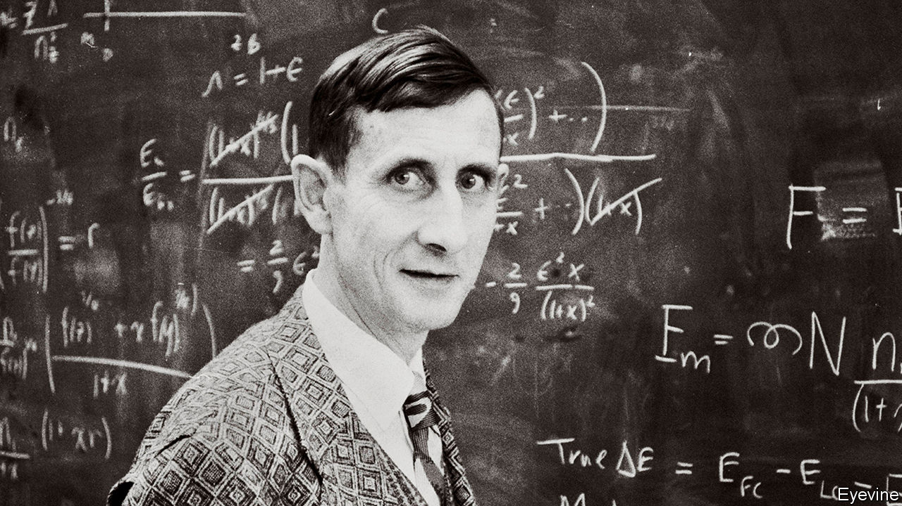

## Infinite possibilities

# Freeman Dyson died on February 28th

> The maverick physicist and big thinker was 96

> Mar 12th 2020

THERE ARE, wrote Freeman Dyson towards the end of his long life, two different kinds of mathematicians. Some are birds, who fly high, surveying the broad vistas and spotting unexpected links between different bits of the mathematical landscape. Others are frogs, who prefer to be up close and on the ground, delighting in the details and the beauty of the flowers.

He counted himself among the frogs, and started there. At the age of 24 he made a fundamental contribution to the study of Diophantine equations, a branch of mathematics dating back to the ancient Greeks. A year later he resolved a tricky conundrum in quantum electrodynamics, a field so new that it had hardly existed when he was born. But already the airborne tendencies were stirring. He was fascinated by biology, engineering, international relations and, in particular, physics, at which he became a master. For him, it was an ideal subject. Its mathematical underpinnings might be abstruse and theoretical, but in the 20th century those theories handed blunt, world-changing power to nations that could master their applications. In the second world war, he applied his mathematics at Britain’s Bomber Command to calculate the most destructive (but safe) formations for the planes to fly in. After the war, when he moved to the Institute for Advanced Study in Princeton, he rubbed shoulders with both Albert Einstein, whose theorising on relativity he had revered since boyhood, and Robert Oppenheimer, who had developed the atomic bomb.

Despite a lack of credentials (he never got round to earning his PhD; friends joked that he was the world’s most accomplished graduate student), he was plainly clever. By the age of five, growing up in Berkshire, he had tried to calculate how many atoms there were in the sun. His leisure reading as a teenager was Piaggio’s “Differential Equations”; and he had solved that quantum electrodynamics puzzle, without pen or paper, while riding in a Greyhound bus. His very cleverness, his vivid language and his faith in the potential of science—which marked him as it marked the century—meant that, even when his schemes were wildly bizarre, they were not dismissed. Colleagues respected him too much.

And the schemes came thick and fast. He proposed using genetically altered trees to turn comets into places where humans could resume an “arboreal existence”; these trees would grow hundreds of miles high, until the comet would look like a sprouting potato. He also popularised a wild thought called the Dyson sphere, a gigantic shell made of pulverised asteroids that might be spread by a very advanced civilisation round its parent star to capture all its energy. (Looking for such structures and their infra-red glow elsewhere in the galaxy, he argued, might be a good way to detect super-advanced aliens.) He imagined plants that could grow greenhouses round themselves, and genetically altered microbes that could harvest minerals and clear up plastic litter from space.

In 1958 he was briefly lured away from his professorship at the IAS to work on Project Orion: a plan to build a rocket, propelled by nuclear power, that would be faster and more efficient than any other. The basic principle was to throw a stream of nuclear bombs out of the back of the rocket, detonate them, and ride the shock waves to Mars and beyond. On paper, it seemed to work. Flight tests on small models, using conventional explosives, were encouraging. Orion could reach Mars in weeks, where chemical rockets would take six months or more. A more powerful version could cross the vast void to Alpha Centauri, the nearest star to the sun, in a bit over a century. Since the bigger the rocket, the more efficient it was, he proposed a 240m-ton ship 90 miles in diameter, designed to carry thousands of colonists and make humanity an interstellar species. Whether he was serious, even he may not have known.

The project was scuppered in the end by a mix of political queasiness over the fallout (rather literally—later modelling suggested that each launch of a modestly-sized rocket from Earth’s surface would kill about ten people) and the partial test ban treaty of 1963, which forbade nuclear explosions except underground. He was involved in that too, arguing in favour of the ban, in his clipped home-counties tones, in front of America’s Senate. Since the power they had unleashed thrust physicists into high places, he also became a government adviser on science and grand strategy. He was on the board of sponsors of the Bulletin of the Atomic Scientists, maintainers of the nuclear Doomsday Clock, which now stands at 100 seconds to midnight. There was far more to nuclear weapons, he knew, than the science that had spawned them. He wrestled with the moral questions they raised, studying game theory in an effort to work out when, if ever, it might make sense to use such a weapon in anger. The problem of nuclear war, it seemed to him, was fundamentally not technical but human and historical.

He was an iconoclast, too, and enjoyed being known as one. Heretics were useful in science. It was far better to be contradicted than ignored; better to be wrong than vague. As a colleague said, whenever consensus was forming like ice hardening on a lake, he would do his best to chip away at it. He dared to challenge natural selection as the only driver of evolution, and he queried climate change: not the fact that it was happening, but the usefulness of the models that aimed to predict its effects. In any case, some of those effects might be beneficial—a longer growing season, for example, and fewer deaths from the cold. Environmentalism struck him as more a religion than a science.

Not that he was against religion; he supported it, in a diffident Church of England way. To get back beyond the Big Bang, certainly, you needed religion. But the real faith that sustained him was a boundless belief in the power and possibilities of science. He had witnessed at first hand how it could give mere mortals the power to destroy their own world. Perhaps they could use science to save it, too—or, if not, leave it for another altogether. ■

## URL

https://www.economist.com/obituary/2020/03/12/freeman-dyson-died-on-february-28th
