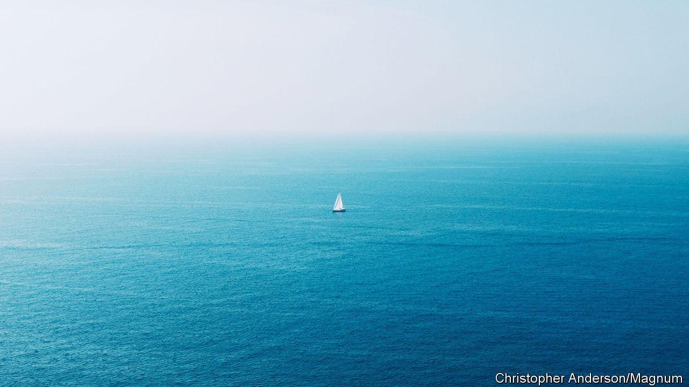

## Monitoring the high seas

# American researchers want to fill the oceans with sensors

> They could track ships, storms, wildlife and weather

> Mar 14th 2020

THERE IS TWICE as much water on Earth as land. Oceanographers are nevertheless fond of saying that science knows less about the high seas than it does about the moon. If John Waterston gets his way, though, that could soon change.

Mr Waterston is the head of the “Ocean of Things” project at the Defence Advanced Research Projects Agency (DARPA), an American military think-tank that has helped develop everything from the internet to stealthy fighter planes. The project’s name is a play on the “Internet of Things”, the awkward phrase which describes the trend for stuffing sensors and an internet connection into all manner of ordinary objects, from cars and toothbrushes to factory robots and doorbells. The Ocean of Things aims to likewise wire up the high seas with swarms of floating, connected sensors.

Such devices are not in themselves new. There are around 6,000 floating sensors deployed around the world’s oceans, run by navies and research institutes. What is unprecedented is the scale of Mr Waterston’s ambition. Over the next few years he hopes to deploy 50,000 sensors across 1m square kilometres of sea, an area considerably larger than Texas. The eventual goal—much more distant—is to enable the continuous monitoring and analysis of a significant fraction of the world’s oceans.

The project’s main aim, mindful of the “D” in DARPA’s name, is tracking ships. But rather than building something that can do just one job, Mr Waterston wants the Ocean of Things to supply a wealth of other information, from water temperature to wave heights, weather conditions, nearby wildlife and more. All this would then be made freely available to scientific and commercial users.

Existing “floating instrument packages”, known as floats or drifters, are often custom-built, and usually contain the highest-quality instruments available. They therefore tend to be expensive, and are bought only in small numbers. A typical existing float, designed for scientific research, is the Argo. It costs around $20,000, and can measure water temperature and salinity.

The Ocean of Things takes the opposite approach. The aim is to cram as many cheap, off-the-shelf components as possible into a single low-cost package. Current float prototypes cost around $750, and Mr Waterston hopes that economies of scale could drive the cost down further. That would allow tens of thousands to be deployed without breaking the bank. Large numbers are crucial for coverage. They also help compensate for inaccuracies in individual instruments. “Can a $5 sensor do the same things as a $1,000 temperature gauge?” Mr Waterston asks rhetorically. “The answer is ‘yes’ if you have a lot of them, because you can cross-correlate. Maths solves the problem for you.”

The project’s researchers are evaluating three designs from different manufacturers, ranging in size from about six to 18 litres. One, proposed by Xerox’s Palo Alto Research Centre, is made of glass, like a traditional Japanese fishing float. A second, from a firm called Areté Associates, has an aluminium shell, and uses wood for buoyancy. Both models feature solar panels. The third, made by a company called Numurus, is made of lacquered cardboard, and relies entirely on its batteries. All three are designed to last for a year or so and are made to be as environmentally friendly as possible, with minimal use of plastics. That is important because, at the end of their mission, the floats are designed to scuttle themselves.

Some of the instruments on offer are common to any smartphone—GPS sensors, accelerometers to detect motion, a compass, a microphone, temperature sensors and a camera. Others are more directly tailored for the job, such as an underwater microphone, a gizmo to measure the water’s conductivity (and therefore its salinity), and detectors to pick up radar and radio signals, including transmissions from marine anti-collision beacons. Some data from these instruments will be crunched on board, but most will be sent back to land in bursts, for onshore analysis. For now, that connectivity is provided by the Iridium network of satellites. But the modems necessary to talk to those satellites, says Mr Waterston, are the most expensive and power-hungry devices on the floats. He hopes that new satellite networks, currently being built by firms such as SpaceX and OneWeb, will provide cheaper alternatives.

Having lots of different sensors will help the floats build the best possible picture of what is going on around them. For example, if the microphone picks up a sound at the same time as the accelerometer shows movement, it could mean that a bird has landed on the float. Several birds landing on several floats could show how a flock is moving. Their presence, in turn, might be an indicator of shoals of fish or other biological activity.

Similarly, a ship sailing through a float field will leave all sorts of traces. It might be detected by its radio beacon, or its radar. It might sail close enough for a float to take a picture, or hear it on the hydrophone, or be disturbed by its wake. Correlating data from several floats will reveal the ship’s speed and direction. By building a database of such encounters, the project’s scientists hope to learn quickly how to tell different sorts of craft apart. Fishing vessels might be using fish-finding sonar or noisy trawl nets. A giant supertanker will sound different from a naval frigate.

The range of sensors on a float will also produce a mass of data of interest to oceanographers, meteorologists and biologists. The cameras and microphones on a field of floats could, for example, detect and track whales and dolphins. At the moment, whenever a marine mammal is spotted in the shipping lanes off Los Angeles harbour, one of the busiest in America, traffic is slowed down. Better tracking would allow traffic to be rerouted, benefiting both critters and commerce. Float fields could watch for illegal fishing, smuggling and icebergs. They could monitor and track oil spills and algal blooms.

That, at least, is the long-term goal. So far, DARPA has bought around 4,500 floats, and has tested them only in small numbers. The next stage, starting this spring, will see fields of 1,000 at a time deployed in the Gulf of Mexico and in the waters off California. The plan is to deploy one float for every three square kilometres of ocean. The hope is that, as the technology matures, useful data could be gleaned from densities as low as one float per 20 square kilometres. With 361m square kilometres of ocean on the planet, a true Ocean of Things, monitoring everything on and under the water, would require about 18m floats. That will not happen for a while yet. But Mr Waterston’s plans are a start. ■

Correction (March 22nd 2020): An earlier version of this article incorrectly referred to the Iridium network of satellites as geosynchronous. This has been changed.

## URL

https://www.economist.com/science-and-technology/2020/03/14/american-researchers-want-to-fill-the-oceans-with-sensors
