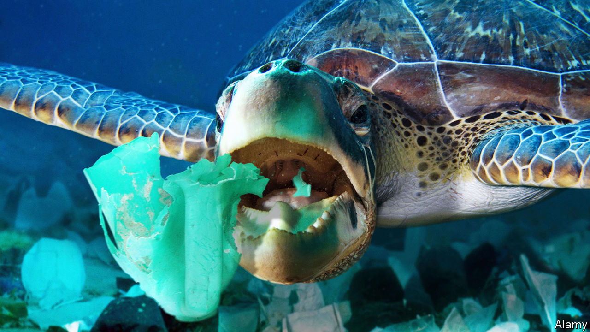

## Ocean pollution

# Plastic rubbish smells good to turtles

> That seems to be why they eat it

> Mar 12th 2020

TURTLES HAVE an unfortunate habit of devouring plastic objects floating in the sea. These then get snared in their alimentary canals, cannot be broken down by the animals’ digestive enzymes and may ultimately kill them. It is widely assumed that this penchant for plastics is a matter of mistaken identity. Drifting plastic bags, for instance, look similar to jellyfish, which many types of turtles love to eat. Yet lots of plastic objects that end up inside turtles have no resemblance to jellyfish. Joseph Pfaller of the University of Florida therefore suspects that something more complicated is going on. As he writes in Current Biology, he thinks that the odour of marine micro-organisms which colonise floating plastic objects induces turtles to feed.

The idea that the smell of plastic flotsam might lure animals to their doom first emerged in 2016. Researchers at the University of California, Davis, noticed that certain chemicals, notably dimethyl sulphide, which are released into the air by micro-organism-colonised plastics, are those which many seabirds sniff to track down food. These chemicals mark good places to hunt because they indicate an abundance of the algae and bacteria that lie at the bottom of marine food chains. The researchers also found that birds which pursue their food in this way are five or six times more likely to eat plastic than those which do not.

Since turtles are known to break the surface periodically and sniff the air when navigating towards their feeding areas, Dr Pfaller theorised that they are following these same chemicals, and are likewise fooled into thinking that floating plastic objects are edible.

To test that idea, he and his colleagues set up an experiment involving loggerhead turtles, a species frequently killed by plastic. They arranged for 15 of the animals, each around five months old, to be exposed, in random order, to four odours delivered through a pipe to the air above an experimental arena. The odours were: the vapour from deionised water; the smell of turtle-feeding pellets made of shrimp and fish meal; the smell of a clean plastic bottle chopped up into ten pieces; and the smell of a similarly chopped bottle that had been kept in the ocean for five weeks to allow algae and bacteria to grow on it.

Two of the smells proved far more attractive to the animals than the others. When sniffing both the odour of food pellets and that of five-week-old bottles turtles kept their nostrils out of the water more than three times as long, and took twice as many breaths as they did when what was on offer was the smell of fresh bottle-plastic or deionised-water vapour. On the face of it, then, the turtles were responding to the smell of old bottles as if it were the smell of food.

Though they have not yet tested whether dimethyl sulphide is the culprit, Dr Pfaller and his colleagues think it is the most likely candidate. In an unpolluted ocean, pretty well anything which had this smell would be edible—or, at least, harmless. Unfortunately, five-week-old plastic bottles and their like are not.■