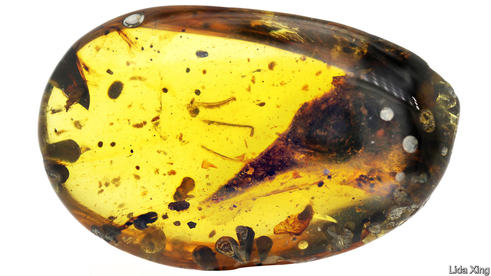

## Palaeontology

# The smallest dinosaur?

> Another intriguing discovery from the amber mines of Myanmar

> Mar 12th 2020

OCCASIONALLY, A FOSSIL turns up that reminds people of how little is really known about the past. This, perhaps, is such a discovery. It is the skull, a mere 7mm long, of a tiny, yet full-grown dinosaur, preserved in amber from a deposit in northern Myanmar which is 99m years old. That dates it to the middle of the Cretaceous, more than 30m years before this period’s more famous dinosaurian denizens, Ankylosaurus, Triceratops and Tyrannosaurus, bestrode what is now North America.

Extrapolating from its skull, Oculudentavis khaungraae would have been about the size of a bee hummingbird, the smallest bird now alive. And—confusingly to modern sensibilities, which are used to thinking of “dinosaurs” and “birds” as separate categories—it was a bird, too. It belonged to a group called the Enantiornithes, which were similar to modern birds, the Neornithes, except that evolution did not deprive them of either their teeth or the claws on their forelimbs, even though those forelimbs were fully functional wings.

The Enantiornithes perished along with most other dinosaurs (and about three-quarters of the rest of the planet’s animal and plant species) in a collision, 66m years ago, between Earth and an asteroid. The Neornithes, though, survived this catastrophe and went on to become, in 1758, the class of animals called Aves in Linnaeus’s “Systema Naturae”. This classification predated the discovery of fossil dinosaurs (indeed, it predated the realisation that Earth is far older than suggested by Biblical and other mythical traditions). That, and the everyday familarity of birds, has made it hard to grasp that the Aves truly are a group of dinosaurs.

The formal description of O. khaungraae was published this week in Nature by Xing Lida of the China University of Geosciences, in Beijing, who has many previous discoveries from the north-Burmese amber to his name. There is evidence that the area in which it lived was, at the time, an island in an archipelago in a vanished ocean called Tethys. Dr Xing and his colleagues therefore speculate that it may have been a product of island dwarfism—a tendency of insular species to shrink, compared to their mainland relatives. Whatever the explanation for its size, though, O. khaungraae now shares with the bee hummingbird (which is not a product of island dwarfism, but rather of its habit of feeding on the nectar of flowers) the title of “smallest dinosaur known”.

## URL

https://www.economist.com/science-and-technology/2020/03/12/the-smallest-dinosaur
