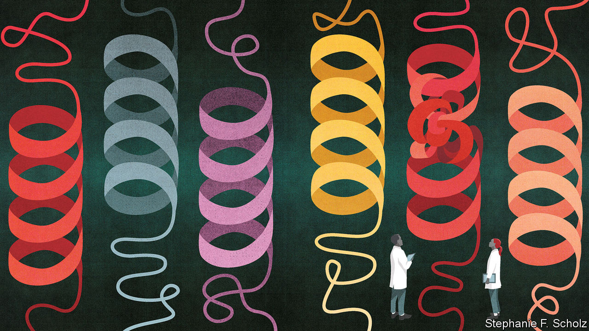
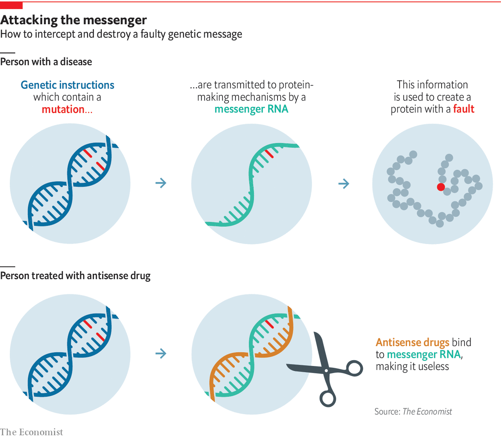

## Congenital disease

# Congenital diseases reveal a lot about human biology

> And some can be treated—even if there is only one patient

> Mar 12th 2020

WHEN A CLINICIAN showed Dr Nizar’s sons a pain chart, they asked her what the smiley face at one end of the scale meant. The boys do not know, Dr Nizar says, what it is like to live without pain. Not all the diseases caused by calamitously failed single genes are quite that awful. But unlike the more generalised genomic influences on health—those to which everyone is heir, but few know about—people with serious congenital diseases have no escape or respite; their symptoms are inescapable. And so, too, for the most part, are their diseases. Genomics makes the diagnosis of such diseases, especially the rare ones, easier and more precise, and it has revealed what is going on in some of them in useful ways. It has not yet, though, provided much by way of cures. Now this is beginning to change.

Those who deal with rare genetic diseases talk of the “diagnostic odyssey”. This is the process, familiar to viewers of “House”, a television show, of repeatedly suggesting a cause for a rare disease, testing, ruling out and suggesting again. In real life such odysseys do not to fit into a tense hour of screentime; until recently they used drag themselves out for five years or so, according to Mark Caulfield of Genomics England. Dr Nizar’s took even longer, largely because only a handful of doctors on the planet have any experience with Jansen’s disease. Even over eight seasons, Dr House and his team never saw a single case.

In Britain and many other rich countries, genomic testing has the length of the odyssey down to months or even weeks, says Dr Caulfield. This matters because, even when genetic diseases cannot be cured, knowing the precise nature of the defect often matters—and the earlier it is known, the better. When a Mexican clinic for children with birth defects had 60 of its patients sequenced, subsequent changes in diagnosis led to revisions in the care given to almost half of them.

Sometimes the correct care has dramatic results. Jessica was four years old when sequencing showed that the disease affecting her movement and development stemmed from a misprint in a gene called SLC2A1. This meant her cells did not make enough of a protein that transports sugar into the brain, thus leaving it chronically underpowered. Giving Jessica a carefully tailored low-carbohydrate diet activated an alternative way of getting calories to herbrain. Another situation in which knowledge gives huge power is Brown-Vialetto-Van Laere disease, a rare form of motor-neurone disease that strikes in childhood. Faults in the genes SLC52A2 and SLC52A3 reduce the body’s stocks of a protein that transports riboflavin (vitamin B2) from the gut into the blood stream. High doses of riboflavin can provide great benefits to many such patients—but they will not get them if they do not know they need them.

Most of those with rare diseases cannot be provided with such a positive outcome on the basis of knowledge alone. But a secure diagnosis still helps. For one thing, the diagnostic odyssey is ended: no need for further invasive inquiry. And then there is support, which matters a lot. Accurate diagnosis lets people find others in similar straits to exchange advice, sympathy—and plans.

A genetic understanding of rare diseases also provides valuable insights into common ones. If drug developers have a target with a well defined causal role in some sort of disease, their studies are twice as likely to lead to a working drug than if they do not. The study of rare diseases provides insights of that sort which can be used to develop treatments that are much more widely applicable. That is why it continues to matter to more than just the families suffering from them.

Studies of two rare genetic disorders in which bones grow too eagerly, sclerosteosis and van Buchem’s disease, revealed that both involved mutations in SOST, a gene that describes a protein now called sclerostin. When expressed in bone-building cells, sclerostin turned out to suppress bone growth—hence the bone overgrowth problems when the gene is faulty. This opened up the possibility that patients without enough bone growth might benefit from a drug that inhibited sclerostin. That has led to the development of antibodies against sclerostin as a new strategy for treating osteoporosis. Van Buchem’s disease is almost as rare as Jansen’s; but in ageing populations osteoporosis is a public-health scourge.

Similarly, studies of a Chinese family with a rare form of erythromelalgia, which causes burning pain and redness in the feet, are driving the development of new painkillers. Studies of the faulty PCSK9 gene found in families with a genetic disorder that gives them poor coronary health inspired a whole class of new anti-cholesterol drugs that are more effective than statins.

A wrinkle on this approach is to find people with disease-causing mutations who stay healthy, or whose disease progresses slowly. These people contain genes that may protect them from harm, which might be useful in creating new therapies for others. Maze Therapeutics, based in San Francisco, is looking for “genetic modifiers” that alter the course of conditions like ALS (also known as Lou Gehrig’s disease). This disease is normally fatal within a couple of years. But in some sufferers, such as the late physicist Stephen Hawking, it develops much more slowly.

Yet as humanity’s knowledge of disease mechanisms has grown dramatically through the study of rare inherited diseases, the development of treatments for those diseases themselves has failed to keep pace. Conditions that blight lives by the dozen or hundred are not big markets.

Many hope that various new technologies could drastically reduce the costs of bespoke treatments for at least some congenital diseases. Most drugs today work by targeting a protein—either one of the body’s proteins that is misbehaving, or a protein in a pathogen that is achieving its goals all too well. The drug has to be tailored to the shape and activity of the protein it targets, while not messing up the workings of other inoffensive proteins that are doing vital work. That isn’t easy.

What, though, if you could stop a problematic protein from being made in the first place? For a cell to make a protein, it first needs to make a copy of the gene sequence that describes that protein. This copy is called a messenger RNA, or mRNA. If you know the sequence of the gene, it is easy to work out the sequence of its mRNA, and from that design a short strand of DNA that, by dint of its own sequence, will stick to that mRNA, thus rendering it useless (see diagram).

Such DNA-based saboteurs are called “antisense oligonucleotides” (ASOs). They are now being used to treat various faulty-gene diseases, including a particular form of spinal muscular atrophy (SMA), some types of Duchenne muscular dystrophy and familial hypercholesterolemia—the disease that led to the design of new anti-cholesterol drugs. There are trials under way to see if an ASO can slow the progression of Huntington’s disease, a lethal degenerative disease which affects from five to 10 people per 100,000.

Antisense drugs are particularly exciting to patients with rare congenital diseases because they can be easily tailored. Once the sequence of the gene for the protein at fault is established, an ASO can be ready in under a year, says Art Krieg, the boss of Checkmate Pharmaceuticals, a biotech company. The fact that ASOs are based on sequences means that they can be “programmed” to inhibit the synthesis of a wide range of proteins. An ASO can also be designed and used to treat a disease unique to a single patient—what doctors call an n-of-1 trial.

When she was six, Mila Makovec was diagnosed with Batten disease, in which a defect in a gene called CLN3 causes proteins and lipids to build up in the brain. That build-up was progressively robbing her of movement, sight and thought. It was eventually going to kill her. In 2017, though, sequencing showed that Mila’s version of Batten disease was not down to a good protein not being made, as most cases are, but an unhelpful version of another protein. Tim Yu, a neurologist at Boston Children’s Hospital who knew about the ASO being used to stop harmful proteins being made in SMA, realised that a similar approach might work for Mila.

The girl’s parents raised $3m dollars through crowdfunding to create Mila’s Miracle Foundation. With some of that Dr Yu designed an ASO tailored directly to Mila’s genome and got it produced. The molecule, called milasen, seems to have helped. The foundation is now trying to get the same thing done for hundreds of other very rare diseases.

A lot of charities are doing similar things. Some are big: the Chan Zuckerberg Initiative has kick-started work on various other rare diseases with its Rare As One Network. The n-Lorem Foundation, launched this year, also aims to make the development of ASOs easier. Some are small, like the one Rohan Seth, an entrepreneur, started for his six-month-old daughter Lydia. An ASO to deal with the mutation in KCNQ2 that is making her progressively more disabled cannot come soon enough. Dr Nizar watches approvingly. The disease which afflicts her family is not yet amenable to this particular approach. But there may be more miracles on the way.

## URL

https://www.economist.com/technology-quarterly/2020/03/12/congenital-diseases-reveal-a-lot-about-human-biology
