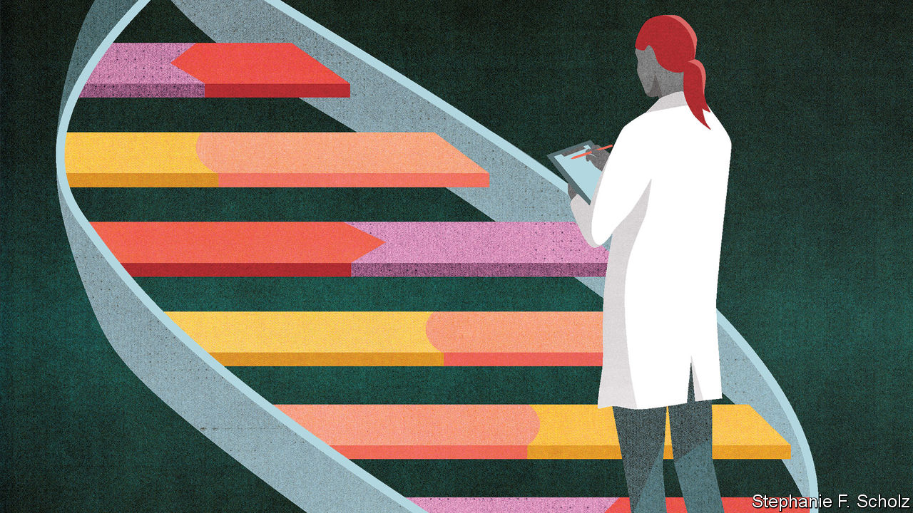
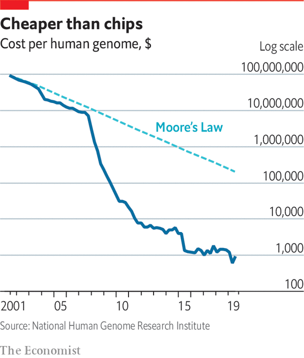

## The human genome project

# Genomics took a long time to fulfil its promise

> Getting really cheap helped

> Mar 12th 2020

THE ATOMIC bomb convinced politicians that physics, though not readily comprehensible, was important, and that physicists should be given free rein. In the post-war years, particle accelerators grew from the size of squash courts to the size of cities, particle detectors from the scale of the table top to that of the family home. Many scientists in other disciplines looked askance at the money devoted to this “big science” and the vast, impersonal collaborations that it brought into being. Some looked on in envy. Some made plans.

The idea that sequencing the whole human genome might provide biology with some big science of its own first began to take root in the 1980s. In 1990 the Human Genome Project was officially launched, quickly growing into a global endeavour. Like other fields of big science it developed what one of the programme’s leaders, the late John Sulston, called a “tradition of hyperbole”. The genome was Everest; it was the Apollo programme; it was the ultimate answer to that Delphic injunction, “know thyself”. And it was also, in prospect, a cornucopia of new knowledge, new understanding and new therapies.

By the time the completion of a (rather scrappy) draft sequence was announced at the White House in 2000, even the politicians were drinking the Kool-Aid. Tony Blair said it was the greatest breakthrough since antibiotics. Bill Clinton said it would “revolutionise the diagnosis, prevention and treatment of most, if not all, human diseases. In coming years, doctors increasingly will be able to cure diseases like Alzheimer’s, Parkinson’s, diabetes and cancer by attacking their genetic roots.”

Such hype was always going to be hard to live up to, and for a long time the genome project failed comprehensively, prompting a certain Schadenfreude among those who had wanted biology kept small. The role of genetics in the assessment of people’s medical futures continued to be largely limited to testing for specific defects, such as the BRCA1 and BRCA2 mutations which, in the early 1990s, had been found to be responsible for some of the breast cancers that run in families.

To understand the lengthy gap between the promise and the reality of genomics, it is important to get a sense of what a genome really is. Although sequencing is related to an older technique of genetic analysis called mapping, it produces something much more appropriate to the White House kitchens than to the Map Room: a recipe. The genes strung out along the genome’s chromosomes—big molecules of DNA, carefully packed—are descriptions of life’s key ingredients: proteins. Between the genes proper are instructions as to how those ingredients should be used.

If every gene came in only one version, then that first human genome would have been a perfect recipe for a person. But genes come in many varieties—just as chilies, or olive oils, or tinned anchovies do. Some genetic changes which are simple misprints in the ingredient’s specification are bad in and of themselves—just as a meal prepared with “fuel oil” instead of “olive oil” would be inedible. Others are problematic only in the context of how the whole dish is put together.

The most notorious of the genes with obvious impacts on health were already known before the genome was sequenced. Thus there were already tests for cystic fibrosis and Huntington’s disease. The role of genes in common diseases turned out to be a lot more involved than many had naively assumed. This made genomics harder to turn into useful insight.

Take diabetes. In 2006 Francis Collins, then head of genome research at America’s National Institutes of Health, argued that there were more genes involved in diabetes than people thought. Medicine then recognised three such genes. Dr Collins thought there might be 12. Today the number of genes with known associations to type-2 diabetes stands at 94. Some of these genes have variants that increase a person’s risk of the disease, others have variants that lower that risk. Most have roles in various other processes. None, on its own, amounts to a huge amount of risk. Taken together, though, they can be quite predictive—which is why there is now an over-the-counter genetic test that measures people’s chances of developing the condition.

In the past few years, confidence in science’s ability to detect and quantify such genome-wide patterns of susceptibility has increased to the extent that they are being used as the basis for something known as a “polygenic risk score” (PRS). These are quite unlike the genetic tests people are used to. Those single-gene tests have a lot of predictive value: a person who has the Huntington’s gene will get Huntington’s; women with a dangerous BRCA1 mutation have an almost-two-in-three chance of breast cancer (unless they opt for a pre-emptive mastectomy). But the damaging variations they reveal are rare. The vast majority of the women who get breast cancer do not have BRCA mutations. Looking for the rare dangerous defects will reveal nothing about the other, subtler but still possibly relevant genetic traits those women do have.

Polygenic risk scores can be applied to everyone. They tell anyone how much more or less likely they are, on average, to develop a genetically linked condition. A recently developed PRS for a specific form of breast cancer looks at 313 different ways that genomes vary; those with the highest scores are four times more likely to develop the cancer than the average. In 2018 researchers developed a PRS for coronary heart disease that could identify about one in 12 people as being at significantly greater risk of a heart attack because of their genes.

Some argue that these scores are now reliable enough to bring into the clinic, something that would make it possible to target screening, smoking cessation, behavioural support and medications. However, hope that knowing their risk scores might drive people towards healthier lifestyles has not, so far, been validated by research; indeed, so far things look disappointing in that respect.

Assigning a PRS does not require sequencing a subject’s whole genome. One just needs to look for a set of specific little markers in it, called SNPs. Over 70,000 such markers have now been associated with diseases in one way or another. But if sequencing someone’s genome is not necessary in order to inspect their SNPs, understanding what the SNPs are saying in the first place requires that a lot of people be sequenced. Turning patterns discovered in the SNPs into the basis of risk scores requires yet more, because you need to see the variations in a wide range of people representative of the genetic diversity of the population as a whole. At the moment people of white European heritage are often over-represented in samples.

The need for masses of genetic information from many, many human genomes is one of the main reasons why genomic medicine has taken off rather slowly. Over the course of the Human Genome Project, and for the years that followed, the cost of sequencing a genome fell quickly—as quickly as the fall in the cost of computing power expressed through Moore’s law. But it was falling from a great height: the first genome cost, by some estimates, $3bn. The gap between getting cheaper quickly and being cheap enough to sequence lots of genomes looked enormous.

In the late 2000s, though, fundamentally new types of sequencing technology became available and costs dropped suddenly (see chart). As a result, the amount of data that big genome centres could produce grew dramatically. Consider John Sulston’s home base, the Wellcome Sanger Institute outside Cambridge, England. It provided more sequence data to the Human Genome Project than any other laboratory; at the time of its 20th anniversary, in 2012, it had produced, all told, almost 1m gigabytes—one petabyte—of genome data. By 2019, it was producing that same amount every 35 days. Nor is such speed the preserve of big-data factories. It is now possible to produce billions of letters of sequence in an hour or two using a device that could easily be mistaken for a chunky thumb drive, and which plugs into a laptop in the same way. A sequence as long as a human genome is a few hours work.

As a result, thousands, then tens of thousands and then hundreds of thousands of genomes were sequenced in labs around the world. In 2012 David Cameron, the British prime minister, created Genomics England, a firm owned by the government, and tasked initially with sequencing 100,000 genomes and integrating sequencing, analysis and reporting into the National Health Service. By the end of 2018 it had finished the 100,000th genome. It is now aiming to sequence five million. China’s 100,000 genome effort started in 2017. The following year saw large-scale projects in Australia, America and Turkey. Dubai has said it will sequence all of its three million residents. Regeneron, a pharma firm, is working with Geisinger, a health-care provider, to analyse the genomes of 250,000 American patients. An international syndicate of investors from America, China, Ireland and Singapore is backing a €365m ($405m) project to sequence about 10% of the Irish population in search of disease genes.

Genes are not everything. Controls on their expression—epigentics, in the jargon—and the effects of the environment need to be considered, too; the kitchen can have a distinctive effect on the way a recipe turns out. That is why “biobanks” are being funded by governments in Britain, America, China, Finland, Canada, Austria and Qatar. Their stores of frozen tissue samples, all carefully matched to clinical information about the person they came from, allow study both by sequencing and by other techniques. Researchers are keen to know what factors complicate the lines science draws from genes to clinical events.

Today various companies will sequence a genome commercially for $600-$700. Sequencing firms such as Illumina, Oxford Nanopore and China’s BGI are competing to bring the cost down to $100. In the meantime, consumer-genomics firms will currently search out potentially interesting SNPs for between $100 and $200. Send off for a home-testing kit from 23andMe, which has been in business since 2006, and you will get a colourful box with friendly letters on the front saying “Welcome to You”. Spit in a test tube, send it back to the company and you will get inferences as to your ancestry and an assessment of various health traits. The health report will give you information about your predisposition to diabetes, macular degeneration and various other ailments. Other companies offer similar services.

Plenty of doctors and health professionals are understandably sceptical. Beyond the fact that many gene-testing websites are downright scams that offer bogus testing for intelligence, sporting ability or wine preference, the medical profession feels that people are not well equipped to understand the results of such tests, or to deal with their consequences.

An embarrassing example was provided last year by Matt Hancock, Britain’s health minister. In an effort to highlight the advantages of genetic tests, he revealed that one had shown him to be at heightened risk of prostate cancer, leading him to get checked out by his doctor. The test had not been carried out by Britain’s world-class clinical genomics services but by a private company; critics argued that Mr Hancock had misinterpreted the results and consequently wasted his doctor’s time.

He would not be the first. In one case, documented in America, third-party analysis of genomic data obtained through a website convinced a woman that her 12-year-old daughter had a rare genetic disease; the girl was subjected to a battery of tests, consultations with seven cardiologists, two gynaecologists and an ophthalmologist and six emergency hospital visits, despite no clinical signs of disease and a negative result from a genetic test done by a doctor.

At present, because of privacy concerns, the fortunes of these direct-to-consumer companies are not looking great. 23andMe laid off 14% of its staff in January; Veritas, which pioneered the cheap sequencing of customers’ whole genomes, stopped operating in America last year. But as health records become electronic, and health advice becomes more personalised, having validated PRS scores for diabetes or cardiovascular disease could become more useful. The Type 2 diabetes report which 23andMe recently launched looks at over 1,000 SNPs. It uses a PRS based on data from more than 2.5m customers who have opted to contribute to the firm’s research base.

As yet, there is no compelling reason for most individuals to have their genome sequenced. If genetic insights are required, those which can be gleaned from SNP-based tests are sufficient for most purposes. Eventually, though, the increasing number of useful genetic tests may well make genome sequencing worthwhile. If your sequence is on file, many tests become simple computer searches (though not all: tests looking at the wear and tear the genome suffers over the course of a lifetime, which is important in diseases like cancer, only make sense after the damage is done). If PRSs and similar tests come to be seen as valuable, having a digital copy of your genome at hand to run them on might make sense.

Some wonder whether the right time and place to do this is at birth. In developed countries it is routine to take a pinprick of blood from the heel of a newborn baby and test it for a variety of diseases so that, if necessary, treatment can start quickly. That includes tests for sickle-cell disease, cystic fibrosis, phenylketonuria (a condition in which the body cannot break down phenylalanine, an amino acid). Some hospitals in America have already started offering to sequence a newborn’s genome.

Sequencing could pick up hundreds, or thousands, of rare genetic conditions. Mark Caulfield, chief scientist at Genomics England, says that one in 260 live births could have a rare condition that would not be spotted now but could be detected with a whole-genome sequence. Some worry, though, that it would also send children and parents out of the hospital with a burden of knowledge they might be better off without—especially if they conclude, incorrectly, that genetic risks are fixed and predestined. If there is unavoidable suffering in your child’s future do you want to know? Do you want to tell them? If a child has inherited a worrying genetic trait, should you see if you have it yourself—or if your partner has? The ultimate answer to the commandment “know thyself” may not always be a happy one.■

## URL

https://www.economist.com/technology-quarterly/2020/03/12/genomics-took-a-long-time-to-fulfil-its-promise
