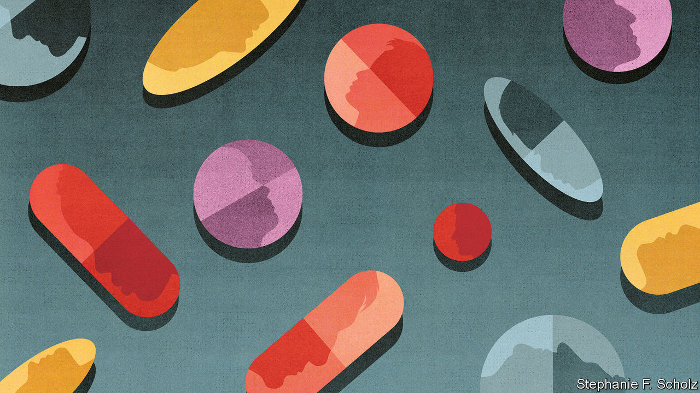
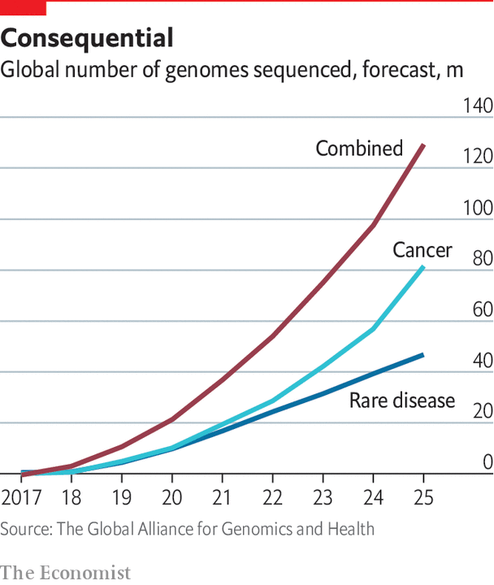

## Personalised medicine

# Medicine is getting to grips with individuality

> Treatments can increasingly be tailored to the genes, environments and activities that make every patient different, says Natasha Loder

> Mar 12th 2020

NEENA NIZAR is 42 years old, a professor of business studies and just 122cm tall. The ends of her bones are soft and pliable: on an x-ray they look frayed, like old paintbrushes. During her childhood and adolescence in Dubai she was operated on 30 times. The source of her problem remained a mystery. In 2010, after three decades of wondering, she finally received a diagnosis: Jansen’s Metaphyseal Chondrodysplasia, a condition first recognised in the 1930s. Her problems stem from a broken copy of just one of her 20,000 genes.

Dr Nizar is in some ways very unusual. Fewer than one in 200m people have the mutation to the PTH1R gene that causes Jansen’s disease. In other ways she is like everyone else. Although few people have a defect as debilitating, everyone’s health, and ill-health, is tied to the contents of their genomes. All genomes contain arrangements of genes that make psychological disorders, cancers, dementias or circulatory diseases either more of a problem or less of one. Everyone has genes that make them better or worse at metabolising drugs, more or less likely to benefit from specific forms of exercise, better able to digest some foods than others.

The same arrangement will never be seen twice. Though for identical twins the differences are the height of subtlety, each of the 7.5bn human genomes sharing the planet is unique. That irreducible diversity represents a challenge to many of the 20th century’s greatest medical advances, which were based on a one-size-fits-all approach. Personalising medicine is an enticing opportunity for improvement.

Good doctors have always treated their patients as individuals. In the 20th century blood tests, X-rays, body scans and other diagnostic tools made the specifics of each patient’s particular problems ever more visible. A spectacular reduction in the cost of reading, or sequencing, the DNA “bases” that make up human genetic information is adding a new level of individuality. It is now possible to inspect genetic differences with an ease previously unimaginable, and thus to know something about propensities to disease well before any symptoms show up.

Nobody knows exactly how many human genomes have been fully sequenced, and different sequencing procedures read the genome to different degrees—there are quick skims and painstaking philological studies. But the number is in the millions (see chart). By the 2030s genome sequencing is likely to be as routine in some places as taking a pin-prick of blood from a baby’s heel is today—it may even be part of the same procedure. Genome science is becoming a matter of practical medicine. New therapies that make it possible to adjust or edit this genetic inheritance are coming to market.

This flood of data is allowing medicine to become more precise and more personal—in many ways, the p-words are two sides of the same coin. Previously recognised genetic diseases, such as Jansen’s, have been traced to specific genes and can be connected to defects in the proteins they create (almost all genes describe proteins, and proteins do almost all the body’s chemical work). Most of these diseases are rare, in that they typically affect no more than one person in 2,000 in the general population. But with over 6,000 such rare diseases now recognised, this means they are common in the aggregate. In Britain one in 17 people can expect to suffer from a rare disease at some point.

Studies of genetic diseases are not just a worthwhile end in themselves. Understanding what goes wrong when a specific protein is out of whack can reveal basic information about the body’s workings that may be helpful for treating other ailments. And the growing understanding of how large sets of genes may contribute to disease is making it possible to pick out the patients most at risk from common diseases like diabetes, heart conditions and cancer. That will help doctors personalise their interventions. In theory, the rise in access to personal genetic information allows individuals to better calculate these risks and to take pre-emptive action. In practice, so far, few people seem to do so.

Genomics is not the only source of new personal-health data. Just as all genomes are unique, so are the lives that all those genome-carriers lead. The increase in other forms of data about individuals, whether in other molecular information from medical tests, electronic health records, or digital data recorded by cheap, ubiquitous sensors, makes what goes on in those lives ever easier to capture. The rise of artificial intelligence and cloud computing is making it possible to analyse this torrent of data.

Almost 4bn people carry smartphones that can monitor physical activity. It is estimated that by 2022, 1bn people may be wearing a device such as a smart watch that can monitor their heart rate. The data-driven giants and startups of Silicon Valley are eager to help. Consumers no longer need to go to a doctor for a genome scan or to engage with a wide range of opinion about what ails them, or will ail them. The pharmaceutical companies used to dominating medicine are working hard to keep up. So are doctors, hospitals and health systems.

These possibilities are not without their risks, drawbacks and potential for disappointment. The ability to pinpoint what has gone wrong in a genome does not make it easy to fix. Moreover, as technology helps people monitor themselves in more ways, the number of the “worried well” will swell and unnecessary care will grow. Many could be done real harm by an algorithmic mirage.

Beyond this, the “move fast and break things” attitude common in tech companies sits uneasily with “first, do no harm”. And the untrammelled, unsupervised and unaccountable means of data accrual seen in other industries which have undergone digital transformations sits uneasily with concerns over medical privacy.

The very nature of medicine, though, means that the future will not just be a matter of business goals, research cultures, technological prowess, wise practice and well-crafted regulations. It will also be subject to the driving interests of particular individuals in ways never seen before. The development of gene-based medical research in Britain was deeply affected by the short, difficult life of Ivan Cameron, whose father, David Cameron, did much to build up genomics when he was prime minister. Many of those working in this field are impelled by personal loss.

And then there are those whose interests stem from the way in which their own genes shape their lives. People like Dr Nizar, who is now crafting a new research agenda for Jansen’s disease. There may only be 30 people in the world who suffer from it. But two of them are her children, and they are in ceaseless pain. Science knows why; medicine cannot yet help. “We believe in miracles,” she says. She is also working to make one happen. ■

## URL

https://www.economist.com/technology-quarterly/2020/03/12/medicine-is-getting-to-grips-with-individuality
