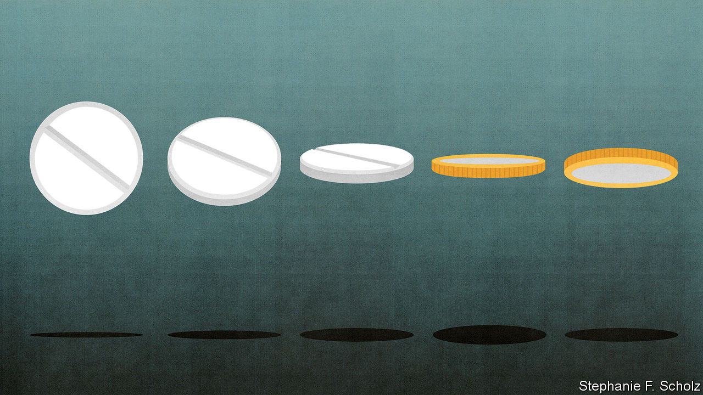
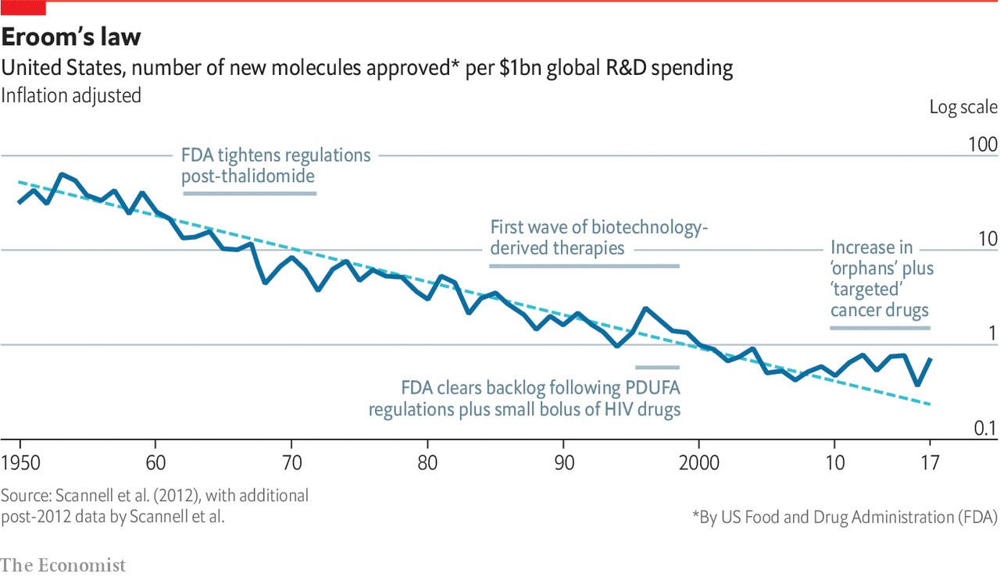

## The pharmaceutical industry

# New drugs are costly and unmet need is growing

> The pharmaceutical industry needs new ways of doing things

> Mar 12th 2020

BEING ABLE to see all the details of the genome at once necessarily makes medicine personal. It can also make it precise. Examining illness molecule by molecule allows pharmaceutical researchers to understand the pathways through which cells act according to the dictates of genes and environment, thus seeing deep into the mechanisms by which diseases cause harm, and finding new workings to target. The flip side of this deeper understanding is that precision brings complexity. This is seen most clearly in cancer. Once, cancers were identified by cell and tissue type. Now they are increasingly distinguished by their specific genotype that reveals which of the panoply of genes that can make a cell cancerous have gone wrong in this one. As drugs targeted against those different mutations have multiplied, so have the options for oncologists to combine them to fit their patients’ needs.

Cancer treatment has been the most obvious beneficiary of the genomic revolution but other diseases, including many in neurology, are set to benefit, too. Some scientists now think there are five different types of diabetes rather than two. There is an active debate about whether Parkinson’s is one disease that varies a lot, or four. Understanding this molecular variation is vital when developing treatments. A drug that works well on one subtype of a disease might fail in a trial that includes patients with another subtype against which it does not work at all.

Thus how a doctor treats a disease depends increasingly on which version of the disease the patient has. The Personalised Medicine Coalition, a non-profit advocacy group, examines new drugs approved in America to see whether they require such insights in order to be used. In 2014, it found that so-called personalised medicines made up 21% of the drugs newly approved for use by America’s Food and Drug Administration (FDA). In 2018 the proportion was twice that.

Two of those cited were particularly interesting: Vitrakvi (larotrectinib), developed by Loxo Oncology, a biotech firm, and Onpattro (patisiran), developed by Alnylam Pharmaceuticals. Vitrakvi is the first to be approved from the start as “tumour agnostic”: it can be used against any cancer that displays the mutant protein it targets. Onpattro, which is used to treat peripheral-nerve damage, is the first of a new class of drugs—“small interfering RNAs”, or siRNAs—to be approved. Like antisense oligonucleotides (ASOs), siRNAs are little stretches of nucleic acid that stop proteins from being made, though they use a different mechanism.

Again like ASOs, siRNAs allow you to target aspects of a disease that are beyond the reach of customary drugs. Until recently, drugs were either small molecules made with industrial chemistry or bigger ones made with biology—normally with genetically engineered cells. If they had any high level of specificity, it was against the actions of a particular protein, or class of proteins. Like other new techniques, including gene therapies and anti-sense drugs, siRNAs allow the problem to be tackled further upstream, before there is any protein to cause a problem.

Take the drugs that target the liver enzyme PCSK9. This has a role in maintaining levels of “bad” cholesterol in the blood; it is the protein that was discovered through studies of families in which congenitally high cholesterol levels led to lots of heart attacks. The first generation of such drugs were antibodies that stuck to the enzyme and stopped it working. However, the Medicines Company, a biotech firm recently acquired by Novartis, won approval last year for an siRNA called inclisiran that interferes with the expression of the gene PCSK9—thus stopping the pesky protein from being made in the first place. Inclisiran needs to be injected only twice a year, rather than once a month, as antibodies do.

New biological insights, new ways of analysing patients and their disease and new forms of drug are thus opening up a wide range of therapeutic possibilities. Unfortunately, that does not equate to a range of new profitable opportunities.

Thanks in part to ever better diagnosis, there are now 7,000 conditions recognised as “rare diseases” in America, meaning that the number of potential patients is less than 200,000. More than 90% of these diseases have no approved treatment. These are the diseases that personalised, precision medicine most often goes after. Nearly 60% of the personalised medicines approved by the FDA in 2018 were for rare diseases.

That might be fine, were the number of diseases stable. But precision in diagnosis is increasingly turning what used to be single diseases into sets of similar-looking ones brought about by distinctly different mechanisms, and thus needing different treatment. And new diseases are still being discovered. Medical progress could, in short, produce more new diseases than new drugs, increasing unmet need.

Some of it will, eventually, be met. For one thing, there are government incentives in America and Europe for the development of drugs for rare diseases. And, especially in America, drugs for rare diseases have long been able to command premium prices. Were this not the case, Novartis would not have paid $8.7bn last year to buy AveXis, a small biotech firm, thereby acquiring Zolgensma, a gene therapy for spinal muscular atrophy (SMA). Most people with SMA lack a working copy of a gene, SMN1, which the nerve cells that control the body’s muscles need to survive. Zolgensma uses an empty virus-like particle that recognises nerve cells to deliver working copies of the gene to where it is needed. Priced at $2.1m per patient, it is the most expensive drug ever brought to market. That dubious accolade might not last long. BioMarin, another biotech firm, is considering charging as much as $3m for a forthcoming gene therapy for haemophilia.

Drug firms say such treatments are economically worthwhile over the lifetime of the patient. Four-fifths of children with the worst form of SMA die before they are four. If, as is hoped, Zolgensma is a lasting cure, then its high cost should be set against a half-century or more of life. About 200 patients had been treated in America by the end of 2019.

But if some treatments for rare diseases may turn a profit, not all will. There are some 6,000 children with SMA in America. There are fewer than ten with Jansen’s disease. When Dr Nizar asked companies to help develop a treatment for it, she says she was told “your disease is not impactful”. She wrote down the negative responses to motivate herself: “Every day I need to remind myself that this is bullshit”.

A world in which markets shrink, drug development gets costlier and new unmet needs are ceaselessly discovered is a long way from the utopian future envisaged by the governments and charities that paid for the sequencing of all those genomes and the establishment of the world’s biobanks. As Peter Bach, director of the Centre for Health Policy and Outcomes, an academic centre in New York, puts it with a degree of understatement: if the world needs to spend as much to develop a drug for 2,000 people as it used to spend developing one for 100,000, the population-level returns from medical research are sharply diminishing.

And it is not as if the costs of drug development have been constant. They have gone up. What Jack Scannell, a consultant and former pharmaceutical analyst at UBS, a bank, has dubbed Eroom’s law—Eroom being Moore, backwards—shows the number of drugs developed for a given amount of R&D spending has fallen inexorably, even as the amount of biological research skyrocketed. Each generation assumes that advances in science will make drugs easier to discover; each generation duly advances science; each generation learns it was wrong.

For evidence, look at the way the arrival of genomics in the 1990s lowered productivity in drug discovery. A paper in Nature Reviews Drug Discovery by Sarah Duggers from Columbia University and colleagues argues that it brought a wealth of new leads that were difficult to prioritise. Spending rose to accommodate this boom; attrition rates for drugs in development subsequently rose because the candidates were not, in general, all that good.

Today, enthused by their big-science experience with the genome and enabled by new tools, biomedical researchers are working on exhaustive studies of all sorts of other ‘omes, including proteomes—all the proteins in a cell or body; microbiomes—the non-pathogenic bacteria living in the mouth, gut, skin and such; metabolomes—snapshots of all the small molecules being built up and broken down in the body; and connectomes, which list all the links in a nervous system. The patterns they find will doubtless produce new discoveries. But they will not necessarily, in the short term, produce the sort of clear mechanistic understanding which helps create great new drugs. As Dr Scannell puts it: “We have treated the diseases with good experimental models. What’s left are diseases where experiments don’t replicate people.” Data alone canot solve the problem.

Daphne Koller, boss of Insitro, a biotech company based in San Francisco, shares Dr Scannell’s scepticism about the way drug discovery has been done. A lot of candidate drugs fail, she says, because they aim for targets that are not actually relevant to the biology of the condition involved. Instead researchers make decisions based on accepted rules of thumb, gut instincts or a “ridiculous mouse model” that has nothing to do with what is actually going on in the relevant human disease—even if it makes a mouse look poorly in a similar sort of way.

But she also thinks that is changing. Among the things precision biology has improved over the past five to 10 years have been the scientists’ own tools. Gene-editing technologies allow genes to be changed in various ways, including letter by letter; single-cell analysis allows the results to be looked at as they unfold. These edited cells may be much more predictive of the effects of drugs than previous surrogates. Organoids—self-organised, three-dimensional tissue cultures grown from human stem cells—offer simplified but replicable versions of the brain, pancreas, lung and other parts of the body in which to model diseases and their cures.

Insitro is editing changes into stem cells—which can grow into any other tissue—and tracking the tissues they grow into. By measuring differences in the development of very well characterised cells which differ in precisely known ways the company hopes to build more accurate models of disease in living cells. All this work is automated, and carried out on such a large scale that Dr Koller anticipates collecting many petabytes of data before using machine learning to make sense of it. She hopes to create what Dr Scannell complains biology lacks and what drug designers need: predictive models of how genetic changes drive functional changes.

There are also reasons to hope that the new “upstream” drugs—ASOs, siRNAs, perhaps even some gene therapies—might have advantages over today’s therapies when it comes to small-batch manufacture. It may also prove possible to streamline much of the testing that such drugs go through. Virus-based gene-therapy vectors and antisense drugs are basically platforms from which to deliver little bits of sequence data. Within some constraints, a platform already approved for carrying one message might be fast-tracked through various safety tests when it carries another.

One more reason for optimism is that drugs developed around a known molecule that marks out a disease—a molecular marker—appear to be more successful in trials. The approval process for cancer therapies aimed at the markers of specific mutations is often much shorter now than it used to be. Tagrisso (osimertinib), an incredibly specialised drug, targets a mutation known to occur only in patients already treated for lung cancer with an older drug. Being able to specify the patients who stand to benefit with this degree of accuracy allows trials to be smaller and quicker. Tagrisso was approved less than two years and nine months after the first dose was given to a patient.

With efforts to improve the validity of models of disease and validate drug targets accurately gaining ground, Dr Scannell says he is “sympathetic” to the proposal that, this time, scientific innovation might improve productivity. Recent years have seen hints that Eroom’s law is being bent, if not yet broken.

If pharmaceutical companies do not make good on the promise of these new approaches then charities are likely to step in, as they have with various ASO treatments for inherited diseases. And they will not be shackled to business models that see the purpose of medicine as making drugs. The Gates Foundation and America’s National Institutes of Health are investing $200m towards developing treatments based on rewriting genes that could be used to tackle sickle-cell disease and HIV—treatments that have to meet the proviso of being useful in poor-country clinics. Therapies in which cells are taken out of the body, treated in some way and returned might be the basis of a new sort of business, one based around the ability to make small machines that treat individuals by the bedside rather than factories which produce drugs in bulk.

There is room in all this for individuals with vision; there is also room for luck: Dr Nizar has both. Her problem lies in PTH1R, a hormone receptor; her PTH1R gene makes a form of it which is jammed in the “on” position. This means her cells are constantly doing what they would normally do only if told to by the relevant hormone. A few years ago she learned that a drug which might turn the mutant receptor off (or at least down a bit) had already been characterised—but had not seemed worth developing.

The rabbit, it is said, outruns the fox because the fox is merely running for its dinner, while the rabbit is running for its life. Dr Nizar’s incentives outstrip those of drug companies in a similar way. By working with the FDA, the NIH and Massachusetts General Hospital, Dr Nizar helped get a grant to make enough of the drug for toxicology studies. She will take it herself, in the first human trial, in about a year’s time. After that, if things go well, her children’s pain may finally be eased. ■

## URL

https://www.economist.com/technology-quarterly/2020/03/12/new-drugs-are-costly-and-unmet-need-is-growing
