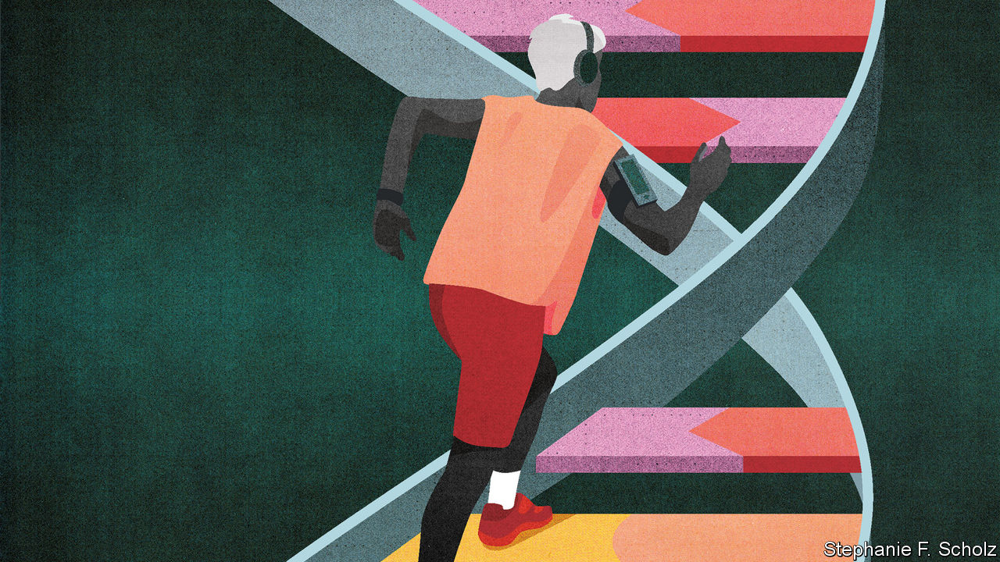
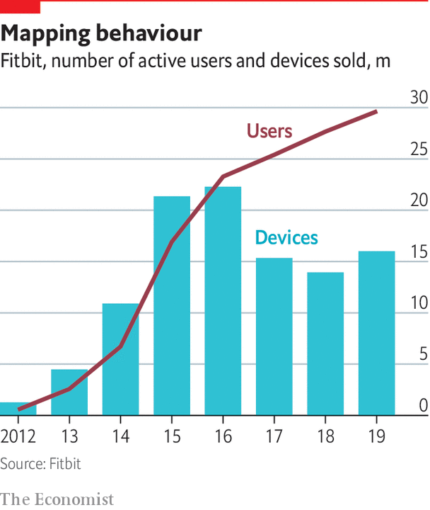

## The sum of all lives

# The way people live their lives can be mined, too

> But there will be setbacks and privacy problems along the way

> Mar 12th 2020

THREADWORMS ARE trending, according to the app on Johannes Schildt’s phone. The app was created by Kry, the Swedish digital health-care firm Mr Schildt runs. It offers information on the sicknesses for which people are currently booking doctor’s appointments, as well as on things specifically important to its user—it keeps Mr Schildt, who suffers from hay fever, up to date with the pollen count. It lets him book an appointment with a family doctor or a specialist, and indeed to have such an appointment by phone. None of this sounds particularly stretching. But in health care, it counts as radical.

According to the Organisation for Economic Co-operation and Development (OECD), a club of richer nations, the world creates 2.5 exabytes of data a day—thousands of times what even the grandest sequencing centre can produce in a month. Of those which get stored, 30% pertain to health. The trove contains insights into the health of populations and of individuals, the efficacy of drugs and the efficiency of health-care systems, the failings of doctors and the financial health of insurers. But OECD countries typically spend less than 5% of their health budgets managing these data, much less than is the norm in other areas. By failing to make the most of their potential, these countries are wasting $600bn a year—roughly the GDP of Sweden.

This underutilised resource has attracted the attention of a panoply of private companies, from minnows like Kry to giants like Amazon, Apple, Facebook and Google. Governments, hospitals and insurers, they think, will pay for what they glean from it. So will individuals—who will often pay for the privilege of supplying yet more data off their own bat. Mobile phones log their users’ physical activity, creating records used by many of the billions of health-related smartphone apps downloaded globally every year (1.7bn in 2013, 3.7bn in 2017). Make sense of all this data for them, the argument goes, and you can make money helping people stay healthy and warning them of disease.

As with the genome twenty years ago, some scepticism is warranted. But in time a picture of a life built up from the genome’s underlying recipe, from medical histories and tests that profile specific bodily functions, and from the monitoring of every step and heartbeat, will allow personalised, preventive medicine to be rolled out across entire populations. “All these layers define the medical essence of a human being,” says Eric Topol, head of the Scripps Research Translational Institute in La Jolla, California.

Adding real-world data to genome-based profiles would undoubtedly be useful. Michael Joyner of the Mayo Clinic in Rochester, Minnesota, and Nigel Paneth at Michigan State University argue that characteristics such as family history, neighbourhood, socioeconomic circumstances, height and girth still outperform genetic profiling as predictors for all sorts of health outcomes. This does not mean genetic information is without value; it means it needs context.

Various new frontiers in diagnosis are being explored. Firms across the world are competing to develop “liquid biopsies” that can detect and characterise cancers by means of fragments of DNA in the blood; other molecular markers could reveal other diseases. But so could the digital footprints people leave when they decide whether to leave the house, what to buy, what to search for or what to stream.

Sometimes the footprints may be just that. Dan Vahdat, who runs Medopad, a health-technology firm in London, says conditions as varied as Parkinson’s disease, depression and breast cancer can all have a distinctive effect on a patient’s gait. He speculates that with enough data covering different behaviours it will be possible to identify “digital biomarkers” capable of predicting the risk of Alzheimer’s or a heart attack. Work by Dr Topol has already shown that spikes in resting heart rate—more common when people have an infection—allow someone with access to lots of fitbits to see when flu is breaking out in the population.

The recognition of such patterns is clearly a job for the machine-learning techniques driving the current expansion of AI. These techniques are already being used to interpret diagnostic tests, sometimes with real success. An AI system for prostate cancer diagnosis developed by the Karolinska Institute in Stockholm has held its own against a panel of 23 international experts; a nine-country trial is now assessing how much it can reduce the workload of doctors. But recent research published in The Lancet Digital Health, a journal, suggests some caution is advisable. Looking at around 20,000 studies of medical AI systems that claimed to show that they could diagnose things as well as health-care professionals, it found that most had methodological flaws.

One particular worry with machine learning in general is that bias in the “training sets” from which the computers learn their stuff can mean that the algorithms do not work equally well for all members of the population. Medical research has a poor historical record on such matters, for example when it does not match clinical-trial populations to the population at large, or excludes women of child-bearing age from trials. Machine learning could bake in such biases, and make them invisible.

Excessive optimism that edges into barefaced hype is just one cause for concern about datomics. Privacy is, as always, an issue. The amount of data that parts of the NHS have shared with Google has worried some Britons. Conversely, some researchers feel hampered by constraints such as those of Europe’s General Data Protection Regulation, says Claire Gayrel of the EU’s data protection authority. They see it as an obstacle to innovation. Ms Gayrel treats that with equanimity: “I don’t think it is a bad thing to think slower, especially in health.”

As well as worries over what researchers or companies might do with personal data, there are reasonable concerns over how safe they can keep it. A cyberattack on Premera Blue Cross, an American insurer, may have exposed the medical data of 11m customers in 2015.

There is also the challenge of cost. Whatever claims are made early on and whatever benefits they may demonstrate, new technologies have a marked, persistent tendency to drive up spending on health in rich countries. There is no obvious reason to think that, just because sequencing, data processing and some forms of machine learning are getting cheaper, their ever greater application to health care will drive down costs.

One reason is that, although knowledge may be power, it may also be a needless worry. A DNA test that seems to tell you some of your future, or a watch that can pick up atrial fibrillation, may seem great to users; they are less enticing to health systems that have to deal with diagnoses which are not, in themselves, clinically relevant. Last year the New York Times reported that a period-tracking app which also evaluated women’s risk of polycystic-ovary syndrome, a hormonal problem, was recommending that an improbably large number of its users see their doctors.

Trustable intermediaries—such as government health-care systems, regulators and reputable insurers—will help consumers to know what works best. They should also be able to help each other. Not everyone is motivated to improve their health, and even avid consumers of health data will rarely have the same sense of common cause as people with congenital diseases and their families. But health concerns bring people together, and through supporting each other they may develop new mechanisms for change.

Because health systems look to the needs of the many, personalised medicine will hit its stride only when it can show that its approaches work in the round. But as people get more used to customising their lives through online services that know what they want, health care will get pulled along. There will be many false correlations, privacy violations, and errors along the way. But in the end, people of all sorts will benefit from being understood as unique. ■