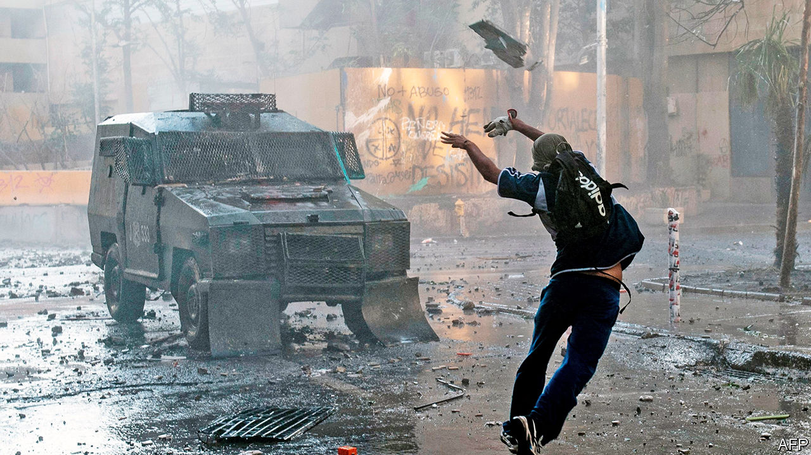
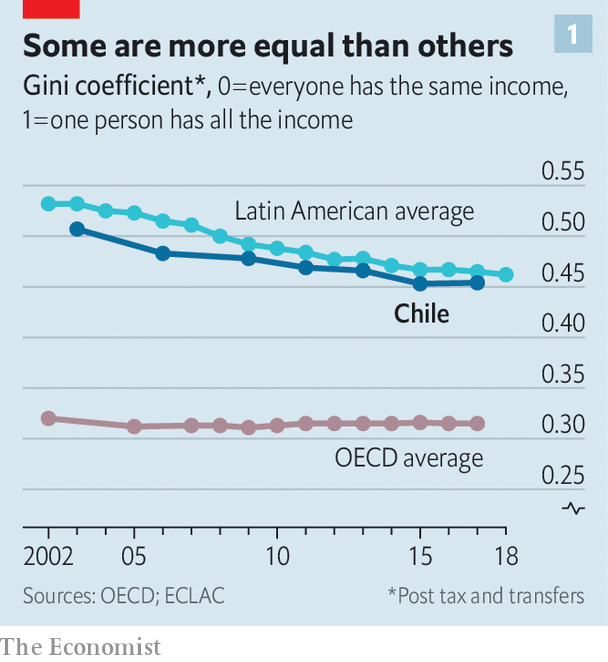
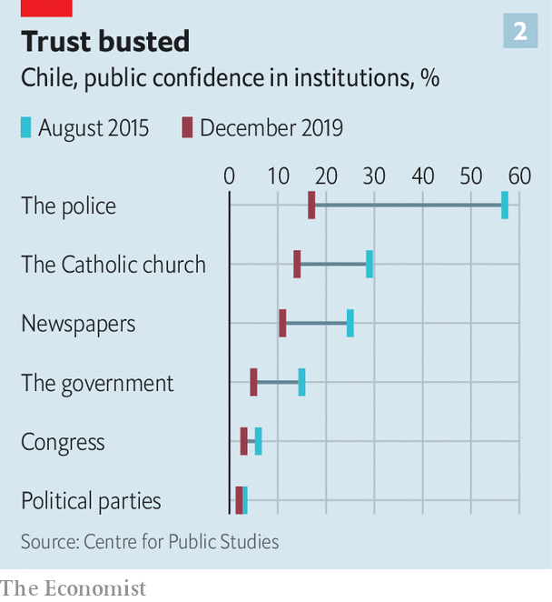
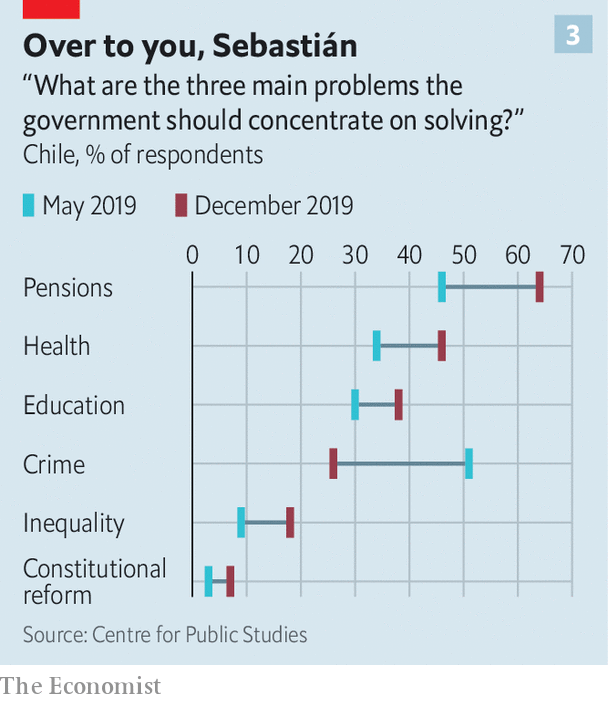
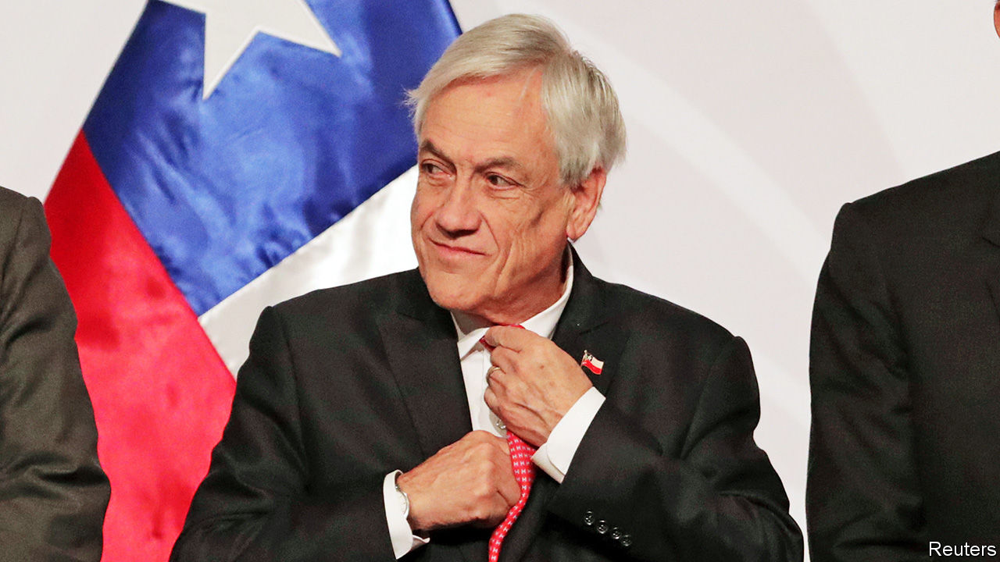

## Remodelling the model

# Can Chile reinvent itself?

> Why the country’s citizens are so angry

> Mar 12th 2020SANTIAGO

WALK NORTH-EAST along the Alameda, the main avenue of Chile’s capital, Santiago, to the well-heeled neighbourhood of Providencia, and for several miles the scene on either side is one of desolation. Hundreds of businesses are boarded up, some operating through doors between shutters. The Baquedano metro station and a large hotel next to it are partly burned out. Pavements have been ripped up, leaving earth and rubble. Traffic lights are disabled. Walls and statues are plastered with graffiti. Many denounce as “murderers”, variously, Sebastián Piñera, Chile’s centre-right president, the Carabineros (the national police force), the state and capitalism. Others hail a coming revolution, or at least a new constitution.

The trouble began on October 6th with a 30-peso (four-cent) rise in the price of peak-hour metro tickets. That set off mass fare-dodging by school pupils. Days later much of the metro in Santiago suffered arson attacks (by foreign agitators, claimed the government, without evidence). Declaring that Chile was “at war”, Mr Piñera imposed a state of emergency for ten days and sent the army on to the streets for only the second time since the dictatorship of General Augusto Pinochet (1973-90). That prompted peaceful protests, including a march in Santiago of perhaps 1m people—in a metropolitan area of 7m. At the same time, supermarkets and pharmacies were looted and several churches and public buildings burned. Much of the damage was in poorer areas on the periphery of Santiago and other cities. At least 30 people died. The economy was hurt, too: growth last year was barely above 1%. The government had forecast 2.6%.

The malcontents are a loose confluence of young people. In the capital nearly 200,000 neither work nor study. Chile has an intellectual proletariat of graduates from low-grade private universities, many of whom have large student debt. Over the past decade anarchist groups that specialise in attacking the police have grown in Santiago. Then there are football hooligans and the footsoldiers of the drug trade, who operate in poor barrios. The fact that many of these people are outside the political system has made it harder for the government to know whom to negotiate with.

Things came to a head on November 12th when, some Chileans feared, the country faced a choice between anarchy and martial rule. “Many people called me, desperate, saying ‘They are burning the city’,” Mr Piñera said in an interview in late January. “I had two choices: to call on the armed forces again, or give another opportunity for peace, dialogue and agreements. It was a very difficult decision.”

According to several sources, this time the military commanders balked at intervening without immunity from prosecution. “The armed forces would have obeyed a presidential order,” insists Mr Piñera. For whatever reason, he drew back. The government swiftly negotiated cross-party agreements for a plebiscite, to be held on April 26th, on whether to set up an assembly to write a new constitution. It rushed through an increase in pensions for the poorest and a tax increase on the better-off, and promised other measures.

All this released some of the tension. The protests faded during the southern-hemisphere summer holidays. But now they have resumed, while vandalism never really stopped.

Several other countries in Latin America saw street protests last year, though not on the same scale. But Chile? Over the past 30 years it came to be viewed as the one country in Latin America on the path to developed-country status. The protests are a big blow to that confidence, and threaten to halt Chile’s progress. But they might also be the spur by which it finally joins the global top tier.

Chile “could become a country with a more solid and sustainable social contract that resolves the legacy issues [left by the Pinochet dictatorship],” as Mario Marcel, the president of the Central Bank, puts it. He notes that those obstacles have contributed to what economists call the middle-income trap, in which sociopolitical shortcomings slow growth and prevent countries reaching developed status.

But if violence continues and the state is unable to contain it by democratic means, and if conservatives block change, others fear a darker future. Chile could face “a classic Peronist moment in which a country successful in growth has contradictions it can’t manage”, says Óscar Landerretche, an economist aligned with the Socialist Party, referring to the period in the 1940s in which Argentina embraced populism and dictatorship.

In many respects Chile has been a success story since democracy returned in 1990. Governed by the centre-left for 24 of those years, it has combined economic growth, political stability, fairly strong institutions and expanding social services. Those below the official poverty line (of $206 per month) fell from 45% of the population in the mid-1980s to 9% in 2017. Some 65% of Chileans are middle-class, up from 24% in 1990, according to the World Bank’s income criteria. Since Chile joined the OECD, a club of mainly rich countries, in 2010, its elites have taken to suggesting that it has little in common with its neighbours.

What, then, prompted the social explosion? “There are many theories,” says Mr Piñera, a billionaire businessman. “I agree with all of them, and they are contradictory, which means we lack a shared diagnosis.” The first theory, favoured on the right, is the slowing of economic growth since 2014. In Mr Piñera’s first term (from 2010 to 2014) growth averaged 5.3% a year, boosted by reconstruction after an earthquake. He won his second term in 2017 by promising a repeat but failed to deliver it. A second, related theory concerns rising expectations. It sees discontent as the consequence of Chile’s success in creating a middle class that demands more of government.

A third view, common on the left, is that the country is rebelling against inequality, which, it is claimed, is entrenched by Pinochet’s “neoliberal” economic “model”. This gave private enterprise free rein and confined the state to a subsidiary role, even in providing social services. By OECD standards, though not those of Latin America, income inequality is indeed wide (see chart 1). “You can’t go through a process of rapid growth and capitalist modernisation and persist with pre-capitalist levels of inequality and absence of meritocracy and social mobility,” says Mr Landerretche. Yet income distribution has improved this century.

A fourth theory highlights political failures. During the second government in 2014-18 of Michelle Bachelet, a Socialist, much of the left disowned its own past work of gradual, consensual reform, propagating the view that it was a failure. As for Mr Piñera, he and his team, who come from a privileged slice of society, lack political skills and empathy with the masses. In their first 18 months in office, they failed to get promised tax and pension reforms through Congress, where the opposition has a majority. Polls now put the president’s popularity at 6-12%. But they reveal a broader abyss between the people and the system: trust in institutions, from the police to the press and the politicians to the churches, has evaporated (see chart 2).

“It’s not [about] 30 pesos, it’s about 30 years of abuses,” goes a popular slogan. Considered more broadly, inequality is indeed at the heart of the matter. It “isn’t just about income, it’s about place, gender, skin colour, where you live, what school you went to, what surname you have,” says Heraldo Muñoz, who leads the centre-left Party for Democracy. “The explosion is against the arrogance of the elite.” More concretely, discontent is focused on pensions, health care and the privileges of a small minority (see chart 3). These mean that being “middle-class” in Chile often means receiving second-class services.

One of the trademarks of Pinochet’s model was a pension system of individual savings accounts in private funds known as AFPs, with no contributions by employers or governments. It was imposed in 1981 by José Piñera, the current president’s (estranged) brother, who calculated that it should deliver pensions averaging 70% of final salary. Widely praised and copied, the system provided Chile with a deep capital market and cheap financing for big firms.

Andrés Uthoff, a member of a consultative committee on pensions under Ms Bachelet, points out that José Piñera’s calculation depended on three conditions being met: continuous employment with a steady income, interest rates above 5% and no increase in life expectancy. None has been: Chile’s labour market is Latin American, not European, featuring low wages, high churn and, for about a third of the labour force, informal work. For every ten people in the workforce, only four pay into their AFP for their whole working life, according to Ignacio Briones, who became finance minister in October. In recent years millions of Chileans have reached retirement age. Four-fifths of all pensions are less than the minimum wage (301,000 pesos per month, or $378) and 44% are below the poverty line, according to Mr Uthoff.

Ms Bachelet introduced a safety net in the form of a basic pension for the poor of 110,000 pesos. Following the protests, the government has raised this to 160,000 pesos. That does not help middle-class retirees. Significantly, Pinochet did not require the armed forces to join AFPs. The government spends more on pensions for the security forces and on those who remained in the pre-1981 system (more than 2% of GDP) than it does for the whole of the rest of the population (less than 1%), points out Roberto Zahler, a former Central Bank president. Government and opposition are close to an agreement that would add employer contributions to pension accounts.

The dictatorship set up a segregated health service. All those in jobs pay a contribution of 7% of salary for health care. In theory, they are free to use that to join private health schemes (with no waiting lists) known as Isapres. But these demand often large additional payments. The Isapres cream off people “with better health and more money”, according to Carolina Velasco of the Centro de Estudios Públicos, a think-tank. Some 77% of the population relies on the public system (known as Fonasa). This is short of money and doctors, so waiting lists are long. “In Chile 25,000 people a year die while waiting for medical treatment,” says Germán Codina, the mayor of Puente Alto, a poor district in Santiago, who is from President Piñera’s National Renovation party.

Then there is the problem of medicines. Fonasa provides some free but there are “queues of up to eight hours to get them, and sometimes they don’t have it”, says Ms Velasco. In 2009 the three main pharmacy chains, which control 90% of the market, were found guilty of price collusion. Even today, prices of over-the-counter drugs are wildly inflated. To take one example, a steroid nasal spray costs $51 in Santiago, compared with $22 in Lima and $13 in Madrid.

This price-gouging is part of a wider pattern of abuse by businesses. Water and fishing rights are held as private property, in practice in perpetuity. Until recently cartels flourished in industries ranging from toilet paper to buses and chickens. Many of the rich avoid taxes. The top 1% pay no more than 15% of their income, according to Rodrigo Valdés, who was finance minister under Ms Bachelet. “Tax lawyers in Chile have helicopters, a sign that we are in trouble,” he says.

Successive governments have tried to deal with these problems, but not fast enough. They faced obstinate resistance from the right and business lobbies. Congress approved a tough competition law in 2009 that makes price fixing a criminal offence. But it is not retroactive. “Many people won’t think anything has changed until someone is in prison,” says Eduardo Engel, an economist at the University of Chile.

“Those who refused to listen or who blocked change are complicit in what happened,” says Mr Codina in Puente Alto. The constitution, drawn up by the dictatorship, has been amended more than 40 times and now carries the signature of Ricardo Lagos, a Socialist president. But it still gives undue protection to vested interests. A score of “organic laws” can only be changed with a four-sevenths majority of Congress. The Constitutional Tribunal, which has a conservative bias, has shielded the Isapres from price regulation, for example.

When Ms Bachelet proposed a new constitution to overcome such resistance in 2015 this was greeted with a collective yawn. Now it has been seized on as a way out of the troubles. Opponents fear that a new charter will lead to the creation of “rights” that are impossible to fulfil and to fiscal irresponsibility. But the law for the April plebiscite on setting up a constitutional convention stipulates that the new document must command two-thirds support in that body, as well as approval in a second referendum in which voting will be compulsory. “The mechanism requires reaching agreements,” says Giorgio Jackson, a left-wing legislator. “So there’s not much time for radicalisation or space for polarisation.” There is little demand to weaken the Central Bank’s independence or Chile’s strict fiscal rules.

The proposal for a new constitution has split the right. Some who were initially panicked into backing it no longer do. Despite such resistance, Eugenio Tironi, a political consultant who ran the campaign that defeated Pinochet’s attempt to stay in power through a plebiscite in 1988, thinks that if turnout in April is at least 60% the convention will be approved by 60% or more of those voting.

Mr Piñera has seemed to veer between the demand for order from his own political base and for change from much of the country. Both are necessary. The scale of the protests and violence spread fear among business folk. “We have a very basic concern,” says Bernardo Larraín of Sofofa, a business lobby. “Does the Chilean state have the ability to maintain public order, so that people can get to work and companies can operate normally?” The Carabineros were once respected. They have been tarnished by recent corruption scandals in a country with much less graft than many of its Latin American peers. In the face of sometimes extreme provocation, they have been exposed as incompetent as well as brutal. Almost 1,900 people were hurt by plastic bullets or buckshot, including 445 with eye injuries, according to the National Human Rights Institute. At 60,000, the force is too small. “The police police themselves,” says Lucía Dammert, a political scientist at the University of Santiago. “The political world hasn’t put any limits on them.” Reforming the police is now widely seen as essential, but will take years.

Because of its macroeconomic prudence, Chile has money to respond to some of the demands for more public spending. This will rise by 9% this year, though much of that will go on repairing the damage. In addition, Mr Briones is preparing a plan for “a gradual and moderate” increase in taxes and permanent spending. “The list of demands is infinite, we have to prioritise,” he says. “We are Chile, not Sweden.”

Will that be enough? Much will depend on whether the constitutional convention takes off, on whether large-scale violence resumes and on how quickly the economy hits its stride again. “Of course there’s more uncertainty and investment decisions are being postponed,” says Mr Larraín. Nevertheless, at least before factoring in covid-19, the Central Bank thinks Chile will avoid recession and that the economy will grow by around 1% this year, helped by fiscal and monetary stimulus.

As with the student rebellion in France in May 1968, Chile’s events have shaken a country that seemed to be progressing, placing both the survival of its president and its political stability in doubt. Mr Piñera says he has been reading a new biography of General Charles de Gaulle, who weathered the 1968 protests as France’s president but bowed out shortly afterwards. Mr Piñera insists he will soldier on to the end of his term in 2022.

“We don’t yet know whether this crisis will be a way of improving Chile or whether it will get worse,” he admits. The country lacks a recent populist tradition, but some of the elements are there. “The people, united, functions without parties”, proclaims a large graffito. The next few months will determine whether Chile seeks a saviour or follows a path of improving its institutions. Time alone will not heal: there is no going back to the country of October 5th.■