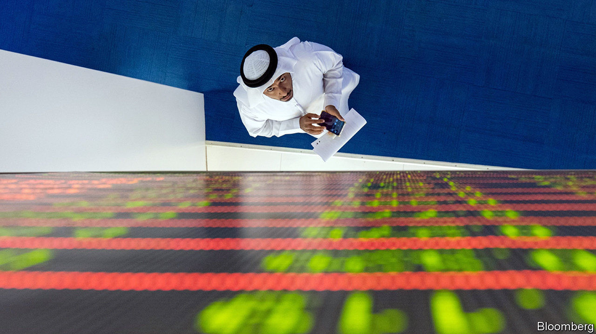
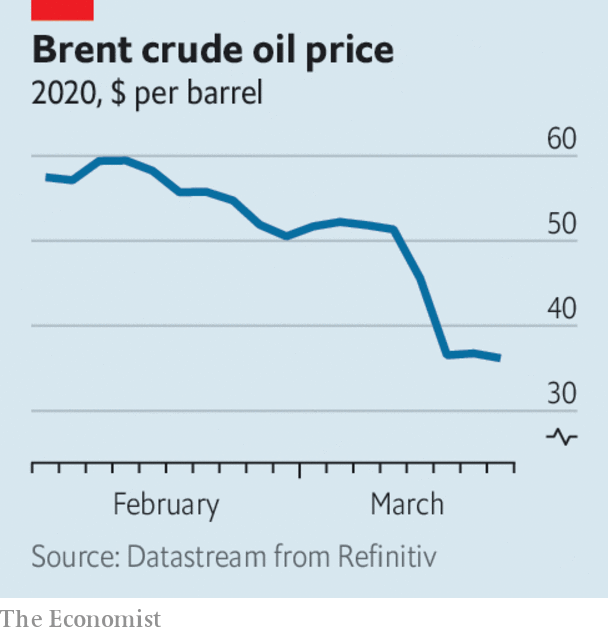

# Business this week

> Mar 12th 2020

Staggering from the effects of coronavirus on business, stockmarkets were also sent reeling by Saudi Arabia’s decision to instigate an oil-price war with Russia, as the pair’s agreement over production levels broke down. Oil prices plunged in the sharpest one-day decline since 1991. Saudi Aramco, the state-controlled oil company, is increasing capacity by 1m barrels of oil a day to a record 13m, saturating an already over-supplied market. Trading remained volatile; the decade-long bull run in stockmarkets was deemed to be over. See [article](https://www.economist.com//finance-and-economics/2020/03/12/no-one-is-likely-to-win-the-oil-price-war).

Amid the turmoil Saudi Aramco saw its stock fall below 32 riyals ($8.50) for the first time, the price at which the shares were offered when they floated on the stockmarket in December.

The Bank of England made an emergency cut to interest rates, lowering its main rate by half a percentage point to 0.25%. It also extended cheap funding to banks so that they can “bridge a potentially challenging period”. The European Central Bank prepared to ease policy and offer a range of supportive actions to companies and banks. The Federal Reserve pumped money into the short-term repo market to support the “smooth functioning of funding markets”. See [article](https://www.economist.com//finance-and-economics/2020/03/12/the-challenge-of-addressing-covid-19s-economic-effects-in-europe).

The aviation industry is being battered by the covid-19 outbreak. Boeing lost a fifth of its market value in a day amid reports that it would soon use the remainder of a $13.8bn loan it had only recently secured. Korean Air, which has cancelled 80% of its international flights, said that prolonged disruption threatened its survival. The suspension of many flights, and a general reluctance to travel, has already led to a collapse in bookings, which will be compounded by America’s ban on flights from Europe. Chinese airlines have been the worst affected. Chinese passenger numbers tumbled by 85% in February compared with February 2019.

China’s exports dropped sharply in January and February, and imports fell, producing a surprise trade deficit of $7.1bn. That raises questions about whether China will be able to meet its commitments under the “phase one” trade deal with America, through which it is supposed to buy more American products.

India’s central bank stepped in to rescue Yes, the country’s fourth-largest private lender, which is grappling with high debt. The bail-out involves State Bank of India, the biggest government-owned bank, taking a stake in Yes. See [article](https://www.economist.com//finance-and-economics/2020/03/12/yes-banks-rescue-deepens-worries-about-indian-finance).

Jamie Dimon, the chief executive of JPMorgan Chase, had an emergency procedure on his heart, leaving two senior executives in charge until he recovers. Mr Dimon has run the company since 2005, making him the longest-serving CEO of any big American bank. See [article](https://www.economist.com//leaders/2020/03/12/should-jamie-dimon-wall-streets-most-celebrated-boss-call-it-a-day).

Aon and Willis Towers Watson, the world’s second- and third-largest insurance brokers, agreed to combine in a $30bn deal. Separately, Tesco, one of the world’s biggest supermarket chains, said it would sell its operations in South-East Asia to Charoen Pokphand, a Thai conglomerate, for $10.6bn. It is the biggest-ever takeover in Thailand.

Twitter reached a truce with activist investors led by Elliott, a hedge fund, seeking changes at the company. Three new directors were added to the board. Jack Dorsey keeps his job as chief executive; he has been criticised by the investors for having too many outside interests. As part of the deal a committee has been tasked with evaluating a “succession plan” for Mr Dorsey.

In Britain, dozens of Conservative MPs backed an amendment to a bill that would end the involvement of Huawei, a Chinese maker of telecoms equipment, in the country’s 5G networks, on the grounds of national security. The amendment was defeated, but it was the first Tory rebellion against Boris Johnson’s government.

The Chinese owner of Grindr, the world’s most popular gay-dating app, found a buyer for the business after the American government reportedly pressed it to sell. In 2016 Beijing Kunlun Tech acquired Grindr from its American developers. But that led to concerns that China could tap into data on the app in order to blackmail American citizens.

The UN and World Meteorological Organisation released a report on the rise of carbon-dioxide emissions. “Greenhouse-gas concentrations are at the highest levels in three million years, when the Earth’s temperature was as much as three degrees hotter and sea levels some 15 metres higher,” said António Guterres, the UN’s secretary-general.

The list of events cancelled or postponed because of covid-19 mushroomed. Casualties include the rest of the NBA season in America and the Coachella festival in southern California. The Council on Foreign Relations scrapped a roundtable on “doing business under coronavirus”. See [article](https://www.economist.com//graphic-detail/2020/03/14/foot-traffic-has-fallen-sharply-in-cities-with-big-coronavirus-outbreaks).