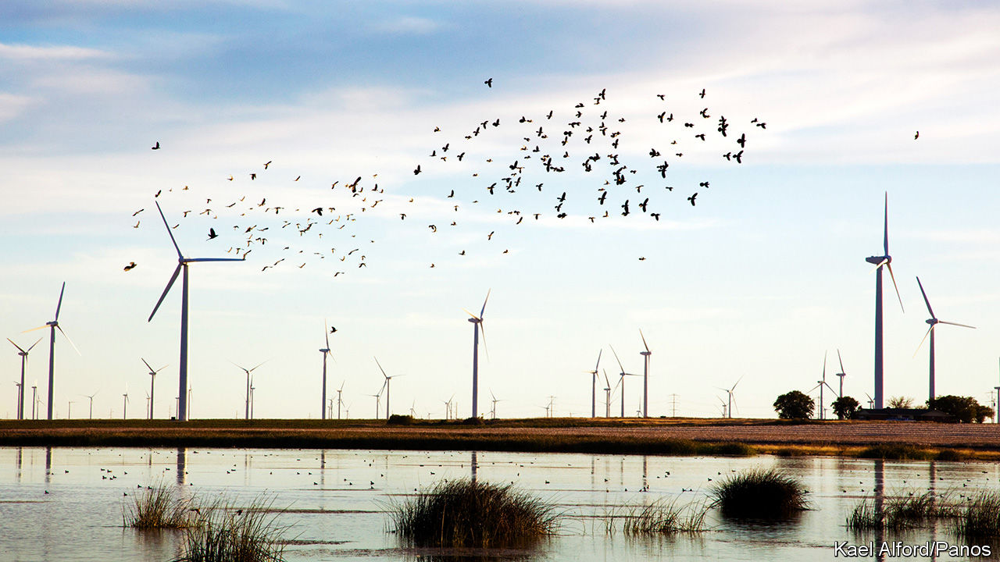

## Green Texas

# A renewable-energy boom is changing the politics of global warming

> An awful lot of Republican-voting states have fallen for wind farms and solar panels

> Mar 14th 2020TAHOKA, TEXAS

OVER THE PAST few years Dewey Engle, an 81-year-old retired highway worker who lives on the outskirts of Tahoka, a small farming town in west Texas, has acquired a new view from his back porch. Dozens of wind turbines hum 300ft over the cotton fields behind his bungalow. Some people might be disturbed by the sudden arrival of such monstrous machines practically in their garden. Mr Engle says that his only problem with them is that they are not on his modest patch of farmland, so he does not get any royalties. “I would love to have that money coming in,” he says. “I’d like to have ten of them.”

The wind farm at Tahoka is owned by Orsted, a Danish energy firm which entered the American market less than two years ago. It comprises 120 turbines, each capable of generating enough power for 1,000 homes. At next door Sage Draw, another 120 turbines are still being erected and hooked up to the Texas grid. Fracking, another industry which has transformed parts of western Texas over the past decade, is now in trouble. But turbine blades will not stop spinning. Drive from Lubbock to Sweetwater, and for almost the entire journey the horizon bristles with windmills in every direction. The vast majority were put up in the past ten years. Texas now meets 20% of its sizeable electricity demand with wind. If it were a country, the Lone Star State would be the fifth-biggest in the world in its production of wind energy.

Curiously, America’s renewable-energy boom has been strongest in Republican-controlled states like Texas. Democrat-controlled places like New York have policies intended to attract investment, for example pledges that state governments will buy only green power. But Texas has lots of wind and sun and rather fewer Nimbys. President Donald Trump, who has spent a small fortune trying to fight a wind farm within sight of his Scottish golf club, evidently cannot stand turbines. At rallies he likes to rant about how they kill birds. But for many of his supporters, particularly in rural areas, wind turbines and solar panels are a boost to ailing economies. In Lynn County, of which Tahoka is the seat, 77% of people voted for Mr Trump. Could the boom persuade Republicans that decarbonising might be an economic opportunity, not just a cost?

In recent years turbines have sprouted across the American plains; proportionately, Kansas and Oklahoma both rely on wind more than Texas does. For some years now, one of the fastest-growing job categories in America has been “wind-turbine technician”. Nor is the boom confined to wind. Investment is pouring into solar plants and battery systems, especially in the sun-soaked south-west. The growth in numbers of solar-panel installers has now overtaken that of wind-turbine technicians. Taken together, solar and wind energy make up 55% of the new electricity-generating capacity added each year, according to the Solar Energy Industries Association, an industry group. Since coal plants are shutting faster than gas ones open, overall fossil-fuel capacity is shrinking.

What precipitated this boom? Federal policies have helped—wind has benefited from a production tax credit for decades, though it will expire in the next few years. A solar-investment tax credit will continue. But local policies have helped, too. Texas has its own electricity grid, which is managed by ERCOT, a state utility. In the 2000s lobbying by politicians in the west of the state led it to create a fund to build a new network of transmission lines, which made it possible for wind producers to supply power to the grid from remote but windy parts of the state. The same lines are now helping to boost solar, says Dan Woodfin of ERCOT. He says that, ten years ago, he did not believe that the system would be able to handle as much renewable energy as it does now; at the peak, 55% of Texas’s electricity has been supplied by wind.

Yet the biggest driver has simply been low cost and high demand. The cost of wind turbines and solar panels has fallen precipitously. And in rural places like Texas (unlike more densely populated parts of the country) royalties paid for the use of land are important enough to landowners and local governments to deter opposition. Meanwhile a growing number of large firms want to buy green electricity to reduce their own carbon emissions, which means producers can package up their renewable energy to sell with virtual power-supply agreements.

Will all this growth begin to change attitudes towards climate change? For now, Texas has around 35,000 jobs in solar and wind energy. The figure has grown quickly, but ten times that number are still in fossil fuels. Texas is America’s biggest producer of carbon emissions. So it is perhaps unsurprising that its governor, Greg Abbott, has been sceptical that humankind has much to do with global warming. Plenty of Republican politicians, such as Senator Chuck Grassley of Iowa, show that it is entirely possible to be an enthusiastic proponent of green energy in your district while still denying that climate change overall requires any national policy response.

But the shift towards greener energy is changing some minds. Curt Morgan, the CEO of Vistra Energy, one of Texas’s biggest electricity firms, which both generates and sells electricity, says his firm has moved from relying on coal for around 70% of its generation to less than half that now. All of Vistra’s new investments are in renewable energy, and the firm now backs a carbon tax, which Mr Morgan says is the best way to incentivise firms like his to move away from polluting carbon. ExxonMobil, a fossil-fuel giant headquartered in the state, is another proponent of the idea.

Yet will that persuade Republicans? Mr Morgan says he thinks the party is moving in the right direction. They have moved from being a “just say no party on climate change to a party that recognises it is a problem,” he says. But, he adds, progress is slow. “The politicians have a problem—they need to get re-elected.” In February Republicans in the House of Representatives proposed to reduce emissions by creating a tax credit for carbon sequestration and encouraging the planting of trees. Despite its modesty, the plan was immediately denounced as capitulation by some groups on the right. The Republican Party risks being left behind defending old industries even as new ones sweep them away.■

Sign up to our fortnightly climate-change newsletter [here](https://www.economist.com//theclimateissue/)

## URL

https://www.economist.com/united-states/2020/03/14/a-renewable-energy-boom-is-changing-the-politics-of-global-warming
