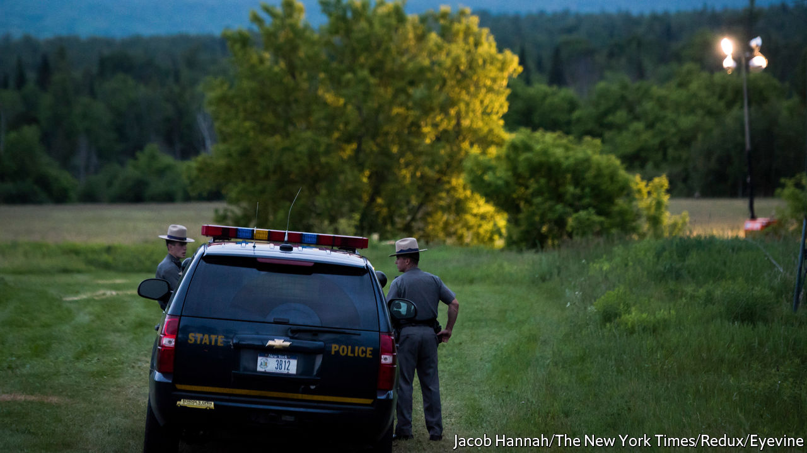

## Country cops

# Small towns and rural parts of America have a policing problem

> Difficulty recruiting and retaining officers means that the number of police departments is shrinking

> Mar 12th 2020THOMASTON, MAINE

“THE ANDY GRIFFITH SHOW”, one of the most popular television programmes during the 1960s, was about a small town’s sensible and empathetic sheriff. It would be difficult to reboot today. The loyal deputy position would have a high turnover rate and the sheriff would consider resigning for a job with family health insurance. The town council, meanwhile, would debate disbanding the police department altogether.

Thomaston, a picturesque town of 2,800 people in mid-coast Maine, found itself with just one full-time police officer last year. Two officers resigned and then two more left for better-paying jobs in other law-enforcement agencies. The police department at full capacity is made up of four full-time officers, the police chief and three reserve officers. A reserve officer is a sort of apprentice cop, who works part-time and is certified to enforce the law, but has not yet gone to the police academy for training. The small department was kept busy responding to around 5,000 calls a year, ranging from barking-dog complaints to domestic violence. Much of the crime is related to opioid addiction. Keeping good cops had long been a problem. Their families were not entitled to health coverage, and working nights, weekends and holidays is not for everyone.

The exodus left just Tim Hoppe, the police chief. A referendum was held to disband the police department and contract a sheriff to patrol the town. The townspeople voted in favour of keeping its local force, even if it meant paying more in taxes. But a police department does not come cheap. Training an officer can cost $40,000-50,000. Health care can be extortionate. Equipment is pricey and must be upgraded regularly. Bulletproof vests, for instance, must be changed every few years. Many small departments make do with battered cruisers and radios which fail to work in rural dead zones. Some departments require officers to pay for their own firearms, body armour and body cameras.

About half of all local police departments have fewer than ten officers. Many are battling to keep even those. Better pay in the private sector is helping thin the ranks. The result is that the number of officers per 1,000 residents fell by 7% between 2007 and 2016, the most recent year examined by the Bureau of Justice Statistics.

Thomaston is not alone in debating the future of policing in its town hall. Rural districts from Maine to Montana are consolidating law-enforcement resources or contracting them out to the county or state. Gouldsboro, another Maine town of 1,700 people, voted to keep its department in 2019. Croydon, a small town in New Hampshire, disbanded its one-man police department last month.

Jim Burch of the National Police Foundation, a research outfit, says contract policing with a larger county agency can work well. But, he says, it comes at a cost. Response times can be slower. And local policing brings other benefits. Mr Hoppe knows everyone in Thomaston. Two people have died from opioids in the past two weeks in his town. He knew them both.

The Department of Justice recently held a series of sessions around the country to understand the troubles of local law-enforcement agencies. The hope is that the feds will adjust funding to give rural police forces some backup.■