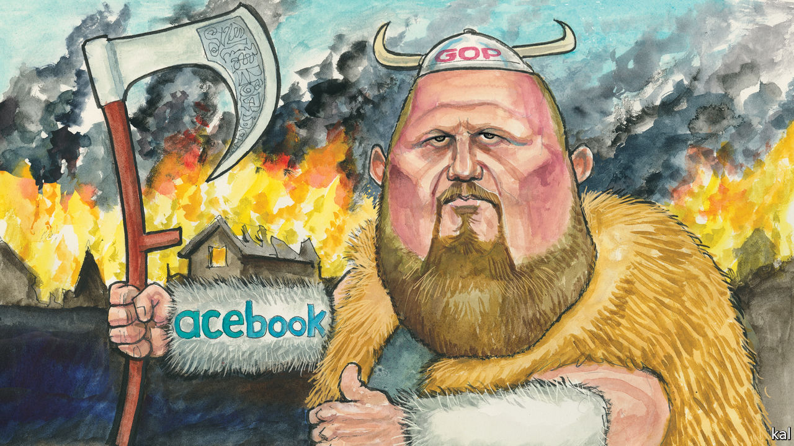

## Lexington

# The Trump campaign

> Donald Trump owes his election to the moral choices of millions of voters—not to Facebook ads

> Mar 14th 2020

FIRST IT WAS Steve Bannon; then Jared Kushner; now it is Brad Parscale. Ever since Donald Trump began persuading millions of Americans to support him while behaving as no successful politician ever had, mainstream commentators have looked for the evil genius pulling his strings. Messrs Bannon and Kushner were both auditioned for the part, but rejected, after achieving little in office besides notoriety. Now, as Mr Trump’s re-election campaign starts going full tilt, Mr Parscale is being considered.

Tremulous profiles of the Trump campaign’s manager are the latest thing in political reporting. They typically start by noting his intimidating height, bullish demeanour and “Viking beard” (“I get the Viking thing often,” Mr Parscale has acknowledged). Such attributes are on-brand with a president fixated on central casting—as are other features of the 44-year-old Mr Parscale’s rise from obscurity in San Antonio, Texas, where he worked as an online marketer, to command the heights of the politics business.

Like Mr Trump—who launched Mr Parscale by paying him $1,500 to design his first campaign website—he is a political gadfly, rabble-rouser and dissembler. A sometime libertarian, who has rarely voted, he is now a staple warm-up act at Trump rallies: praising the president and attacking his enemies. A self-described “farm boy from Kansas”, he in fact grew up in suburbia, the son of a wannabe Democratic politician. But, again like Mr Trump, he has a reputation for native cunning and outlandish success that can make such foibles seem colourfully additive or irrelevant.

Mr Parscale’s reputation is based on Mr Trump’s 2016 digital campaign, which he led. A Facebook executive described it as “the single best digital ad campaign I’ve ever seen”. Heavily focused on Facebook advertising, it was credited with micro-targeting thousands of Trump voters in swing states with the half-truths and xenophobic messaging that Mr Parscale has a gift for turning from Mr Trump’s lips into ad copy. And sometimes the other way round: he is also credited with persuading the president to swap “illegal immigrants” for “illegal aliens”, a more stimulating phrase.

The liberal commentariat fears Mr Parscale is about to repeat his electoral feat. Mr Trump’s campaign is now awash with cash and even more ambitiously digitised than it was in 2016. It also stands to benefit disproportionately from his incumbency, because digital campaigning is based on data-gathering, which he has been doing non-stop. Perhaps a million people have attended the hundred-odd rallies he has held since his election, and many more provided their names and phone numbers to register for one. At a rally in South Carolina last month one attendee, with phone in hand, showed your columnist what happens next.

Every few hours she had received a text message, purportedly from one of Mr Trump’s sons, demanding cash. “My father asked me to reach out personally, friend…Don’t disappoint him,” ran the latest from Eric Trump. By such means Mr Trump and his proxies have raised over $200m, far more than their Democratic rivals.

That sort of money buys impunity as well as advertising. Though Facebook has tried to impose a code of conduct on political advertisers—for example, it vowed to block content ruled untrue by a third-party fact-checker—the Trump campaign has often violated its terms. And in response the platform has backed down; for example, although the campaign recently pushed a lie linking Joe Biden to corruption in Ukraine, Facebook decided to make political campaigns exempt from its fact-checking rule.

This is a promise of yet more disinformation and divisiveness. Yet whether Mr Parscale’s digital knavery will affect Mr Trump’s chances of re-election is moot. Academic studies of political advertising suggest it reinforces existing biases but is almost useless at changing voters’ minds. Americans’ partisan affiliations and familiarity with advertising are too strong. “The best estimate of the effects of campaign contact and advertising on Americans’ candidate choices in general elections is zero,” concluded the authors of a recent meta-study of electoral research. Mike Bloomberg spent half a billion dollars proving the same point in a primary contest. It bought him some decent poll numbers, but the moment he faced critical coverage after a bad debate performance, they collapsed.

Digital campaigning is fast-evolving. But, notwithstanding the fears he is inspiring, there is little reason to think Mr Parscale has anything up his sleeve that could alter this reassuring picture. His main ploy in 2016 was to use Facebook technology to raise money, according to David Karpf of George Washington University, an expert on disinformation. Mr Parscale was told how to do so by Facebook staffers loaned to the campaign. Otherwise, the Trump campaign’s digital strategy was not fundamentally different from Hillary Clinton’s. Her campaign also spent heavily on Facebook.

The mystique surrounding Mr Parscale and his digital arts appears to be largely a product of vested interests. Political operatives revere ads in part because many have got rich on them, including Mr Parscale. One of his many firms has charged the Trump campaign and related organisations nearly $35m since 2017, mostly to pay for ads it has commissioned. This has also given Facebook, the main beneficiary of Mr Parscale’s strategy, an obvious incentive to talk up his genius and the potency of digital advertising—though there is no compelling evidence for either claim.

Journalists who covered the 2016 election also have reasons to buy the myth of Mr Trump’s digital mastery. It allows them to downplay their own responsibility for his win by providing blanket coverage of the Republican candidate and the many slanders he levelled at Mrs Clinton, concerning her emails, alleged corruption and so forth. It is also a means to avoid confronting the uncomfortable fact that 63m Americans heard who Mr Trump was from his own mouth, unfiltered, and still voted for him. That is a better explanation for his success than Mr Parscale’s dark arts.■

Dig deeper:

## URL

https://www.economist.com/united-states/2020/03/14/the-trump-campaign
