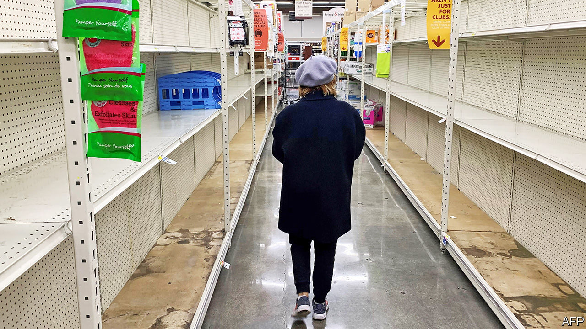

## Spluttering

# Tracking the economic impact of covid-19 in real time

> It is not necessary to wait for quarterly GDP numbers to see what the virus is doing to activity

> Mar 14th 2020SAN FRANCISCO

AS FEARS GROW about the impact of the covid-19 virus, financial markets have slumped. Now there are signs that the virus is moving from traders’ screens to the real economy. No one will know the true economic impact for some time, because official statistics are published with a lag: the first estimate of GDP growth in the current quarter, for instance, will not appear until April 29th. Analysts cannot wait that long. So they are turning to “real-time” data, mainly produced by the private sector, on everything from transport use to social-media activity. None of these measures is reliable by itself, but together they give a decent impression of what is going on.

It is not all doom and gloom. So far there are few indications—either from weekly jobless claims or from company announcements—that joblessness is rising. Worries that broken supply chains would stoke inflation also look overdone, for now at least. Data to the beginning of March from State Street PriceStats Indicators, which measures inflation daily, suggest that inflation has been on a steady downward trend since the beginning of the year (though in recent days food prices have inched up, perhaps pointing to the effects of stockpiling). Railway and trucking volumes appear to be holding up. There is some evidence of lower electricity demand, perhaps as people miss work, though the figures are volatile.

Household spending is taking a big hit, however. Analysis by Goldman Sachs, a bank, of Twitter posts suggests that consumer confidence has dropped. People are nervous of crowds—and some 40% of household spending is vulnerable to people shunning gatherings, according to calculations by The Economist using a methodology from an Oxford University research paper. (About 5% of consumer spending goes on dining out, for instance.)

Google searches for “restaurant reservations” are way down. The maître d’ at San Francisco’s best oyster bar was so pleased to see a customer that he offered a free plate of them when your correspondent bought a drink (the bar looked over the bay towards Grand Princess, a virus-stricken ship harboured in Oakland). A report from JPMorgan Chase, another bank, estimates that last weekend the virus reduced cinema-ticket receipts by 20%. Attendance at Broadway shows has also dropped. Data from TomTom, a location-technology firm, reveal unusually low traffic congestion in many American cities since the end of last week. Lower consumer spending points to feeble GDP growth in the first half of this year, though a recession still seems unlikely at this stage.

What happens next depends on whether America gets a handle on the outbreak. If it does not, then over time revenue-starved firms and salary-starved families will struggle. Any short-term economic boost from stockpiling would be cold comfort in the face of lower spending on services. But if America contains the virus, it can look forward to a bounceback of sorts. Real-time data in China, from traffic congestion to energy consumption, remain weak but are fast improving as the number of new infections slows. An acute economic shock does not have to turn chronic. ■

Dig deeper: