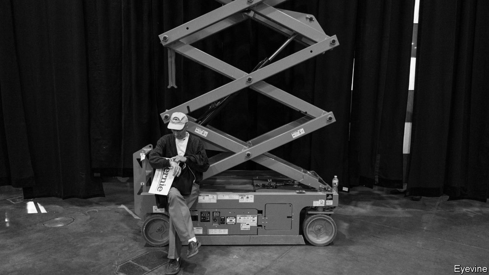
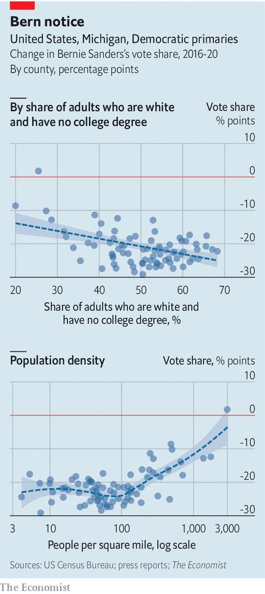

## Berning out

# Working-class whites deserted Bernie Sanders in the Midwest

> Joe Biden will very probably be the Democratic nominee

> Mar 12th 2020WASHINGTON, DC

IN 1987, WHILE he was mayor of Burlington, Vermont, Bernie Sanders released an album of folk songs and poetry entitled “We Shall Overcome”. The record included anthems of Americana such as “This Land Is Your Land”, as well as civil-rights ballads like “Oh Freedom”. It became popular among Mr Sanders’s supporters during the 2016 Democratic primaries, embodying his long-standing devotion to progressive ideas about race and civil rights, along with his vintage lefty beliefs about the state’s responsibility to create equality. (His singing abilities were probably less of a factor in the album’s success.)

Despite his folksy appeal, Mr Sanders was unable to win the Democratic Party’s presidential nomination that year. Voters seem to have decided on a similar fate for him this time round. After briefly leading the primary race in February, the Vermont senator suffered a severe setback on Super Tuesday. He limped into this week trailing Joe Biden, the former vice-president, by roughly 80 delegates, according to The Economist’s projections. On March 10th Mr Biden dealt him another crushing blow. Mr Sanders lost in Michigan, where he won in 2016, by more than 15 percentage points. He also lost in Missouri and Mississippi (which he lost in 2016) and in Idaho (which he won).

The results in Michigan are particularly rough for Mr Sanders. Back in 2016 his surprise victory was an important boost for a campaign that had struggled to build a winning coalition. He had lost the majority of the primaries and caucuses held the previous week, and trailed Hillary Clinton by 156 delegates (a far worse deficit than his position this week). Yet despite the odds—polls had him down by 20 percentage points—he won the state, breathing new life into his campaign. Victory then came thanks to support from working-class whites, who favoured him by large margins over Mrs Clinton, and from young people. Mr Sanders’s protectionist trade policies may have been particularly popular in declining post-industrial cities such as Grand Rapids and Kalamazoo.

Much of that Sanders coalition from 2016 has not stuck around. In post-industrial Kent County (which surrounds Grand Rapids), his vote share fell by 18 points compared with 2016. In Kalamazoo County, it fell by 17 points.

Cracks in the base had already begun to show. Suburbanites and young voters had failed to turn out in Super Tuesday states in the revolutionary numbers that he has long promised. Until now, though, it was not clear whether rustbelt whites would give him enough support to keep his hopes alive. But across Michigan his vote share slipped by larger amounts in counties with higher concentrations of white adults without a college degree. It plunged too in the sparsely populated areas of the state (see chart).

Although these voters were willing to cast their ballots for a self-described socialist in 2016, that was probably because they disliked Mrs Clinton more. Given the choice between Mr Biden and a far-left ideologue, they picked the moderate this time round.

The primaries are now all but over. Mr Biden emerges from the latest contests with a 145-delegate lead, according to our projections of how remaining delegates from partially-reporting states will be allocated. Barring disaster, Mr Biden will probably go on to win a large majority of delegates in next week’s contests. Polls put him ahead in Arizona, Florida, Illinois and Ohio—worth 577 delegates in total.

Mr Sanders’s campaign will not have been for nought; he has moved the party left on the issues he cares about most. Ultimately, though, Democrats just did not believe he could beat Donald Trump. ■

Dig deeper:

## URL

https://www.economist.com/united-states/2020/03/12/working-class-whites-deserted-bernie-sanders-in-the-midwest
