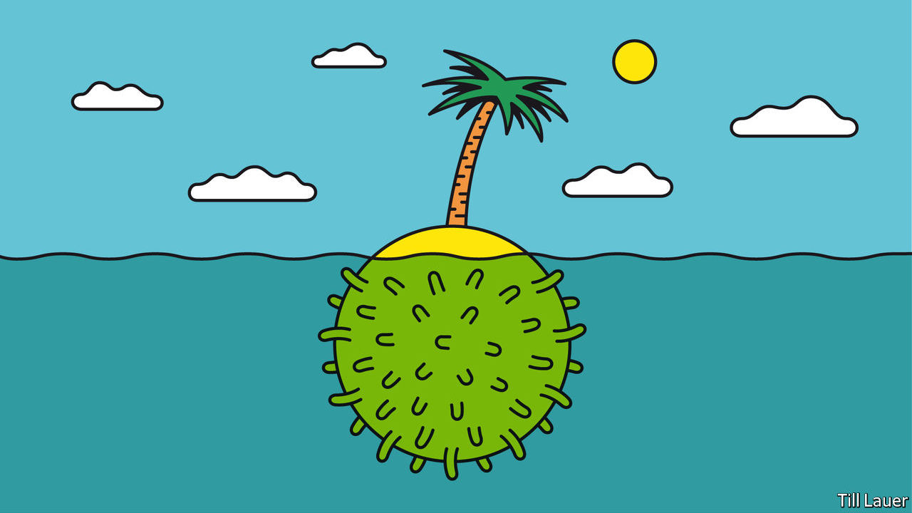

## Banyan

# Even tiny Pacific islands cannot escape covid-19

> Contact with the outside world is risky but they can’t survive without it

> Mar 21st 2020

Editor’s note: The Economist is making some of its most important coverage of the covid-19 pandemic freely available to readers of The Economist Today, our daily newsletter. To receive it, register [here](https://www.economist.com//newslettersignup). For more coverage, see our coronavirus [hub](https://www.economist.com//coronavirus)

REMOTE AND pristine, the tiny island nations of the Pacific are often the object of apocalypse-proofing fantasies. But if you think they are in any state to ride out covid-19, dream on.

Many Pacific jurisdictions have thrown up barriers to the new coronavirus. In late January the Federated States of Micronesia banned entry to travellers from countries with confirmed cases. The Cook Islands, Fiji, French Polynesia, New Caledonia, Papua New Guinea (PNG), Tonga and Vanuatu have banned cruise ships. Anyone coming to Samoa has had to produce a medical certificate. In early March the Marshall Islands sealed itself off, banning all inbound visitors. Even supply vessels must wait 14 days at sea before berthing.

The economic cost will be devastating. The island states import nearly everything. Moreover, tourism is the main earner for many. Fiji had a full-blown fiscal crisis even before empty hotels removed a big source of revenue. The Northern Marianas, an American territory, relies on vanished visitors from China, Japan and South Korea. Writing to President Donald Trump for help, the governor warned of the “unequivocal and complete collapse of the foundations of our private sector”.

If the measures kept the coronavirus at bay, they might be worth it. But they won’t. Already, five cases have been confirmed in Guam, five in French Polynesia (including a returning member of France’s National Assembly), two in New Caledonia and one in Fiji. One is suspected in PNG. Testing facilities barely exist in the South Pacific—samples are sent to Australia or New Zealand—although Fiji has raced to set one up.

The coronavirus has many routes to spread. PNG, the region’s most populous state, has a porous border with Australia, just across the Torres Strait, and a land border with Indonesia. It is trying to seal the sea-lanes to the nearby Solomon Islands. Tuvalu and Kiribati are among the tiniest, most isolated states in the world, yet many of their menfolk work as seafarers, with a history of carrying infectious diseases home. Half of the populations of Samoa and Tonga are abroad, many in infected countries. There are more possible vectors than isolated atolls.

It is cause for alarm. The Marshall Islands is only now recovering from a dengue outbreak infecting 3,000, followed by bursts of influenza. It left the little hospital in the capital, Majuro, looking “like a war zone”, says the health secretary, Jack Niedenthal. An outbreak of measles in Samoa in December killed 83, most of them children. Both countries are racing to respond to covid-19. But the Marshall Islands has just six ventilators. Of just 100 protective gowns, goggles and gloves, the hospital got through 22 sets investigating a single suspected case. Meanwhile, the Solomon Islands has such a dilapidated health system that many will view the main hospital in Honiara, the capital, as the last place to go with covid-19.

To cope with the pandemic, Pacific islanders will be thrown back on support networks such as family and church. People are all too used to catastrophes, from cyclones to tsunamis. Only rarely, as Jonathan Pryke of the Lowy Institute in Sydney puts it, do they feel the hand of the state. Traditional networks will prove a blessing, but also carry risks if infections are carried back to villages from capitals. It helps that Pacific populations are relatively young (covid-19 guns for the elderly and infirm). But high rates of non-communicable diseases, notably diabetes, put more people at risk. Thanks to an atrocious diet (think Spam and Kool-Aid), seven of the ten most diabetic countries are in the Pacific. The hospital in Honiara saws off three limbs a day.

Peter Kenilorea, an opposition figure in the Solomon Islands, says the government is unprepared. In its speech marking the opening of Parliament in Honiara this week, only two sentences were devoted to covid-19. A radio station in Fiji has been broadcasting public-health advice for weeks about washing hands. Yet the government will not let it link those messages to the pandemic, lest they spark panic.

Australia and New Zealand both emphasise what New Zealand’s leader, Jacinda Ardern, calls “a duty of care” to Pacific nations. Both countries have promised to send medical equipment and personnel. But Sheldon Yett of Unicef says that the region’s travel clampdown hampers the movement of aid workers and supplies. And once Australia and New Zealand face full-blown crises of their own, how much will they look out for the Pacific?

Dig deeper:For our latest coverage of the covid-19 pandemic, register for The Economist Today, our daily [newsletter](https://www.economist.com//newslettersignup), or visit our [coronavirus hub](https://www.economist.com//coronavirus)