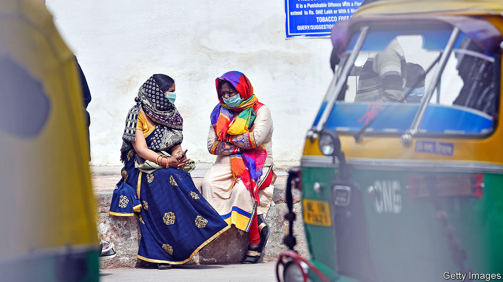
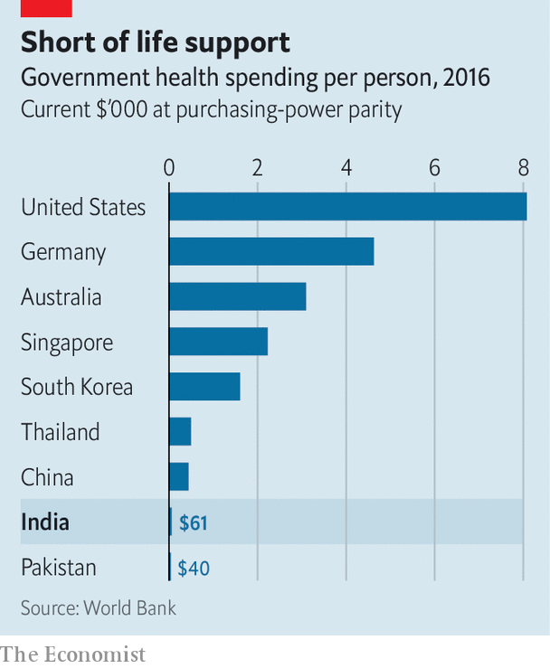

## The billion-person question

# If covid-19 takes hold in India the toll will be grim

> It is poor, crowded, short of doctors and equipment and rife with exacerbating diseases

> Mar 21st 2020DELHI

Editor’s note: The Economist is making some of its most important coverage of the covid-19 pandemic freely available to readers of The Economist Today, our daily newsletter. To receive it, register [here](https://www.economist.com//newslettersignup). For more coverage, see our coronavirus [hub](https://www.economist.com//coronavirus)

IT WAS CALLED the Spanish influenza, but given the number of Indians it killed, the flu pandemic of 1918-19 should perhaps have carried a different name. Some 18m are thought to have died, or 6% of the country’s population at the time. A century later, with covid-19 lapping at India’s now far more crowded shores, fears are rising that the world’s second-most-populous country could again bear a disproportionate share of the global agony.

Until now, India has been lucky with this coronavirus. Despite the proximity of China there is only modest human traffic between the Asian giants, a result of chronically strained relations. Nor do many travellers visit India from other early centres of the pandemic, such as Iran and Italy. Partly as a result, India has registered fewer than 200 cases so far, and only three deaths. Most of those testing positive acquired the virus outside the country.

Indian governments, both central and state, have also been strikingly forceful in their response. They were quick to restrict travel from afflicted areas and apply basic screening at airports. India has also airlifted—and closely monitored the health of—hundreds of its own citizens from stricken spots such as Wuhan, Tehran and Milan. Public information campaigns have saturated every television channel; recorded messages even interrupt calls on India’s 900m mobile phones. Across most states, schools and universities have been shut and public events cancelled. Kerala in the far south, a state with a record of excellence in public health, has gone further. Volunteers now deliver free school lunches directly to homes, while kerbside basins have been installed at even the remotest rural bus stations to encourage hand-washing. To enforce adherence to individual isolation orders, health authorities farther north in Maharashtra are stamping hands in indelible ink with the word “Home Quarantined” and an expiry date.

Health officials insist that they have managed to limit infections to people who were exposed to the virus abroad and their immediate contacts within India. In some places, they have been assiduous in finding and isolating those at risk. One case in Kerala, where success in stemming an outbreak of the far deadlier Nipah virus in 2018 has built institutional expertise, involved tracing nearly 1,000 people who had come in contact with a single family. But not all states are as efficient. Border screening varied between entry points and never amounted to more than taking the temperatures of passengers—a dragnet a covid-carrier could slip through by taking paracetamol, a doctor grumbles.

Many also note the paucity of testing data. Due to the cost and relatively small supply of testing kits, plus the limited capacity of government labs and a commendable desire to control the complex testing process so that it does not itself become a vector for the virus, India has so far only tested some 11,500 people. This compares with 270,000 in South Korea, a country with a fraction of the population. And because the testing protocol has focused so heavily on travellers, it has become what one expert calls a self-fulfilling prophecy, detecting only cases with foreign origins. “I suspect that if we did 20 times more tests we might find 20 times more cases,” says Ramanan Laxminarayan of Princeton University. “I personally think we are already in the thousands if not tens of thousands.”

Should the virus have indeed slipped past India’s barriers, there is little reason to think it will follow a different course from elsewhere. That would put India’s epidemic about two weeks behind America’s and perhaps a month behind Italy’s. That is alarming, given how poorly prepared India is. Decades of under-investment in public health—recent budgets have averaged a meagre 1.3% of GDP—have left it with a thin and creaky system (see chart). There are not enough doctors, not enough beds and not enough equipment for the country’s 1.3bn people, even in ordinary times. Moreover, these scant resources are unevenly distributed. Excellent private hospitals and prestigious public medical schools mean that big cities such as Delhi and Mumbai may be reasonably served. But in 2017 some 63 children suffering from encephalitis died when the oxygen supply ran out at a state-run hospital in Gorakhpur, a drab provincial city near the border with Nepal. India’s 100,000-odd intensive-care beds, which cater to perhaps 5m people a year, could be faced with that many in a month.

The public is not well prepared either, particularly for a disease that primarily afflicts the lungs, and is more severe in patients with pre-existing conditions. The prevalence of both extreme air pollution and drug-resistant tuberculosis do not bode well. Indians also account for an estimated 49% of the world’s diabetics. Widespread poverty not only exacerbates such diseases, it makes it practically impossible for many Indians to leave jobs or to work at home. All too often, anyway, those homes are too tiny and crowded to allow for “social distancing”. In many cases there is not even any way to wash properly: some 160m Indians do not have access to clean water.

The potential for a dire outcome is glaring. Yet as Mr Laxminarayan notes, India has a talent for pulling together for colossal “non-routine” events, such as massive weddings and political rallies. Others hope that the novel coronavirus will take a battering from the looming and ferocious summer heat. (That is true of some other ailments, but may not be for covid-19).

On the streets, meanwhile, it is common to hear the whimsical opinion that Indians are already so toughened by hardship that this virus won’t hurt them. Then, for the truly fervent, there are magic cures. At a recent event in Delhi, members of a fringe cult celebrated the curative properties of cow urine. “It should be served to all tourists on arrival to cure them, for the protection of India,” enthuses Rajeev Kumar of the All-India Hindu Mahasabha, a Hindu nationalist group. “We are even sending a little pack to President Trump, to keep him safe from corona!” ■

Dig deeper:For our latest coverage of the covid-19 pandemic, register for The Economist Today, our daily [newsletter](https://www.economist.com//newslettersignup), or visit our [coronavirus hub](https://www.economist.com//coronavirus)

## URL

https://www.economist.com/asia/2020/03/21/if-covid-19-takes-hold-in-india-the-toll-will-be-grim
