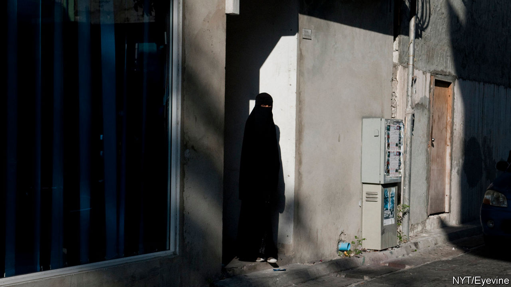

## Many plagues

# The Maldives is threatened by jihadism and covid-19

> Tolerance and tourism are both in danger

> Mar 21st 2020MALÉ

THE ARRIVAL of covid-19 in the Maldives was hardly surprising, since 1.5m tourists from all around the world visit the Indian-Ocean archipelago every year. By March 18th 13 foreigners had been declared infected, although there have not yet been any confirmed cases among locals.

But a no less dangerous contagion—Muslim extremism—is also afflicting the islands. On February 4th three foreigners were stabbed in a suburb of Malé, the capital. (They survived.) Muslim militants claimed responsibility. It was the first incident of religious violence against foreigners since 2007, when jihadists set off a bomb in a park in Malé, injuring 12 tourists. Days after the stabbing, footage of a belligerent British visitor being manhandled by the police for dressing too scantily went viral, neatly illustrating the devoutly Muslim country’s awkward reliance on bikini-clad sun-worshippers for its prosperity.

For the past dozen years, the islanders have been buffeted between authoritarian rulers peddling piety and more tolerant, democratic leaders. In 2008, after 30 years in charge, Maumoon Abdul Gayoom, a conservative, was defeated in the islands’ first truly free election and replaced by Mohamed Nasheed, a secular modernist. Four years later Mr Nasheed was ousted in a coup. Mr Gayoom’s half-brother, Abdullah Yameen subsequently took charge.

For the next six years the government turned a blind eye to growing extremism. A prominent member of parliament, Dr Afrasheem Ali, was murdered. So was a journalist, Ahmed Rilwan Abdulla, and his friend Yameen Rasheed, an influential blogger. Meanwhile the government jailed opponents and winked as an alarming number of islanders headed to Iraq and Syria to join Islamic State. In 2018, however, Ibrahim Solih, an ally of Mr Nasheed, pulled off a surprising election victory.

Under Mr Solih, investigations have been launched into unsolved political murders and into the corruption that had spread under Mr Yameen, who has been sentenced to five years in prison for money-laundering. A presidential commission has concluded that groups linked to al-Qaeda spent a decade bent on radicalisation, recruitment and murder. A police report reckons that 423 Maldivians tried to join jihadists in Syria and Iraq in the past decade or so, 173 of them successfully. It says that some 1,400 Maldivians (out of a population of 350,000) were radicalised to a point where they “would not hesitate to take the life of the person next to them”. A growing number of imams preached not only violent extremism but also the taking of child brides.

The new government has hesitated to crack down, for fear of offending the devout. Instead, in December it shut down a local human-rights NGO, the Maldivian Democracy Network, which had exposed injustices under Messrs Gayoom and Yameen. The authors of a report issued by the NGO have fled the country, after receiving death threats. Meanwhile the courts have failed to prosecute jihadist ringleaders, months after their identities were exposed. The attackers of Yameen Rasheed are the only extremists to have been taken to court so far. Witnesses have been promised anonymity, but there have been endless delays. The collapse of tourism thanks to covid-19 will hobble the economy. That will do nothing to calm the febrile mood. ■

## URL

https://www.economist.com/asia/2020/03/21/the-maldives-is-threatened-by-jihadism-and-covid-19
