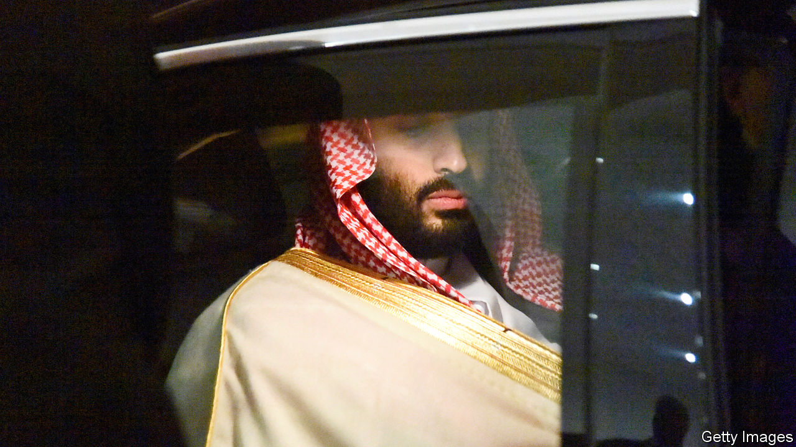

## The prince

# A biography of Saudi Arabia’s Machiavellian ruler

> Though not yet king, Muhammad bin Salman has a firm grip on the kingdom

> Mar 19th 2020

MBS: The Rise to Power of Mohammed Bin Salman. By Ben Hubbard.Tim Duggan Books; 384 pages; $28. William Collins; £20.

TO MARK THE end of its decades-old ban on cinemas, the government of Saudi Arabia held a fancy opening for the first commercial one in Riyadh. Ministers, influencers and at least one royal were invited to watch the Marvel superhero film “Black Panther”. In it a young prince called T’Challa finds himself suddenly in charge of Wakanda, an isolated kingdom rich in a precious natural resource. But he must fight off a challenge to the throne from a ruthless relative called Erik Killmonger. In the end T’Challa prevails and opens up Wakanda to the world.

Sound a little familiar? The man who ended the cinema ban, Muhammad bin Salman, the de facto ruler of Saudi Arabia, has a bit of T’Challa in him. The young crown prince, often known as MBS, is trying to open up his isolated, oil-rich kingdom. Tourists and foreign investors are now welcomed as part of a drive to diversify the economy. Conservative clerics have been muzzled and the vice police curbed, as the Saudis tone down their austere brand of Islam. Archaic restrictions, such as the ban on cinemas and another on women drivers, have been lifted. But, as Ben Hubbard intimates in his book “MBS”, Prince Muhammad arguably has a lot of Erik Killmonger in him, too.

The prince is the sixth son of the 25th son of the founding king of Saudi Arabia—so he was not exactly predestined to rule. Moreover, he was not an especially impressive young man; he never studied abroad, ran a company or served in the army. Abdullah, the previous king, saw him as “an upstart whose experience fell far short of his ambitions”, the author writes. The critique still feels apt. Yet Prince Muhammad was the apple of his father Salman’s eye—and a series of deaths in the family pushed Salman all the way up the royal ladder.

When Salman became king in 2015 he put his son in charge of the economy and defence, but there were still other royals between Prince Muhammad and the throne. That didn’t last long. King Salman, who is now fading, made him deputy crown prince that April. Two years later Prince Muhammad pushed aside his older cousin, Muhammad bin Nayef, to become crown prince. The royal court claimed the move was consensual. Reportedly, however, Muhammad bin Nayef was lured to a palace and denied medicine until he abdicated. He was under house arrest until earlier this month—when, according to Mr Hubbard, who reports for the New York Times, he was taken into custody by security officers. (Senior Saudi officials had denied Muhammad bin Nayef was under house arrest; one described the claim as “not true at all”.)

For a while Saudi-watchers in the West were entranced by the bold and ambitious prince. But recently his rash and ruthless side has been getting more attention. Saudi Arabia’s intervention in neighbouring Yemen, a brainchild of Prince Muhammad’s, has created a humanitarian disaster. His decision to lock up hundreds of Saudi tycoons in a luxury hotel until they handed over chunks of their fortunes alienated outside investors. He in effect kidnapped the prime minister of Lebanon in 2017, then started a pointless feud with Canada. The world’s richest man, Jeff Bezos, thinks the prince hacked his phone (though MBS denies it). World leaders are confounded by all this. “Are his dangerous acts the youthful faults of an inexperienced ruler? Or do they spring from deep in his character and serve as harbingers of things to come?” asks Mr Hubbard.

The book ends with the grisly tale of Jamal Khashoggi, a columnist who was killed and dismembered inside the kingdom’s consulate in Istanbul two years ago. Prince Muhammad denies ordering the murder. Few observers believe him; after all, Saudi dissidents are routinely jailed and tortured. To prevent such incidents from happening again the prince set up a committee to reform the intelligence service. Naturally, he put himself in charge of it. ■