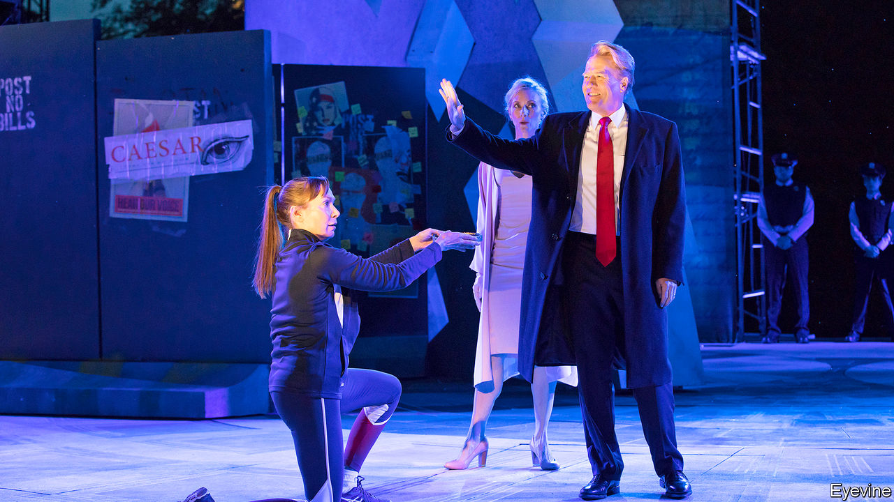

## Brave new world

# How Shakespeare’s plays reflect America’s preoccupations

> But whether they salve political differences, as well as exposing them, is debatable

> Mar 19th 2020

Shakespeare in a Divided America. By James Shapiro.Penguin Press; 320 pages; $27. Faber & Faber; £20.

ABRAHAM LINCOLN spent no more than six months in school, but he knew Shakespeare’s plays intimately and often recited favourite passages by heart. Befitting a president who waged a devastating war, Lincoln was drawn to the speeches of leaders under strain—particularly Macbeth—for the way they expressed nuanced feelings of guilt and grief. Yet the poet who was such a comfort to Lincoln may have also inspired his killer. John Wilkes Booth was an actor, and partial to Shakespeare’s dark men of action, particularly those less inclined to introspection. In a letter defending his assassination of the president, Booth compared himself to Shakespeare’s Brutus, who stabs the tyrannical Caesar out of “his love of Rome”.

For James Shapiro, a leading Shakespeare scholar and author of “Shakespeare in a Divided America”, this story captures the profound role the Bard has long played in helping Americans grapple with their evolving republic. The Founding Fathers looked to him for insight into treachery, sedition and political rebellion. Alexis de Tocqueville noticed in the early 19th century that there was “hardly a pioneer’s hut” without a few volumes of the plays. It may seem odd that a country founded by theatre-averse Puritans and anti-British revolutionaries would embrace an English playwright. Yet many of the issues that preoccupied Shakespeare in the late 16th century—“the dangers of autocratic rule; the imagined threat posed by those of different races, religions or nationalities; the slippery boundaries of gender”—haunted Americans centuries later, and do still.

And because these complex plays inspire conflicting interpretations, they have offered Americans rare cultural common ground for airing disparate views. In his often fascinating book, Mr Shapiro explores specific plays and productions that have reflected national concerns at fraught moments in the country’s past.

For example, both slave-owners and abolitionists saw in “Othello” a cautionary tale of racial equality. John Quincy Adams, a former president and outspoken abolitionist, wrote in a fiery essay that Desdemona got what she deserved for her “unnatural” interracial desire. During the mid-19th-century crusade to conquer the western frontier, macho ideals made the somewhat effeminate role of Romeo “unplayable” for male actors. In the early 20th century anti-immigrant lawmakers cited the shunning of Caliban in “The Tempest” in their push for race-based quotas.

These cases, Mr Shapiro argues, show how Shakespeare alerts Americans to the “toxic prejudices poisoning our cultural climate”. Whether they salve such antagonisms as well as exposing them is another matter. Sometimes the plays function like Rorschach tests that reveal and confirm whatever viewers want to see.

Consider a controversial production of “Julius Caesar” in New York in 2017 (pictured), which left no confusion over the intended modern parallels. Caesar was a tall, blustering blond in dark suits and overlong ties whose comely wife had a Slavic accent. Anyone familiar with the play knows that the brutal assassination, notionally in defence of the republic, is more ugly than heroic, and that the conspiracy ends badly. In this case, Oskar Eustis, the director, aimed to subvert the contemporary appeal of political violence. But after Fox News played a 12-second clip of this murderous scene, devoid of context, public pressure on social media forced corporate sponsors to withdraw their support. Mr Eustis and others received death threats.

Like Mr Shapiro’s other examples, the production handily highlighted the nation’s rifts. But rather than contend with the play’s ideas, critics simply pushed to shut it down. There is a grim and timely irony in the fact that a show hoping to inspire debate about threats to democracy instead revealed “how easily democratic norms could crumble”. ■