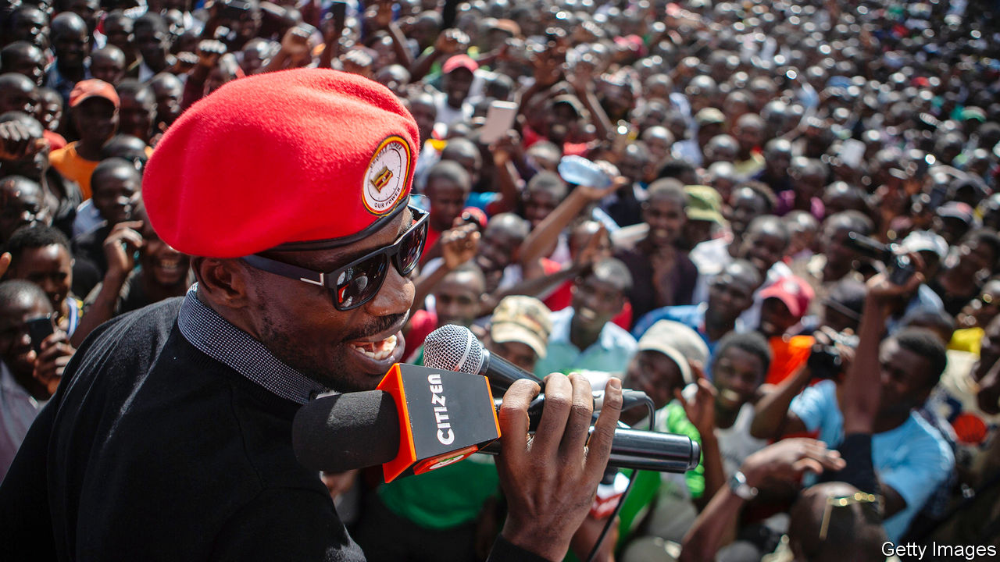

## Ghetto blasters

# Uganda’s pop stars are enlivening political campaigns—and launching them

> Bobi Wine, a singer, is the opposition’s most popular candidate for president

> Mar 19th 2020KAMPALA

NIGHT IS FALLING when Full Figure gets back to her office in a poor quarter of Kampala, the Ugandan capital. The singer, wearing a baseball cap and psychedelic “My Little Pony” T-shirt, is returning from State House, the country’s seat of power. As an unofficial adviser on “ghetto issues”, she explains, she uses her “big voice” to connect the president, Yoweri Museveni, to the people. Mostly that seems to mean organising state handouts for local youngsters, such as the welders raising sparks on the streets below.

Ugandan musicians have played politics since the days when court troupes serenaded kings. Now the young, fast-growing cities are dancing to a new beat. A pop star-turned-MP called Bobi Wine is probably the opposition’s most popular candidate in next year’s presidential election (like other artistes in this story, he is best known by his stage name). Stars who support him are angling for parliamentary seats; others act as praise singers for Mr Museveni, whose strongman rule has so far lasted 34 years. The race for the ghetto’s votes runs through the recording studio.

The “big three” in Uganda’s home-grown music industry are Mr Wine (pictured) and his two rivals, Jose Chameleone and Bebe Cool. When they first appeared on the scene in the early 2000s the airwaves were filled by Congolese bands, local balladeers and Western pop. The trio brought a “fresh sound”, says Douglas Lwanga, a television presenter, mixing Jamaican influences with a home-grown vibe. They battled in lyrics and brawled in nightclubs. “It was about proving to each other who was bigger and better,” recalls Mr Chameleone, swigging whisky backstage in Kampala.

Mr Wine once sang that “there’s more politics in the music industry than in the parliament”. Not that, for him and his peers, conventional politics was ever far away. Mr Cool is a former cabinet minister’s son. He performed at rallies of the National Resistance Movement (NRM), the ruling party; politics, he says, was “my fate”. One of Mr Wine’s brothers, himself a musician and producer, twice ran for parliament. Another was a council chairman in the slum where he was brought up.

His own political awakening came in 2007, when Kampala hosted a meeting of Commonwealth leaders. In preparation, the authorities demolished makeshift dwellings and shut down roadside stalls, including some owned by Mr Wine. “On the day the queen comes the poor man is displaced,” he sang. Soon he was styling himself as president of the “Ghetto Republic of Uganja”, with a cabinet of dreadlocked ministers. Mr Cool sang for “the uptown boys”, says Mr Wine, but his own songs were “a representation of a ragtag society”.

This was a society that Mr Museveni knew little about. The son of a cattle-herder, he came to power through a rural insurgency; his personal taste was for hymns, army tunes and the Nashville crooner Jim Reeves. But he had an ear for the demotic. He once got down with the bazukulu (grandchildren) by rapping a folk song. At the elections in 2016, Mr Museveni backed a ragga singer as the NRM’s candidate for mayor of Kampala; he enlisted musicians—including Mr Chameleone and Mr Cool—to record a sycophantic anthem for his own campaign.

Mr Wine says he refused that gig; he later stood in a parliamentary by-election, and won. Other singers started pulling on the signature red beret of his People Power movement. Among them was Mr Chameleone, aptly changing colours, who announced plans to stand for Kampala mayor himself. Meanwhile, Mr Cool made himself rather uncool by sticking with the ruling party. Bottles were thrown at him on stage. He says the country needs the leadership of army men, not “failed” artistes; he would feel “so disrespected”, he bristles, were Mr Wine to become his president.

For others, politics offers a different sort of opportunity. Musicians earn little from selling songs, which are widely pirated, so rely instead on concerts and product endorsements for their income. Election season is a “time for them to make money”, says Balaam Barugahara, the country’s biggest promoter, who recruits singers to perform at NRM rallies. Murals of Mr Museveni and his son grin from behind his desk.

This time, a chorus of singers say they will stand for parliament. Many have genuine frustrations with the country’s sclerotic politics, but for some an element of financial calculation is involved, too. Running for office usually plunges candidates into debt; rather than doing so in earnest, some musicians may be hoping to make themselves enough of a nuisance that a mainstream candidate will decide to buy them off. “So many artistes have postured to be speaking truth to power but in a real sense they were trying to elevate their premium,” Mr Wine lamented to a posse of performers at his home.

Mr Museveni is a generous patron. In recent months he has signed up an unlikely roster of talent, from Buchaman, formerly the “vice-president” of Mr Wine’s crew, to Bosmic Otim, the biggest star in the country’s Luo-speaking north. The latter once wrote lyrics that associated Mr Wine with Nelson Mandela, and speculated about the responsibility of Mr Museveni’s forces for massacres. But after encounters with state security and a presidential handshake, his latest track is called “I support the government”.

Radio DJs avoid political tunes, fearing a phonecall from above. The choice is between “playing the song” and “staying in business,” says Isaac Mandev, a programmer at a Luganda-language station. Mr Wine is now blocked from performing in public; he and his supporters are arrested and beaten when they congregate. On a steeply tilted playing-field, his chances of winning the election are slim. All the same, a good rhythm is irresistible. At the parliamentary Christmas party of 2018, when the ghetto president grabbed the mike to sing “Kyarenga”—a smash hit about a poor man wooing a woman away from a richer suitor—even NRM stalwarts got up to dance. ■