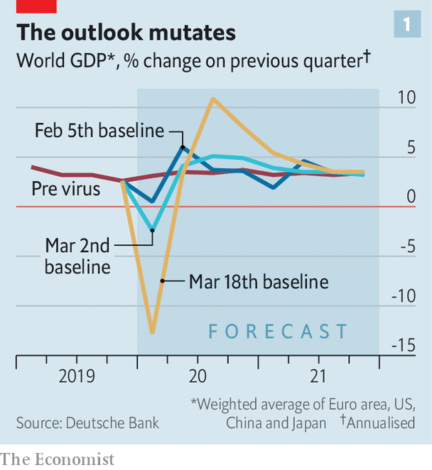
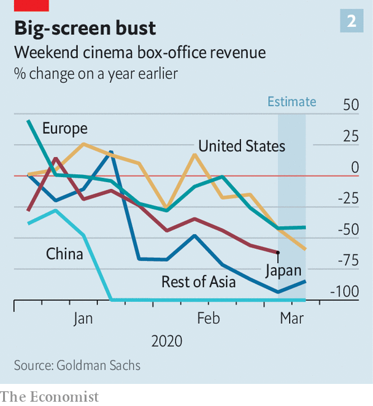
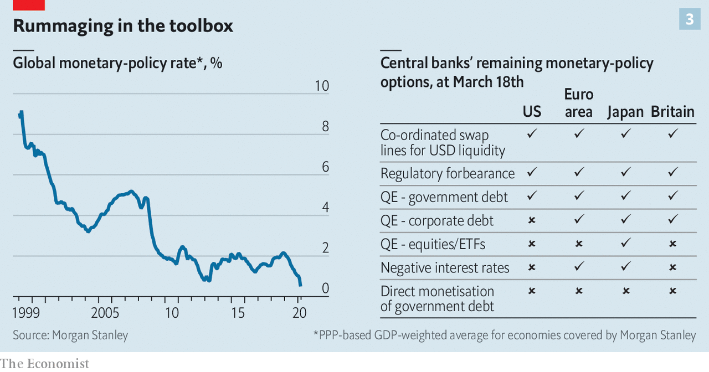

## Experimental treatment

# Governments are spending big to keep the world economy from getting dangerously sick

> The help is targeted at companies and individuals. More will be needed

> Mar 19th 2020BERLIN, SHANGHAI AND WASHINGTON, DC

Editor’s note: The Economist is making some of its most important coverage of the covid-19 pandemic freely available to readers of The Economist Today, our daily newsletter. To receive it, register [here](https://www.economist.com//newslettersignup). For more coverage, see our coronavirus [hub](https://www.economist.com//coronavirus)

A CHARACTER IN a novel by Ernest Hemingway once described bankruptcy as an experience that occurs “two ways: gradually, then suddenly”. The economic response to the covid-19 pandemic has followed this pattern. For weeks policymakers dithered, even as forecasts for the likely economic damage worsened. But in the space of just a few days the rich world has shifted decisively. Many governments are now on a war footing, promising massive state intervention and control over economic activity.

The new phrase on politicians’ lips is “whatever it takes”—a line borrowed from Mario Draghi, president of the European Central Bank (ECB) in 2011-19. He used it in 2012 to convince investors he was serious about solving the euro-zone crisis, and prompted an economic recovery. Mr Draghi’s promise was radical enough. Politicians are now proposing something of a different magnitude: sweeping, structural changes to how their economies work.

There are unprecedented promises. On March 16th President Emmanuel Macron of France declared that “no company, whatever its size, will face the risk of bankruptcy” because of the virus. Germany pledged unlimited cash to businesses hit by it. Japan passed a hastily compiled spending package in February, but on March 10th supplemented it with another one that included over ¥430bn ($4bn) in spending and almost four times as much in cheap lending. Britain has said it will lend over £300bn (15% of GDP) to firms. America may enact a fiscal package worth well over $1trn (5% of GDP). The most conservative estimates of the total extra fiscal stimulus announced thus far put it at 2% of global GDP, more than was shovelled out in response to the global financial crisis of 2007-09.

In part this radical action is motivated by the realisation that the coronavirus, first and foremost a public-health emergency, is also an economic one. The jaw-droppingly bad economic data coming out of China hint at what could be in store for the rest of the world. In the first two months of 2020 all major indicators were deeply negative: industrial production fell by 13.5% year-on-year, retail sales by 20.5% and fixed-asset investment by 24.5%. GDP may have declined by as much as 10% year-on-year in the first quarter of 2020. The last time China reported an economic contraction was more than four decades ago, at the end of the Cultural Revolution.

Grim numbers are starting to pile up elsewhere, not so much in the official statistics, which take time to be published, as in “real-time” economic data produced by the private sector. Across the world, attendance at restaurants has fallen by half, according to OpenTable, a booking platform. International-passenger arrivals at the five biggest American airports are down by at least 30%. Box-office receipts have crumpled (see chart 2).

The disruption to international travel will hurt trade, since over half of global air freight is carried in the bellies of passenger planes. The combination of disrupted supply chains and depressed demand from shoppers should hit trade far harder than overall GDP, if the experience of the last financial crisis is anything to go by. Already, the American Association of Port Authorities, an alliance of the ports of Canada, the Caribbean, Latin America and the United States, has warned that cargo volumes during the first quarter of 2020 could be down by 20% or more from a year earlier.

Official data are now starting to drip out. The Empire manufacturing index, a monthly survey covering New York state, in March saw its steepest drop on record, and the lowest level since 2009. In February Norway’s jobless rate was 2.3%; by March 17th it was 5.3%. State-level numbers from America suggest that unemployment there has been surging in recent days.

All this is fuelling grim forecasts. In a report on March 17th Morgan Stanley, a bank, estimated that GDP in the euro area will fall by an astonishing 12% year-on-year in the second quarter of the year. The Japanese economy is forecast to contract by 2% this quarter and 2% next. Most analysts see global GDP shrinking in the first half of the year, with barely any growth over 2020 as a whole—the worst performance since the financial crisis of 2007-09.

Even that is likely to prove optimistic. On March 17th analysts at Goldman Sachs noted that they had “not yet built a full lockdown scenario” into their forecasts for advanced economies outside Europe. Forecasts for America, which is at an earlier stage than Europe and Asia when it comes to the outbreak, remain Panglossian; very slow growth in China and a big recession in Europe could by itself be enough to send the world’s largest economy the same way. Steven Mnuchin, America’s treasury secretary, warned this week that the country’s unemployment rate could reach 20% unless Congress passes a stimulus package. A negotiating ploy? With shopping malls emptying, factories grinding to a halt and financial markets buckling, lawmakers may be loth to challenge the claim.

Despite stomach-churning declines in GDP in the first half of this year, and especially the second quarter, most forecasters assume that the situation will return to normal in the second half of the year, with growth accelerating in 2021 as people make up for lost time. That judgment is in part informed by China’s experience. More than 90% of its big industrial firms are officially back in business. Its stockmarket had been one of the world’s worst performers in early February but is now the best (or rather, least bad). There remains, however, a risk that global containment and suppression of the virus will need to continue for a year or longer. If so, global economic output could be dragged down for much longer than most people expect.

Perhaps the greatest lesson of the global financial crisis was that it paid to act decisively and to act big, convincing markets and households that policymakers were serious about countering the slump. If done right, central banks and governments can end up doing a lot less than they actually promised. A pledge to bail out banks makes it less likely savers will withdraw deposits and make a rescue necessary.

This time around, central banks sprang into action. Since February the Federal Reserve has cut interest rates by 1.5 percentage points. Other central banks have followed suit. Further deep rate cuts are not possible, though; interest rates were very low long before the virus began to spread.

Not all central banks are acting as boldly as they can. China has room to cut interest rates—its benchmark rate is 1.5%—but has held back in part because inflation is quite high (largely as a result of African swine fever, which hit pig stocks, raising prices). Central banks could try more creative policies. On March 19th the ECB’s governing council agreed to launch a €750bn bond-buying programme, covering both sovereign and corporate debt. But the real action is now taking place on the fiscal front.

Governments are falling over each other to offer bigger and better stimulus packages. All countries are spending more on health care, both in an effort to find vaccines and cures and to increase hospital capacity. However, the bulk of the extra spending is on companies and people.

Take companies first. China, where the outbreak has slowed, is now trying to get people out and buying things. Foshan, a city in Guangdong province, has launched a subsidy programme for people buying cars. Some cities have started giving out coupons that can be spent in local shops and restaurants. Nanjing this month gave out e-vouchers worth 318m yuan ($45m).

Most countries, however, are in or about to enter the worst part of the outbreak. As customers dry up, many firms will go bust without government help. Calculations by The Economist suggest that 40% of consumer spending in advanced economies is vulnerable to people shunning social situations. Firms in leisure and hospitality are especially rattled. The Moor of Rannoch hotel, in about as rural a part of Scotland as it is possible to find, says its insurer will not be paying out a penny for lost custom, since covid-19 is a new disease and thus not covered under its policy.

One approach is to reduce firms’ fixed costs, largely rent and labour. China’s finance ministry will exempt companies from making social-security contributions for up to five months. The government has also temporarily cut the electricity price for most companies by 5% and enacted short-term value-added-tax cuts. The British government has extended a one-year business-rates holiday to all companies operating in the retail, hospitality and leisure sectors. Yet for many firms, no matter how much the government helps them reduce costs, revenues are likely to fall further.

So measures may be needed to allow firms to maintain cashflow. Many banks are offering hefty overdrafts to tide corporate clients over. To encourage banks to keep lending, Britain has promised them cheap funding and state guarantees against losses. For very small firms, many of which do not borrow at all, it is offering non-repayable cash grants of up to £25,000.

Other countries are enacting similar plans. The Japanese government is helping small firms by mobilising its state-owned lenders to provide up to ¥1.6trn of emergency loans, much of it free of interest and collateral requirements. Small firms qualify for help if their monthly sales fall at least 15% below a normal month’s takings. Bavaria, a rich state in Germany, announced on March 16th that small and medium-sized companies with up to 250 employees could receive an immediate cash injection of between €5,000 and €30,000. The European Commission has already relaxed state-aid rules so that governments can channel help to ailing companies.

The second part of the fiscal response is about helping people, and in particular protecting them from being made unemployed or suffering a drastic drop in income if that does happen. Ugo Gentilini of the World Bank counts more than 25 countries that are using cash transfers as part of their economic response to the virus. Brazil will give informal workers, who make up roughly 40% of the labour force, 200 reais ($38) each. Small businesses will be allowed to delay tax payments and pensioners will get year-end benefits early. Australia is instituting a one-time cash payment of A$750 ($434) to pensioners, veterans and people on low incomes.

Northern Europe has led the way on implementing policies that make it less likely firms lay off workers. Germany has relaxed the criteria for Kurzarbeit (“short-time work”), under which the state pays 60-67% of the forgone wages of employees whose hours are reduced by struggling firms. Applications are going “through the roof”, according to the federal labour agency. The use of Kurzarbeit probably halved the rise in unemployment during the recession of 2008-09. More firms are now eligible to use it, temporary workers are covered, and the government will also reimburse the social-security contributions companies make on behalf of affected workers.

In Denmark firms that risk losing 30% or more of their workforce will see the government pay 75% of the wages of employees who would otherwise be laid off, until June. Norway’s government has beefed up unemployment benefits, guaranteeing laid-off workers the equivalent of their full salary for the first 20 days. Freelancers whose work vanishes for more than a fortnight will get payments equivalent to 80% of their previous average income. In Sweden the state will cover half of the income of workers who have been let go, with employers asked to cover most of the rest.

So far America has passed more modest legislation. Federal funding for Medicaid, which provides health care for the poor, is likely to boost spending by about $30bn, assuming it remains in place until the end of December, reckons Oxford Economics, a consultancy. America also has a new paid-sick-leave policy for some 30m workers, including 10m who are self-employed, worth just over $100bn. But in that regard America is merely catching up with other rich countries, which have far more generous sick-leave policies. America also has fewer automatic economic stabilisers, such as generous unemployment insurance, than most other rich countries. As a result, its discretionary fiscal boost needs to be especially large to make a difference.

It might be. The Trump administration’s plan to funnel money directly to households, if approved by Congress, is the most significant policy. It bears some resemblance to a scheme that was introduced in February in Hong Kong, in which the government offered HK$10,000 ($1,290) directly to every permanent resident. Mr Mnuchin is thought to favour a cheque of $1,000 per American—roughly equal to one week’s average wages for a private-sector worker—with the possibility of a second cheque later. Some $500bn-worth of direct payments could soon be in the post.

Some economists are leery about such a policy. For one thing, it would do little to prevent employers from letting people go, unlike the plans in northern Europe. Another potential problem, judging by Hong Kong’s experience, is administration of the plan: the territory’s finance secretary hopes to make the first payments in “late summer”, far too far away for people who lost work last week. Mr Mnuchin promises that payments will happen much sooner.

America has done something similar before, with results that were not entirely encouraging. The government sent out cheques in both 2001 and 2008 to head off a slowdown. The evidence suggests that people saved a large chunk of it. The psychological reassurance of a bit of extra cash could be significant for many Americans, but the sums involved are not especially impressive. Bernie Sanders, a Democratic presidential contender, is not known for his smart economic policymaking, but his suggestion of $2,000 per household per month until the crisis is over is probably closer to what is required.

Indeed, more fiscal stimulus will be needed across the world, especially if measures to contain the spread of the virus fall short. After the Japanese government passes the budget for next fiscal year at the end of this month, it can begin work on a supplementary budget that takes the virus into full account. Britain’s Parliament has given Rishi Sunak, the chancellor of the exchequer, carte blanche to offer whatever support he deems necessary, without limit.

How much further can fiscal policy realistically go? Last year the 35-odd rich countries tracked by the IMF ran combined fiscal deficits of $1.5trn (2.9% of GDP). On the not-unrealistic assumption that the average deficit rose by five percentage points of GDP, total rich-country borrowing would rise to over $4trn this year. Investors have to be willing to finance that splurge. The yield on ten-year Treasury bonds, which had fallen as low as 0.5% as fears of the virus took hold and traders sought havens, has recently risen above 1%. This is probably due to firms and investors selling even their safest assets to raise cash, but might reflect some anxiety over the scale of planned government borrowing.

Still, 1% is still extremely low by historical standards. For a variety of reasons, including population ageing, there is—in normal times, at least—unprecedented demand for low-risk government securities. The Bank of Japan has promised to buy as many bonds as necessary to hold the yield on its government’s ten-year bonds close to zero. Investors remain queasy over some rich countries’ bonds, especially slow-growing European states. The ECB’s latest intervention should allow heavily indebted economies viewed with suspicion by markets, such as Italy, to borrow more cheaply—though it does not fully dispel doubts around the euro zone’s willingness to act to avert crisis.

The question of financing the spending splurge may be more one of practicalities than of feasibility. America’s Treasury cannot issue trillions of dollars of new bonds overnight. It can, however, issue notes and bonds to the Federal Reserve, which could then credit the Treasury’s account, allowing vast sums to be spent immediately, points out Ian Shepherdson of Pantheon Macroeconomics, a consultancy. The bonds could then be sold to investors at a later date. This approach amounts to money-printing, but with little risk of runaway inflation in these straitened times.

The economic hit from covid-19 will be bad enough for rich countries, in both human and economic terms. But they are in a relatively fortunate position, with strong health-care systems, and investors who, for now, remain willing to lend to them on cheap terms. Poorer countries, where the threat posed by the virus is also growing rapidly, have less room to borrow and job markets with a higher share of informal workers who are ineligible for many protections. The rich world faces tough times, but will get through the crisis. The prospects of poorer places are far less certain. ■

Dig deeper:For our latest coverage of the covid-19 pandemic, register for The Economist Today, our daily [newsletter](https://www.economist.com//newslettersignup), or visit our [coronavirus hub](https://www.economist.com//coronavirus)

## URL

https://www.economist.com/briefing/2020/03/19/governments-are-spending-big-to-keep-the-world-economy-from-getting-dangerously-sick
