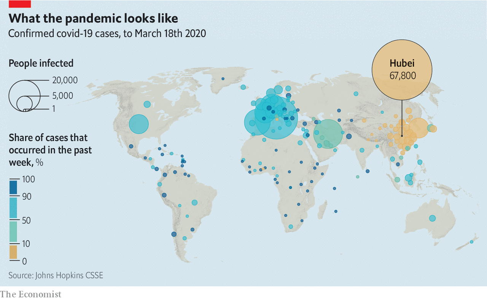
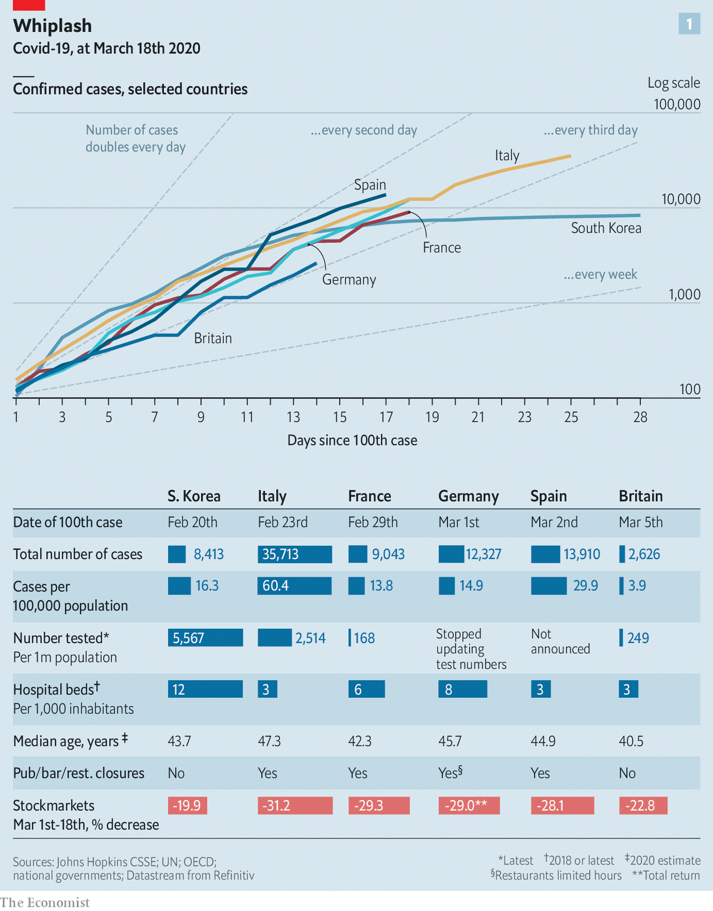
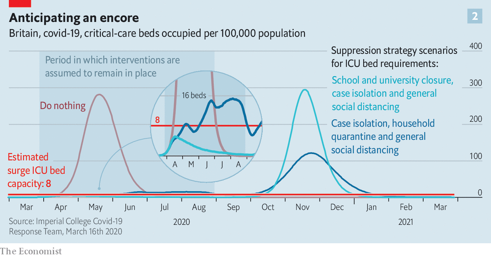

## The lockdown and the long haul

# In Europe, and around the world, governments are getting tougher

> But what happens when restrictions slip?

> Mar 19th 2020BEIJING, BERLIN, MADRID, PARIS AND SEOUL

Editor’s note: The Economist is making some of its most important coverage of the covid-19 pandemic freely available to readers of The Economist Today, our daily newsletter. To receive it, register [here](https://www.economist.com//newslettersignup). For more coverage, see our coronavirus [hub](https://www.economist.com//coronavirus)

SOMETIMES PEOPLE can be a bit of a disappointment to their politicians. On March 12th Emmanuel Macron, addressing the French nation on the fight against covid-19, appealed to their sense of “national solidarity”. In asking them to follow basic health advice and stay at home as much as possible, the president said, he was counting on their “individual and collective discipline”. Individually and collectively, much of the country went on to spend a rather sunny early spring weekend wandering around parks with friends and shopping in crowded street markets. Mr Macron returned to their television screens on March 16th singularly unimpressed. “Not only are you not protecting yourselves,” he admonished the nation: “You are not protecting others.” 

And so the state stepped in. From midday on March 17th onwards, everyone leaving home required a signed attestation—hand-written, or printed out from the interior ministry’s website—that they were on essential business: shopping for food or basic necessities, attending medical appointments, or going to a job that cannot be done from home. Cafés, restaurants, cinemas, nightclubs, museums and sports centres are all closed. Only food shops, pharmacies, banks, newsagents, petrol stations and—the irony—tobacco shops remain open. There are 100,000 police officers and gendarmes on the streets keeping an eye on things; on March 18th they issued 4,095 fines. Mr Macron has also mobilised the army. It is not a lockdown on the scale of Italy’s (see [article](https://www.economist.com//europe/2020/03/19/italy-is-overtaking-china-as-the-country-worst-hit-by-covid-19)); but it was a step change in the country’s response.

A couple of hours before Mr Macron spoke, Boris Johnson, the British prime minister, took a newly tough line, too, though from a more lax starting point. No self-printed papers, or for that matter, enforced closures—but a directive to stay away from both the office and the pub, and a clear steer that further restrictions could be coming in pretty short order. On the same day Angela Merkel, the German chancellor, issued a series of “guidelines” that aimed to level up the various limits on physical interaction that had been imposed by the country’s different states. Spain had moved more quickly. At a seven-hour cabinet meeting on March 14th, its coalition government approved a decree putting the whole country into a 15-day state of emergency. 

It seemed that over the weekend—the Ides of March, as fate would have it—Europe had woken up to the sheer scale of the crisis which it faced: so, to some extent, did President Donald Trump’s administration (see [article](https://www.economist.com//united-states/2020/03/19/american-life-has-been-transformed-in-a-few-short-weeks)). In part, this was another example of a cognitive phenomenon that SARS-COV-2, the virus which causes covid-19, has been provoking around the world: exponential whiplash. Knowing in principle that something may take only a few days to double in size does little to prepare you for the experience of being continually behind the ever-steepening curve such doubling creates.

On the day of Mr Macron’s first speech, France had seen 2,281 covid cases and suffered 48 deaths. Six days later, on March 18th, those numbers had more than tripled, to 9,043 and 148 respectively. In Spain they were 13,910 and 623, in Italy 35,713 and 2,978. Over the week to the 18th the EU and Britain acknowledged around 62,000 new cases of covid-19, 2.6 times the number seen in the rest of the world. Europe’s cumulative caseload now exceeds China’s. In terms of its rapidly evolving responses, too, Europe seems now to lead the world. And it is leading it into lockdown. 

But if general exponential whiplash was the bulk of the explanation, in Britain a model of the epidemic produced by epidemiologists at Imperial College in London played a particular role. Earlier versions had been circulating in the corridors of power for a while (as covid-19 may have been doing, too; on March 18th the study’s lead author, Neil Ferguson, isolated himself with a cough and a fever). Published on March 16th, it is now proving influential elsewhere, too. 

The Imperial modellers adapted a model originally developed for influenza outbreaks. They assumed that the time from infection to symptoms, among those who showed symptoms, would be about five days; that people without symptoms would be somewhat infectious, but less so than people with symptoms; that people would vary in how infectious they get. They assigned covid-19 a “basic reproduction number” of 2.4. This means that in a population not taking any precautions, and where no one is immune, each case leads, on average, to 2.4 secondary cases. 

Under those conditions the model showed the disease infecting 80% of the British population in three to four months. If 4.4% of the people infected became ill enough to be hospitalised and 30% of those deteriorated to the point of needing intensive care, then by mid-April demand for beds in intensive-care units (ICUs) would outstrip the health service’s “surge” capacity. In May the number of critical patients would be more than 30 times the number of ICU beds available. Estimates of the fatality rate in China range from 0.5% to 1.5% of infections. Using a conservative 0.9% for Britain, the model put the death toll by the end of the summer at over half a million.

The 4.4% hospitalisation rate was generated by breaking figures from China down by age cohorts and applying those age-specific rates to Britain’s population structure. This makes the numbers bigger. In China only 12% of the population is over 65; in Britain the proportion is 19% (in America, which the team also looked at, it is 17%). In continental countries you would expect the number to be bigger still; 23% of Italians are over 65, as are 22% of Germans.

The model’s most striking message, though, was not this worst-case scenario: it was how small the effects of less-than-wholehearted interventions appeared to be. Imposing isolation on people with symptoms of the disease, quarantine on their households and protecting the elderly through social distancing—broadly speaking, the sum of British government advice as of last week—cut the height of the epidemic’s peak by two-thirds and pushed it from May to June. But the demand for beds still outstripped the supply by a factor of eight, and the death toll still reached the hundreds of thousands. 

Extending social distancing from the over-70s to the whole population, though—a lockdown along the lines of Mr Macron’s, or of what is being seen in Italy—made a big difference. The peak of the disease outstripped the NHS’s surge capacity by just a factor of two. And it was delayed until July or August. That is a time-frame over which increasing that capacity is clearly plausible. It might also allow the change of the seasons to nibble away at the disease’s reproductive number.

Because cases of covid-19 have already appeared in hot places such as Saudi Arabia and Singapore—not to mention Australia, where it is currently the end of summer—some experts have dismissed the idea that it may be at its worst in winter. But there remains hope that the change in the seasons may slow its spread. In early March Chinese scientists circulated a preprint looking at how air-temperature and humidity influenced transmission in 100 Chinese cities, and controlling for population density and wealth, they concluded that transmission became a little less likely when the weather was hotter and more humid. Summer and rainy seasons may not help a lot—but they could help a bit.

The Imperial results shaped the British government’s new plans: everyone to work from home if they can, no travel for fun, no “unnecessary” visits to care homes, avoid pubs, restaurants, theatres and the like, quarantines of 14 days for households where someone develops symptoms.

This still did not put Britain quite on a par with its neighbours (see chart 1). In Spain the state of emergency has closed all schools and universities, and almost all non-food shops except dry-cleaners, pharmacies and, again, tobacconists. The number of travellers on the Madrid metro on March 18th was 15% of what it usually is, and parks and promenades in the capital are sealed off. Thousands of madrileños who, given lovely weather and clear indications of restrictions on the way, had headed for their beach houses at the weekend promptly found themselves confined by the regional government of Murcia. The state of emergency—which will need parliamentary approval to continue for more than 15 days—allows the government to requisition the facilities of private hospitals and to take over hotels, too. It has already taken over two in Madrid.

Mrs Merkel’s guidelines of March 16th called for most retail outlets to close and for the shops staying open to do so on Sunday, when trading restrictions normally keep almost everything shut. Bars and clubs are closed. In Berlin police went door-to-door in Neukölln and Kreuzberg ordering patrons to drink up. Theatres, concert halls, museums, cinemas, exhibition halls, gymnasiums, swimming pools and casinos have all been closed, as have Germany’s many legal brothels. Hairdressers, though, remain open.

The hairdressers of Spain were initially granted the same privilege, but it was revoked. That said, the Spanish can still go to church services, though with precautions, whereas Germany’s churches and mosques are closed. The Church of England has voluntarily brought an end to public worship, too. As for secular religions, all Europe’s major football leagues have put games on hold until April, and the hiatus is likely to be a lot longer. This summer’s international Euro 2020 tournament has been put off until 2021 (as has the Copa América, which was to take place in Colombia and Argentina). The Glastonbury festival has been cancelled; so will much of the summer be. 

Not all the steps being imposed are well supported by evidence. Size limits on smaller gatherings—Austria, which is imposing some of the strongest rules, wants no more than five people together at a time—are open to question. Anastasia Pharris of the European Centre for Disease Prevention and Control, the EU’s public-health agency, says she knows of no data supporting specific cut-offs for gathering-size with regards to covid-19 transmission.

Politicians also seem much keener on banning international travel than epidemiologists are. The World Health Organisation does not recommend broad international travel restrictions, or the closure of borders. But on March 17th the EU banned non-essential travel into the bloc for 30 days (see [article](https://www.economist.com//europe/2020/03/19/why-europes-new-border-controls-wont-help-much))—at the same time that other countries, from India to America, have banned non-citizens arriving from the EU. Experts agree cordons sanitaires around whole regions will make no difference to the epidemics in individual countries at this point.

Perhaps the most interesting area of divergence has been school closures. For continental countries, they were among the first controls to be put in place, as they have been worldwide (see [article](https://www.economist.com//international/2020/03/19/how-covid-19-is-interrupting-childrens-education)). It was not until March 18th that first Wales, then Scotland and finally England said they would close theirs, too.

How useful this will be will vary from place to place. School closures make most sense in societies where old people spend a lot of time with children and young people and disrupting those ties is hard. Italy, where about two-thirds of adults aged 18-35 live with their parents, and many houses contain three generations, is a case in point. At the same time, closing schools means parents have to find someone else to look after their children or do it themselves. In 2009 researchers at the Brookings Institution, an American think-tank, estimated that closing schools and nurseries for a month would cost America somewhere between 0.1% and 0.3% of GDP. And if the parent works in health care, the losses will be more than financial. The Brookings paper estimated that between 6% and 19% of health-care workers would have to stay at home during a school closure; the English closures allow for the children of health-care workers to continue to go to school.

There is also the question of when to introduce such closures. In the Imperial modelling the closure of schools and universities has a prompt, if not overwhelming, effect. But they also have a delayed cost. This is because of the effect they have on the second wave of the disease.

Interventions which suppress the reproduction number save a lot of lives. But they do not make the population immune to the disease. So if you relax the interventions, thus letting the disease’s reproduction number rise back up, it will promptly set about infecting the large pool of people it missed the first time round.

The model from Imperial showed this well-known effect in action. After its five months of restrictions were brought to a close, a second wave started to build in late autumn. When the model was run with schools and universities closed down at the beginning of the first outbreak, this second wave was considerably worse, because immunity built up through infection-in-the-course-of-education was absent (see chart 2).

Concerns about a second wave are one of the reasons that governments cannot reassure citizens over just how long the disruption to normal life will continue, instead bandying about “the time beings” and “coming weeks and months”. Few are as open as the Robert Koch Institute, a German government health agency, in saying that, in extremis, tough restrictions may need to remain in place until a vaccine can be made, tested and put into use—a period it sees as lasting up to two years.

Even if governments were forthright about how long they expected their impositions to last, it is not clear that the decision will be theirs to make. In free societies the duration will, in practice, depend on how compliant people are, and for how long. The team at Imperial reckons that, if their measures are to show the desired results, compliance with each of those measures must be at least 50-75%. In the early days that may be possible: the chastened and fined French will not be out in the same numbers over the coming weekend as they were over the previous one. And as hospitals start to fill and then overflow, fear may increasingly add its weight to government say-so and social stigma. Still, good behaviour does tend to wear off.

South Korea started to take social distancing seriously long before Europe did, telling the citizens of Daegu and Gyeongbuk, two early hotspots, to stay at home in the middle of February and those of metropolitan Seoul to do so in early March. Public spaces emptied out. This was not the only factor in the country’s apparent success in containing the disease. A huge amount of testing and contact tracing, as is now being implemented in Italy, has been crucial. But it helped. However there is some evidence that people may be becoming more restive. Use of the Seoul metro has ticked up a bit.

No government other than the most repressive will believe it can keep its country on lockdown for months on end—and even if it could, the economic effects would be intolerable. China, having instituted a draconian lockdown, has, now that new cases are rare, begun to ease some restrictions where it can. A couple of provinces that were not badly affected are starting to re-open schools. In Beijing, by contrast, the rules have tightened since orders went out to protect the capital from imported infections. Office buildings are open, but tenants must show that their workplaces are not too crowded; some are allowing only a half or a third of their staff in at any one time. Guards with loud hailers count shoppers in and out of markets and chide those who stand less than a metre apart.

Citizens must wear masks to go outside; after weeks of shortages these can now be found, but at a price. In Hong Kong, where there were admittedly very few cases, the ubiquitous masks are the only indication that the city is not quite back to normal—whether you are on the as-crowded-as-usual metro or at a rave, there is not an unshielded nostril to be seen.

Epidemiologically, these places have, in a way, returned to the tail end of 2019. Just as the world did then, they face a new pathogen to which the population has no immunity. But now they are forewarned. They know about SARS-CoV-2, and no longer see a need to try to deny its existence; they know how to react should it rear its head, and are ready to do so. The emphasis is thus not on suppression, but on hygiene and surveillance.

China is using a variety of smartphone apps to facilitate this. In Shanghai QR codes are used to determine whether a person can be admitted to a building, or even the city—and to provide a detailed contact history should that person later be found to have become infected. Each subway car has its own QR code to be scanned when you get on. If one of the passengers gets sick, only that car, rather than the whole train, needs to be contacted.

Citizens of other countries might be willing to tolerate such surveillance if they really believed it was temporary. One thing that might make it so would be better treatment. Drugs do not make people immune to disease; but if severe cases could be treated more effectively, there would be much less to fear about letting people circulate quite freely. On March 17th Chinese doctors reported that Avigan (favipiravir), a drug used against influenza in Japan, led to clinical improvements in patients. The day before a drug called hydroxychloroquine jumped to prominence after a small, unrandomised trial. Results from large trials of remdesivir, an antiviral developed to tackle Ebola, are weeks away but eagerly anticipated.

Then there is the possibility of giving people immunity without requiring them to get the disease: that is, vaccination. The first genome sequence for SARS-CoV-2 was published on January 10th. The next morning Sarah Gilbert, a virologist at Oxford University, headed straight for her laboratory to see what she could do to turn that sequence into a vaccine—as did hundreds of others at dozens of institutions and companies.

Adrian Hill, a professor at Oxford, says that in general terms “six months from sequence to vaccination is very doable if the right vaccine technology is used”. That means vaccines could be in efficacy tests by summer. There is a risk that they will not work; some microbes, such as HIV and malaria, have proved resistant to being impersonated by vaccines for decades. But other cases—such as that of Ebola—have been comparatively easily cracked.

Suppression strategies may work for a while. But there needs to be an exit strategy—be it surveillance, improved treatment, vaccination or whatever. If governments impose huge social and economic costs and the virus cuts a swathe through the population a little later, they will discover that when politicians disappoint the people over something this serious there is hell to pay. ■

Dig deeper:For our latest coverage of the covid-19 pandemic, register for The Economist Today, our daily [newsletter](https://www.economist.com//newslettersignup), or visit our [coronavirus hub](https://www.economist.com//coronavirus)

## URL

https://www.economist.com/briefing/2020/03/19/in-europe-and-around-the-world-governments-are-getting-tougher
