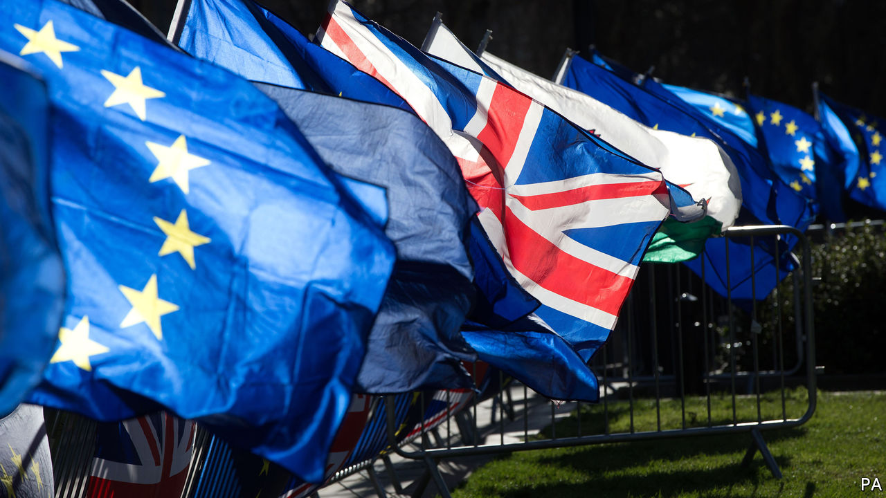

## Crises collide

# Covid-19 is delaying Brexit negotiations

> It may yet delay Britain’s exit from the EU’s orbit

> Mar 21st 2020

Editor’s note: The Economist is making some of its most important coverage of the covid-19 pandemic freely available to readers of The Economist Today, our daily newsletter. To receive it, register [here](https://www.economist.com/https://my.economist.com/user#newsletter). 

BREXIT NEGOTIATORS spent months mulling the prospect of empty supermarket shelves and grounded flights. Their nightmare scenario duly arrived, but from an unexpected source. And an early victim of the pandemic has been trade talks between Britain and the EU.

Negotiations were due to restart on March 18th, with Britain determined to rattle through them in order to leave the EU’s orbit by December 31st. They were put on hold even before Michel Barnier, the EU’s chief negotiator, confirmed on March 19th that he had contracted covid-19. The delay has raised expectations that Boris Johnson will be forced to break his promise by requesting an extension to negotiations.

There are plenty of reasons to delay. For a start, the two sides are already far apart. Britain opposes EU proposals for strict conditions on unfair competition, and to allow European boats to fish in its waters. With covid-19 consuming the British government’s attention, it is hardly an ideal time to thrash out compromises. Charles Grant of the Centre for European Reform, a think-tank, notes that EU minds are also elsewhere, as they confront the serious risks to the bloc’s economy and the potential for destabilisation. “The chances of getting a deal fixed in time are diminishing,” he notes. “An extension is more likely.”

Agreeing a treaty is the easy bit. Afterwards, Britain would have to implement new regulatory systems, immigration policies and customs controls. These changes will be similar whether or not a deal is struck and, despite the best efforts of 25,000 civil servants, the timetable looked tight even without a pandemic. On top of this, Parliament would have to pass a number of major pieces of legislation covering trade, agriculture and fisheries.

If the virus is still causing havoc come winter, the government may conclude it is a bad time to introduce new checks at the border, which risk creating delays to the supplies of food and medical equipment. Planners for Operation Yellowhammer, last year’s no-deal preparations, warned that “concurrent risks” such as a typical winter flu or an outbreak of flooding would stretch government agencies.

But while the logic of a delay is straightforward, the politics are not. A delay would prompt a backlash from Tory Eurosceptics. “It would turn Boris into Theresa May,” says one. And any extension beyond December 31st must be requested by the end of June. That date acts like the mouth of a lobster pot—easy for the government to swim through in the belief that plenty of time remains, but impossible to escape from later.

The hope is that Eurosceptic concerns are outweighed by more pragmatic ones. Businesses will plead with the government not to compound the economic hit from the virus with the pain of a hard exit. Given that any settlement with the EU will probably require compromises on sensitive questions such as fisheries and the European Court of Justice, Mr Johnson may conclude they are best rushed through while attention is elsewhere.■

Dig deeper:For our latest coverage of the covid-19 pandemic, register for The Economist Today, our daily [newsletter](https://www.economist.com/https://my.economist.com/user#newsletter), or visit [our coronavirus hub](https://www.economist.com//coronavirus)