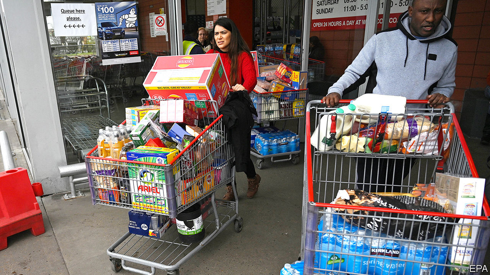

## Retail

# How panic buying is affecting supermarkets

> Retailers battle to restock shelves quicker than Britons are emptying them

> Mar 21st 2020

Editor’s note: The Economist is making some of its most important coverage of the covid-19 pandemic freely available to readers of The Economist Today, our daily newsletter. To receive it, register [here](https://www.economist.com//newslettersignup). For more coverage, see our coronavirus [hub](https://www.economist.com//coronavirus)

EYEING A NEW wave of hoarders advancing towards already half-empty shelves, a supermarket employee says that in normal times the shop sells only ten of its most expensive sirloin steaks in two weeks. “Now 30 go in a day!” Other parts of the store—a branch of Sainsbury’s in east London—resemble a battleground. Those tasked with replenishing toilet rolls look especially flushed. “They are just grabbing them off the boards,” grumbles one worker. “I’m just handing them out one by one.”

Six in ten Britons reckon stockpiling is an unacceptable response to the spread of covid-19, according to Ipsos MORI, a pollster. Yet my prudence is your stockpiling. As customers strip shelves bare, most British supermarkets have implemented some form of rationing. Some chains are limiting purchases of the most popular items, like loo roll, pasta and rice. Others have banned customers from buying more than a few of each product line. Emergency plans, many of which were drawn up to cope with a no-deal Brexit, are being dusted down and put into action.

“We’re seeing Christmas-type levels of demand at the moment but usually you have months to stock up and staff up beforehand,” says one supermarket’s supply-chain boss. Grocers’ depots typically hold enough food to last a week and only a few days’ worth of perishable goods and bulky items, such as loo roll. At the store in east London, the manager remains calm. “The supply chain is doing fine, the depots haven’t run out of stock,” he says. “All I can do is put out what they send me.”

For our latest coverage of the covid-19 pandemic, register for The Economist Today, our daily [newsletter](https://www.economist.com//newslettersignup), or visit our [coronavirus hub](https://www.economist.com//coronavirus)

For now, the problems are caused by surging demand rather than disrupted supplies. That could soon change. Bruno Monteyne, a former supply-chain director who now works for Bernstein, a financial-research firm, says Tesco, Britain’s largest supermarket chain, regularly war-gamed pandemics when he worked there. In a note for clients this month, he noted that supply disruptions are likely to become widespread if unexpected staff absences reach 5-10% of the workforce. At that point “it would only take a few weeks to generate major shortages across the store estate.” Stores will probably narrow the range of goods they sell in order to ease bottlenecks. As Mr Monteyne puts it, “who needs 35 types of ketchup in a pandemic?”

One difficulty is that supermarkets have been engaged in a multi-year price war to maintain market share with two German discounters, Aldi and Lidl, and online services like Ocado and Amazon. Profit margins in the retail sector fell from 6.4% in 2007 to 2.7% in 2018. One of the main responses has been to make their supply chains more efficient—and thus vulnerable to disruption. “We’ve been rationalising supply chains for years and that’s great news for consumers who have ever lower prices, but we don’t have much spare capacity,” says an industry insider.

Italy has managed to maintain food supplies despite a more severe outbreak of covid-19 and a much tighter lockdown. The British supermarket industry is confident it can do the same, but in the weeks ahead disruption is likely and the range of goods offered to consumers will probably narrow still further.

Shelf-stackers in east London are not convinced rationing will put an end to panic buying, however. “First it was toilet roll,” one explains, “then it was pasta, then it was tinned tomatoes, then it was bread, and now it’s fruit and veg.” Her colleague adds that “it will be beer next.”■