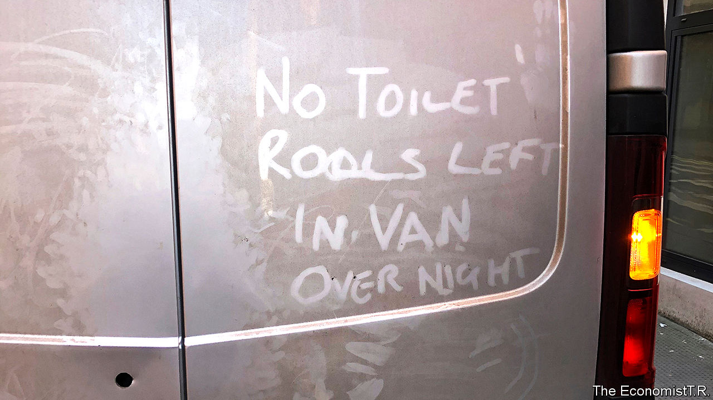

## Life under lockdown

# Slices of British life under coronavirus

> Behaviour in the time of covid-19

> Mar 21st 2020

Editor’s note: The Economist is making some of its most important coverage of the covid-19 pandemic freely available to readers of The Economist Today, our daily newsletter. To receive it, register [here](https://www.economist.com/https://my.economist.com/user#newsletter). 

Half measures

“Of course I’ll go to a pub if I need to go to a pub.”

Stanley Johnson, the prime minister’s father, intends to ignore his son’s advice to stay at home. He is not alone; staff in one London pub said it was busier than usual.

Faith and science

“We respectfully ask that you refrain from the physical sign of peace—especially anyone with cold or flu symptoms—and for all to receive Holy Communion on the hand only. The distribution of the Precious Blood of Christ has been suspended.”

Immaculate Conception, a Catholic church in the Oxfordshire town of Bicester, tends to its flock’s physical as well as spiritual health. The Church of England has suspended services. The Archbishop of Canterbury will lead believers in a digital service.

Especially honourable members

“He’s making a series of very powerful points.”

Boris Johnson responds to Jeremy Corbyn, the opposition leader, in an unusually even-tempered Prime Minister’s Questions.

Soap shortage

“It’s a shame ‘EastEnders’ has been postponed for now. It could have served as a timely reminder that there’s always people worse off than you.”

Paul Sinha, a television quiz-show personality, responds to the BBC’s decision to suspend filming of the soap opera.

Viral video

“We’ve all got the virus, na na na na.”

British holidaymakers in Benidorm failed to impress locals with their football-style chant, which was quickly shared online.

Old-age protesters

“The proposed self-isolation for the over-70s is a euphemism for house arrest...We have done nothing wrong except grow old and are set to be sentenced, without trial…What punishments will be meted out to those who sneak out, maybe to their allotment, or just for a walk in a green space by the sea?”

Eve Woodward in a letter to The Times, March 17th.

Dig deeper:For our latest coverage of the covid-19 pandemic, register for The Economist Today, our daily [newsletter](https://www.economist.com/https://my.economist.com/user#newsletter), or visit [our coronavirus hub](https://www.economist.com//coronavirus)