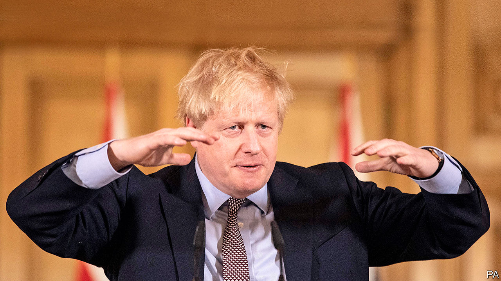

## Government

# The virus means the big state is back

> Covid-19 is the main reason, but not the only one

> Mar 21st 2020

Editor’s note: The Economist is making some of its most important coverage of the covid-19 pandemic freely available to readers of The Economist Today, our daily newsletter. To receive it, register [here](https://www.economist.com/https://my.economist.com/user#newsletter). 

IN 2012, IN the midst of David Cameron’s austerity campaign, a clutch of newly elected Tory MPs published “Britannia Unchained”, a book lamenting Britain’s “bloated state, high taxes and excessive regulation”. The authors included Priti Patel, Dominic Raab and Liz Truss, now home, foreign and trade secretaries respectively. Later, Boris Johnson would advertise Brexit as a liberating mission for a nimble nation. His supporters dreamed of turning Britain’s face away from Brussels and towards Singapore.

They were swimming with the tide, for the horizons of the British state have shrunk over the past 40 years. It intervenes in fewer markets and owns fewer industries. Limits on executive power have been embraced: state aid and competition laws, human rights legislation, and the expansion of judicial review.

But since 2016 this trend has reversed. Brexit is one reason: £6bn ($7bn) in funds and some 20,000 officials have been dedicated to the project, partly reversing cuts to the civil service headcount. The government prepared a bail-out fund for businesses and emergency ferry capacity in case of a messy exit. The free movement of people will be replaced by an occupation-based visa system, representing a shift towards state planning in the labour market.

The second factor is Mr Johnson’s plan to level up poorer parts of the country. In the budget on March 11th, Rishi Sunak, the chancellor, announced £640bn on infrastructure spending over five years, the highest as a share of GDP since the 1970s. Public spending as a share of GDP under Mr Sunak’s plan was due to settle at 40-41%, higher than any recent point outside the financial crisis. Jesse Norman, a treasury minister, says Brexit and big spending are linked. “It’s a Burkean understanding that a nation is a moral idea: a group of people bound together by a moral affinity. It’s that legitimating sense of self that underwrites a nation’s capacity to tax.”

Failing railway franchises have been renationalised with little murmur in recent years. Controls on energy prices, denounced as Marxist by the Tories when proposed by Ed Miliband, then Labour leader, in 2013, were implemented by Theresa May and will be kept by Mr Johnson. He plans new taxes on social-media companies, and new rules over online content.

The third factor is Mr Johnson’s aversion to restraints on ministerial discretion. He hopes to reform judicial review to prevent the courts being used to conduct “politics by other means”, and wants to review human-rights laws to ensure “effective government”. He skips scrutiny hearings in Parliament and plans to loosen European Union rules on state aid and procurement.

But covid-19 is likely to do more than all of these to extend the reach of the state. Already the government has introduced a degree of social control not seen since the second world war. Schools are closing indefinitely. Office workers have been told to stay at home. The elderly have been urged to cocoon themselves from human contact. There is widespread expectation of a lockdown in London. Emergency legislation will allow the speedy hiring of retired and student nurses, the detention of the infectious, the closure of ports and the rapid burial of the dead.

On March 17th Mr Sunak announced a vast economic intervention. He proposes £330bn ($389bn) of state guarantees for bank loans to firms, equivalent to 15% of GDP, plus £20bn of grants and tax reliefs for the leisure industry and small businesses. It followed £12bn of assistance announced in the budget. Airlines and train companies may be nationalised, said Grant Shapps, the transport secretary. Carmakers, drafted 80 years ago to assemble Spitfires, have been asked to make ventilators. Landlords may not evict tenants during the crisis. “This is not a time for ideology and orthodoxy,” said Mr Sunak.

What state will emerge from the virus? The courts should prevent emergency powers granted to handle coronavirus from being misused once normality returns, says Jonathan Sumption, a historian and former Supreme Court judge. But some measures may prove hard to unwind. A better deal for self-employed workers, renters and benefit claimants could be popular. Nationalised transport companies may prove efficient, or hard to sell. The BBC’s doughty schedule of emergency programming is a rebuke to its opponents.

Government itself may be rehabilitated. The drive to downsize the state was born of the belief that the market is a more efficient decision-maker. Pandemics challenge this. “If the government takes huge powers and doesn’t obviously cock it up, people come to accept the higher and more intrusive exercise of state powers as a norm,” says Lord Sumption. Bailed-out industries will need to repay the favour by better training British workers, argues Nick Timothy, a Tory thinker and former Number 10 aide.

The government of Clement Attlee, Winston Churchill’s successor, offers an analogy: Attlee redirected the wartime state to establishing free health care, public housing and state ownership of industry. Covid-19 will combine urgent mobilisation with a collective experience of pain, the breaking of economic taboos and the midwifing of once-radical ideas, argues Peter Hennessy, a constitutional historian. The outcome may be a more interventionist, “filled-in” state. “The tide of ideas and the tide of practicalities have turned. A new consensus is coming out of necessity,” he says.

The challenge for liberals, argues David Gauke, a former treasury minister, is not to fight the growth of the state on principle, but to ensure that government does not revert to the bad habits of producer-capture and pork-barrel spending. The need, he argues, is to reconcile the big state that is likely to be needed with a flourishing market economy, and to ensure it is efficient and effective. ■

Dig deeper:For our latest coverage of the covid-19 pandemic, register for The Economist Today, our daily [newsletter](https://www.economist.com/https://my.economist.com/user#newsletter), or visit [our coronavirus hub](https://www.economist.com//coronavirus)