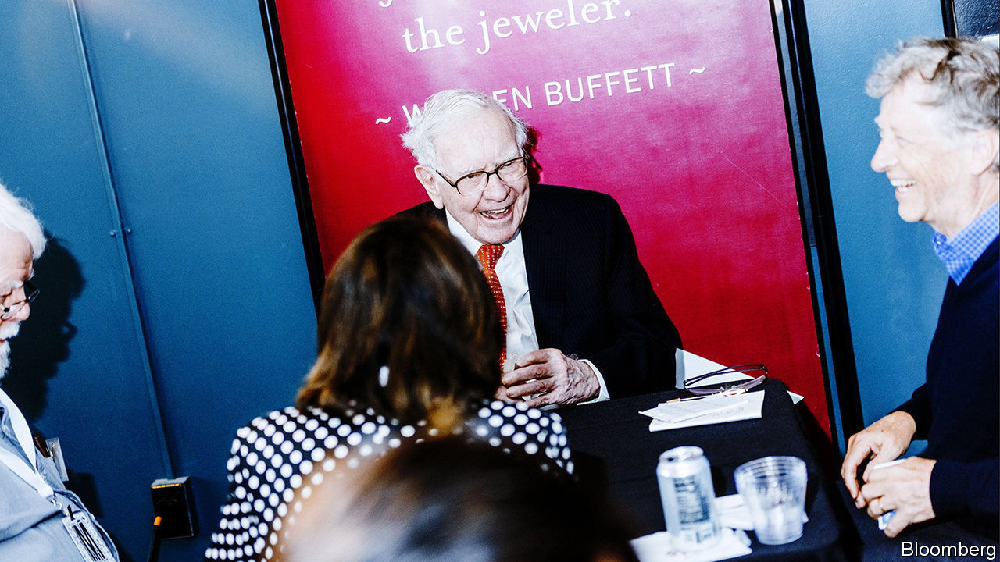
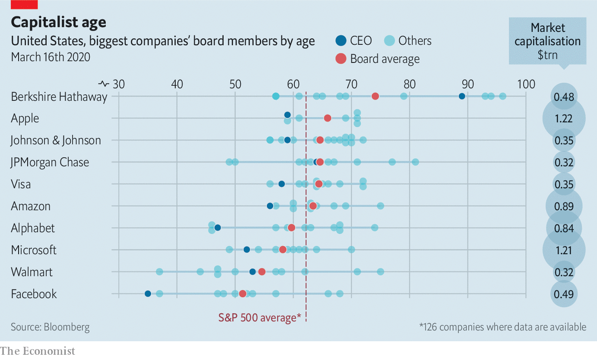

## Very golden oldiest

# Berkshire Hathaway has America Inc’s oldest board

> Its new 68-year-old member looks positively ephebic

> Mar 21st 2020

ON MARCH 13TH Bill Gates stepped down from the boards of Microsoft, the software giant he founded, and Berkshire Hathaway, a company run by his plutocrat pal, Warren Buffett. The 64-year-old Mr Gates’s replacement at Microsoft has not been named. At Berkshire, he will be succeeded by Ken Chenault, a respected former boss of American Express. Mr Chenault, who is four years older than Mr Gates, may not look like the fresh blood the underperforming conglomerate needs, exactly. But relative to its ancient boardroom, which includes three nonagenarians, he looks positively ephebic.■

## URL

https://www.economist.com/business/2020/03/21/berkshire-hathaway-has-america-incs-oldest-board
