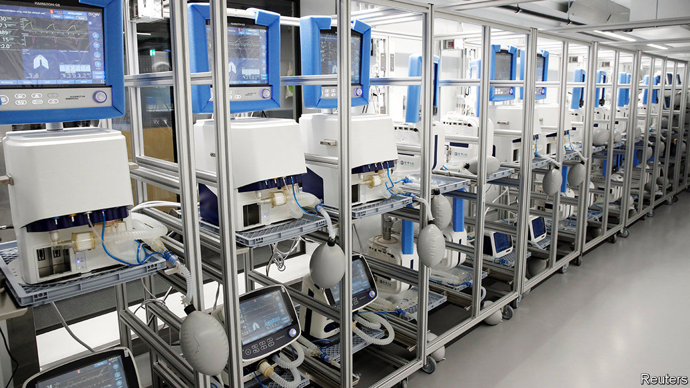
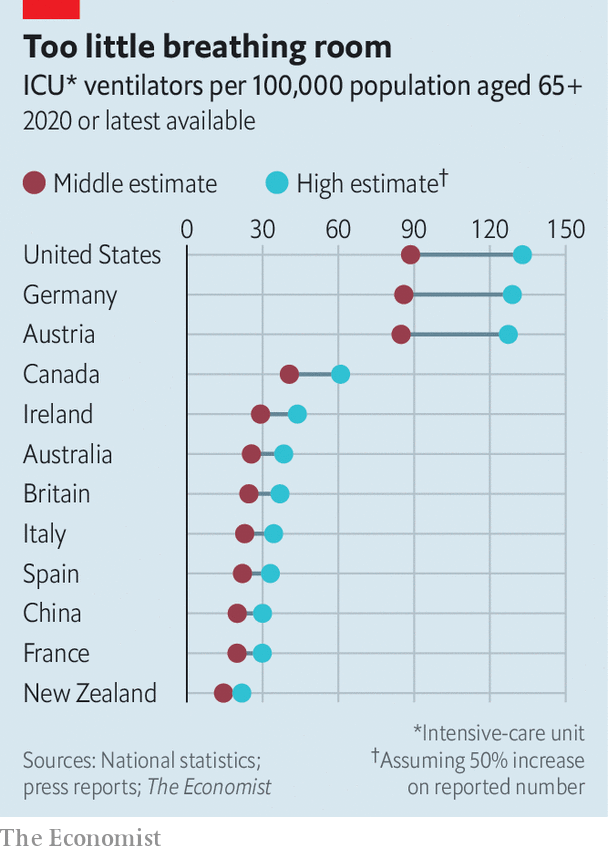

## My iron lung

# Companies are scrambling to build more ventilators

> Demand for breathing apparatus greatly outstrips supply

> Mar 19th 2020

Editor’s note: The Economist is making some of its most important coverage of the covid-19 pandemic freely available to readers of The Economist Today, our daily newsletter. To receive it, register [here](https://www.economist.com/https://my.economist.com/user#newsletter). 

MUCH OF THE panic-buying provoked by the covid-19 pandemic seems overblown. Grocers insist they are not about to run out of food. But in one category of product, scarcity is all too real. Overwhelmed health services are desperately short of mechanical ventilators to help the roughly 10% of sufferers with severe symptoms to breathe. Political leaders are urging existing specialist producers to ramp up production. Germany’s government ordered 16,000 new machines from two domestic producers. Others, like Britain’s prime minister, Boris Johnson, want manufacturers of all stripes to retool and help out. That is easier said than done.

It is hard to pin down how many ventilators health-care systems have on hand. The last survey of ventilator capacity in America was ten years ago. It tallied 62,000 sophisticated machines and 100,000 basic ones. American health authorities are now hastily counting anew. They are likely to find fewer than 200,000, 80-90% of which are typically used by non-covid patients. A rough calculation by The Economist suggests that, if the virus keeps spreading at the current rate, America would run out of spare devices in four weeks. The situation is worse in other countries (see chart). 

In 2019 ventilator-makers had the capacity to churn out just 40,000 units suitable for intensive care, according to Getinge, a Swedish firm which makes one in four such machines sold worldwide. Most companies build kit, which costs anywhere between $10,000 and $60,000 apiece, to order rather than keep inventories. Premier, a firm that bought 2,000 last year on behalf of 40% of America’s hospitals, says that buyers must now wait 8-12 weeks for new ones to arrive, not a fortnight as in normal times. Getinge’s order book is completely filled until June.

All manufacturers are ramping up production. Getinge plans to make 16,000 units this year, 60% more than in 2019. Most of its rivals hope to increase output by a similar amount. Italy’s army has sent 25 technical staff to Siare, its only domestic producer, to try to quadruple production, to 500 units a month. Mr Johnson’s government sent 60 large manufacturers a blueprint of a ventilator along with links to a YouTube video and an academic paper describing a device that could be deployed rapidly. OneBreath, a startup in California, is hoping regulators will fast-track approval of its $4,000 design that could be ready to produce in less than a year.

Getinge’s boss, Mattias Perjos, doubts that the British prime minister’s plan will work, at least in the short term. Ventilators are not the most complicated pieces of machinery. But they are fiddly. It takes Getinge two years on average to develop a new model. Even if regulators relaxed their approval process—which can take another two years—a carmaker will not learn to build safe and effective medical gear overnight. 

Even if specialist firms add production lines to their factories, and non-specialists reconfigure theirs, one other constraint remains. Most components come from China, where virus-related stoppages reduced production of industrial equipment by 28% in January and February, year on year. China is beginning to rev up its industrial engine as new infections slow. But it will be a while before its factories are fully back in business. By the time they are, drastic measures that governments around the world are taking to slow the virus’s spread may leave ventilator-makers themselves with less breathing room to function.■

Dig deeper:For our latest coverage of the covid-19 pandemic, register for The Economist Today, our daily [newsletter](https://www.economist.com/https://my.economist.com/user#newsletter), or visit [our coronavirus hub](https://www.economist.com//coronavirus)