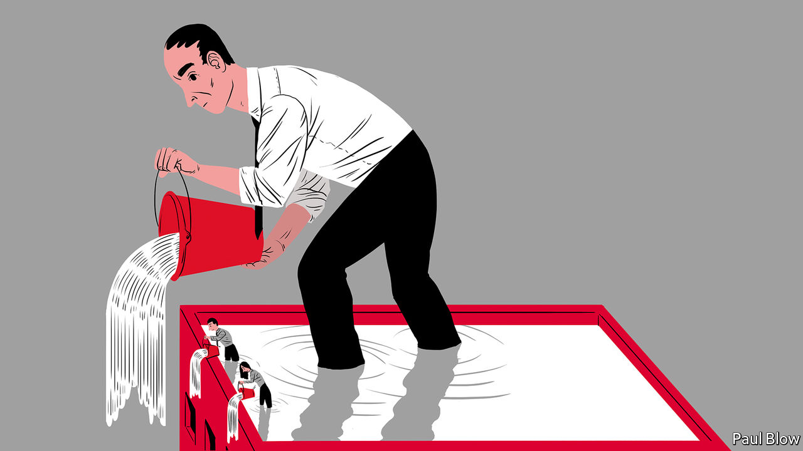

## Bartleby

# How corporate leaders should act in a crisis

> Managers earn their money when the going gets tough

> Mar 21st 2020

Editor’s note: The Economist is making some of its most important coverage of the covid-19 pandemic freely available to readers of The Economist Today, our daily newsletter. To receive it, register [here](https://www.economist.com/https://my.economist.com/user#newsletter). 

WHEN THINGS are going well, it is pretty easy being a business leader. The economy is booming, orders are rolling in and there are no tricky decisions to make about staff or budgets. It is still possible to screw things up, but a rising tide tends to lift all yachts.

It is in a crisis that corporate helmsmen show their mettle. Employees will be uncertain and will look to the leader for direction. Sometimes, as with the covid-19 pandemic, the problem will be something few bosses can reasonably have anticipated. Now they are expected to chart a steady course in days.

In the political arena the obvious examples of successful crisis leadership are Franklin Roosevelt and Winston Churchill. Both were somewhat erratic decision-makers. But they made up for it by being excellent communicators. Their styles diverged, but the public had little difficulty in understanding their core message. Roosevelt made clear that he was willing to try any combination of new ideas in an attempt to end the depression; Churchill was unambiguous about the need for Britain to resist Nazi Germany, whatever the cost.

Corporate leaders should resist the temptation to give Churchillian speeches. But they have something to learn from the calm authority of Roosevelt’s “fireside chats”. As chief executive you have to communicate a message to two different audiences: your workforce and your customers. That message should demonstrate that the company has a plan to deal with the virus. This may involve staff working from home (to prevent the spread of infection) or changes in the supply chain (to maintain production). Both staff and customers will also need reassuring that the company has sufficient financial resources to survive the economic downturn.

Jefferies, an investment bank, has just provided a fine example. In a joint letter, the chief executive, Rich Handler, and the president, Brian Friedman, stressed that “topmost on our minds is the safety of our employees and our clients” before adding that the firm “is flush with capital at both the operating business level and our parent company”. Other firms may not be so lucky. But silence on such matters would be dangerous.

For the broader strategy, tips can be gleaned from the National Defence University (NDU), an American military college. In 2006 it produced a useful—and prescient—report called “Weathering the Storm: Leading Your Organisation Through a Pandemic”. It advised leaders to analyse the tasks required for an organisation to continue operating and prioritise them. To ensure essential functions can be performed, employees should be trained in different disciplines. That way they can cover for colleagues who become sick.

It helps to have done this in advance, of course. But even firms that dithered can—besides making amends now—adopt the right the tone. How you handle crisis communication is, the NDU says, “critical”. It can matter as much as having the right message.

This point is amplified by Shawn Engbrecht, a former US Army ranger who now runs a personal-protection company. He has written a highly entertaining, if idiosyncratic, book entitled “Invisible Leadership”. “As a leader,” he cautions, “you can promise everything to the many until you are unable to deliver even a little to the few.” In the end, “Failure to tell the truth rapidly erodes trust and confidence in higher command.”

In a crisis, Mr Engbrecht advocates “embracing the suck”. This means accepting where you are at a given moment: “Wishing, hoping and praying the problem away does not work so don’t waste your time with coulda, shoulda or woulda.” In short, no sugarcoating. If everyone on staff realises there is a problem, they will not be reassured by an executive blithely promising that it may go away.

A good manager must take time to listen to staff concerns and answer their questions. That may require a bit of patience. In Mr Engbrecht’s words, “the quieter you become, the more you can hear”. Mass meetings may not be appropriate at a time of a highly infectious disease. But an online town-hall gathering would be salutary.

Have a clear message, keep calm and be transparent: all obvious stuff, crisis or no crisis. Another kind of leadership may be more painful. Executives at airlines like Qantas and United have agreed to take pay cuts (or forgo their salaries entirely) until the pandemic passes. Good leaders show they face at least some of the same dangers as their troops.

Dig deeper:For our latest coverage of the covid-19 pandemic, register for The Economist Today, our daily [newsletter](https://www.economist.com/https://my.economist.com/user#newsletter), or visit [our coronavirus hub](https://www.economist.com//coronavirus)

## URL

https://www.economist.com/business/2020/03/21/how-corporate-leaders-should-act-in-a-crisis
